## Redis入门概述

###1.是什么

#####Redis：$\textcolor{red}{RE}$mote $\textcolor{red}{D}$ictionary $\textcolor{red}{S}$erver(远程字典服务器)

#####官网解释：

Remote Dictionary Server$\textcolor{red}{远程字典服务器}$是完全开源的，使用ANSIC语言编写遵守BSD协议，是一个高性能的Key-Value数据库，提供了丰富的数据结构，例如String、Hash、List、Set、SortedSet等等。数据是存在内存中的，同时Redis支持事务、持久化、LUA脚本、发布/订阅、缓存淘汰、流技术等多种功能，提供了主从模式、Redis Sentinel和Redis Cluster集群架构方案

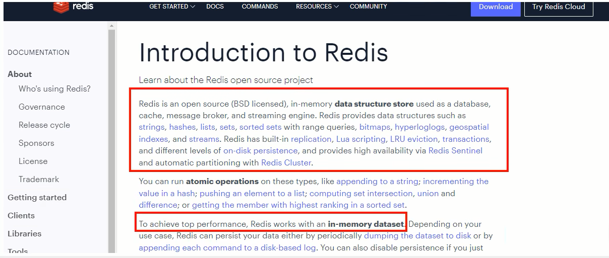

$\textcolor{red}{安特雷兹}$

个人github：github.com/antirez

个人博客：antirez.com/latest/0

###2.能干嘛

##### 主流功能与应用

$\textcolor{red}{1.分布式缓存，挡在MySQL数据库之前的带刀护卫}$

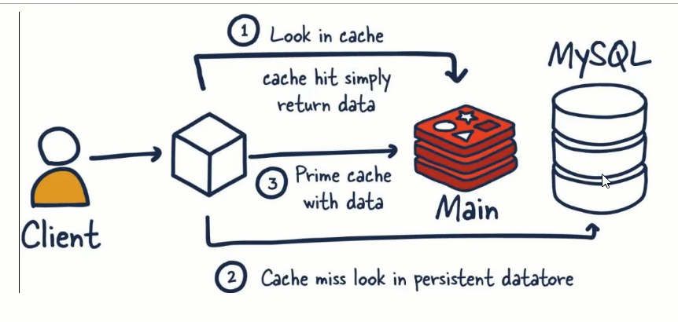

###### 与传统数据库关系(MySQL)

​	·Redis是key-value数据库(NoSQL一种)，MySQL是关系型数据库

​	·Redis数据操作主要在内存，而MySQL主要存储在磁盘

​	·Redis在某一些场景使用中要明显优于MySQL，比如计数器、排行榜等方面

​	·Redis通常用于一些特定场景，需要与MySQL一起配合使用

​	·$\textcolor{red}{两者并不是相互替换和竞争的关系，而是共用和配合使用}$

2.内存存储和持久化（RDB和AOF）

​	Redis支持异步将内存中的数据写到硬盘上，同时不影响继续服务

3.高可用架构搭配

​	单机、主从、哨兵、集群

4.缓存穿透、击穿、雪崩

5.分布式锁

6.队列

​	Redis提供list和Set操作，这使得Redis能作为一个很好的消息队列平台来使用。

​	我们常通过Redis的队列功能做购买限制。比如到了节假日或者推广期间，进行一些活动，对用户购买行为进行限制，限制今天只能购买几次商品或者一段时间内只能购买一次。也比较适合使用。

7.排行榜+点赞

​	在互联网应用中，有各种各样的排行榜，如电商网站的月度销量排行榜、社交APP的礼物排行榜、小程序的投票排行榜等等。Redis提供的zset数据类型能够快速实现这些复杂的排行榜。

​	比如小说网站对小说进行排名，根据排名，将排名靠前的小说推荐给用户。

##### 总体功能概述

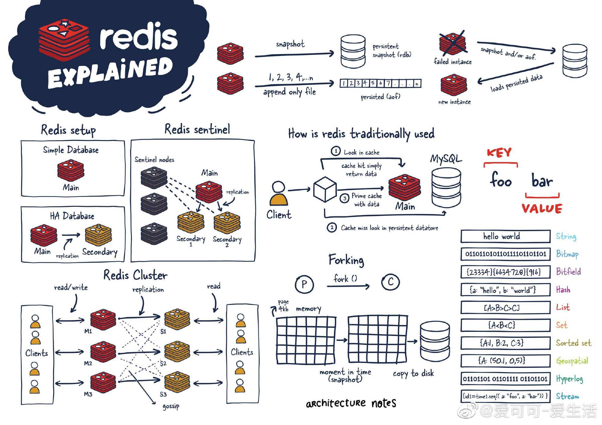

##### 优势

​	性能极高-Redis读的速度是110000次/秒，写的速度是81000次/秒

​	Redis数据类型丰富，不仅仅支持简单的Key-Value类型的数据，同时还提供list，set，zset，hash等数据结构的存储

​	Redis支持数据的持久化，可以将内存中的数据保持在磁盘中，重启的时候可以再次加载进行使用

​	Redis支持数据的备份，即master-slave模式的数据备份

##### 小总结

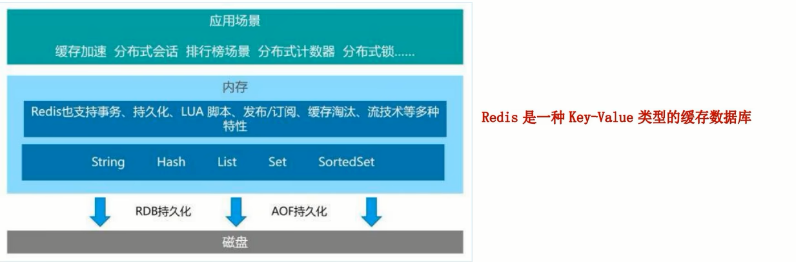

### 2.能干嘛

### 3.去哪下

官网地址: 

英文：https://redis.io/

中文：http://www.redis.cn/	https://www.redis.com.cn/documentation.html

安装包：https://redis.io/download/，选择redis7.0版本即可

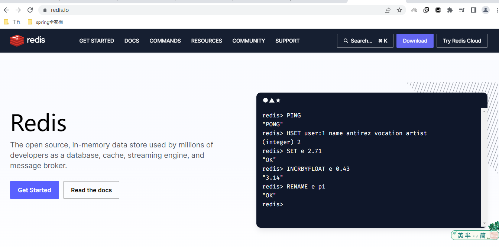

Redis源码地址：https://github.com/redis/redis

Redis在线测试地址(不用下载也能玩)：https://try.redis.io/

Redis命令参考：http://doc.redisfans.com/

###4.怎么玩

官网文档；

多种数据类型基本操作和配置；

持久化和复制，RDB/AOF

事务的控制

复制，集群等


####$\textcolor{red}{Redis迭代演化和Redis7新特性浅谈}$

版本升级：

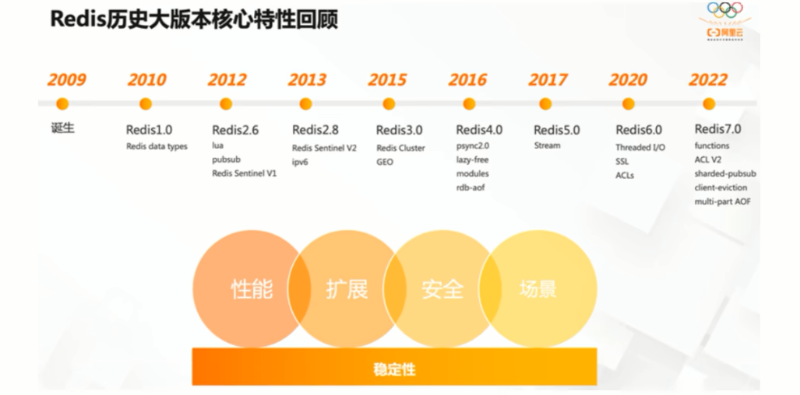

```xml
5.0版本是直接升级到6.0版本，对于这个激进的升级，Redis之父antirez表现得很有信心和兴奋，所以第一时间发文来阐述6.0的一些重大功能"Redis 6.0.0 GA is out!":
```

$\textcolor{red}{随后Redis再接再厉，直接王炸Redis7.0---2023年爆款}$

```xml
2022年4月27日Redis正式发布了7.0更新
(其实早在2022年1月31日，Redis已经预发布了7.0rc-1，近过社区的考验后，确认没有重大Bug才会正式发布)
```

Redis版本迭代推演介绍：

​	几个里程碑式的重要版本:如上图：redis历史版本回顾

​	命名规则：Redis从发布至今，已经有十余年的时光了，一直遵循着自己的命名规则:

1. 版本号第二位如果是奇数，则为非稳定版本，如2.7、2.9、3.1
2. $\textcolor{red}{版本号第二位如果是偶数，则为稳定版，如2.6、2.8、3.2}$
3. 当前奇数版本就是下一个稳定版本的开发版，如2.9版本就是3.0版本的开发版本
4. 我们可以通过redis.io官网来下载自己感兴趣的版本进行源码阅读
5. 历史发布版本的源码：https://download.redis.io/releases/


Redis7.0新特性概述：

https://github.com/redis/redis/releases可以查询到历史发布版本，根据7.0-rc1预发布版本，我们可以看到Redis7的新特性：

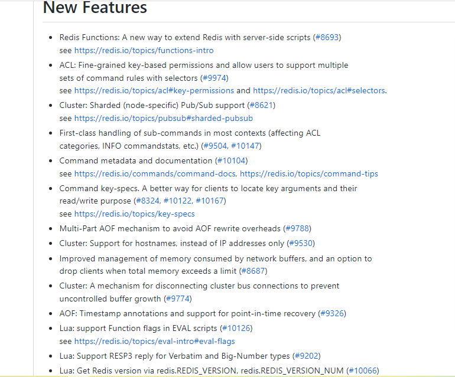

#####部分新特性总览：

2022年4月正式发布的Redis7.0是目前Redis历史版本中变化最大的版本。首先它有超过50个以上的新增命令，其次，它有大量核心特性的新增和改进。

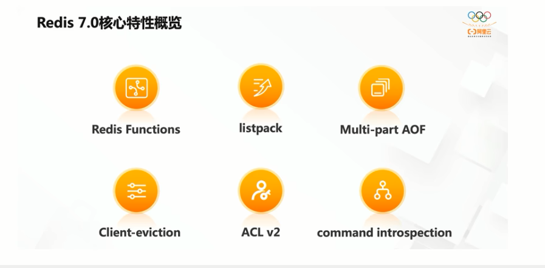

1.Redis Functions(目前不用关心)

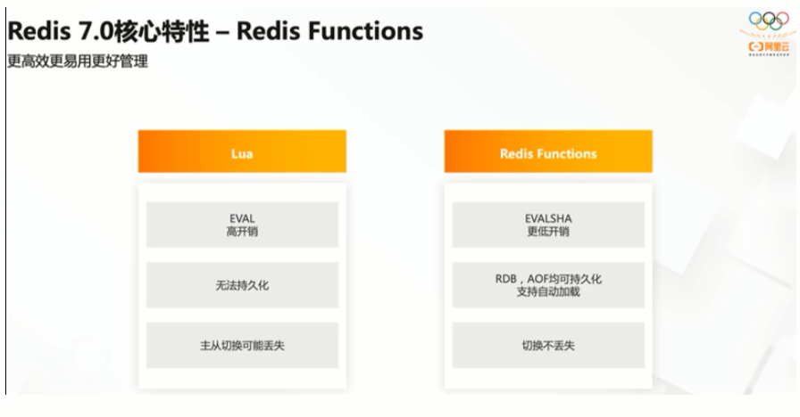

2.Client-eviction


3.Multi-part AOF

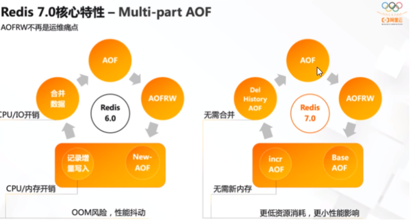

4.ACL v2 权限控制

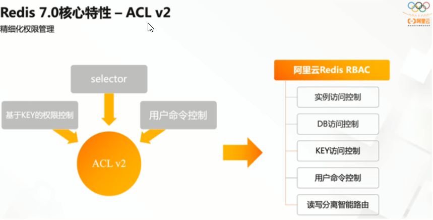

5.新增命令（目前不用关心）

```TEXT
新增ZMPOP，BZMPOP，LMPOP，BLMPOP等新命令，对于EXPIRE和SET命令，新增了更多的命令参数选项。例如，ZMPOP的格式如下：ZMPOP numkeys key [key ...] MIN|MAX [COUNT count],而BZMPOP是ZMPOP的阻塞版本。
```

6.listpack替代ziplist

```text
listpack是用来替代ziplist的新数据结构，在7.0版本已经没有ziplist的配置了（6.0版本仅部分数据类型作为过渡阶段在使用）
```

7.底层性能提升(和编码关系不大)

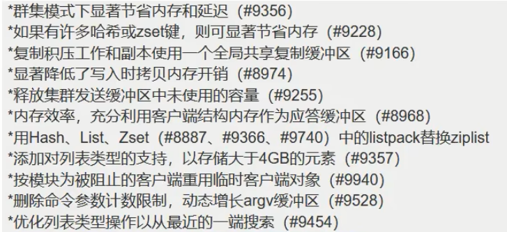

#### 本次将对Redis7的一部分新特性做说明(not all)

##### 总体概述

大体和之前的redis版本保持一致和稳定，主要是自身底层性能和**资源利用率上的优化和提高**，如果生产上系统稳定，**不用着急升级到最新redis7版本**，如果从零开始新系统，直接上redis7.0-GA版。

| 多AOF文件支持                       | 7.0 版本中一个比较大的变化就是 aof 文件由一个变成了多个，主要分为两种类型:基本文件(base files)、增量文件(incr files)，请注意这些文件名称是复数形式说明每一类文件不仅仅只有一个。在此之外还引入了一个清单文件(manifest) 用于跟踪文件以及文件的创建和应用顺序(恢复) |
| ------------------------------ | ---------------------------------------- |
| config命令增强                     | 对于Config Set 和Get命令，支持在一次调用过程中传递多个配置参数。例如，现在我们可以在执行一次Config Set命今中更改多个参数: config set maxmemory 10000001 maxmemory-clients 50% port 6399 |
| 限制客户端内存使用<br />Client-eviction | 一旦 Redis 连接较多，再加上每个连接的内存占用都比较大的时候， Redis总连接内存占用可能会达到maxmemory的上限，可以增加允许限制所有客户端的总内存使用量配置项，redis.config 中对应的配置项<br />//两种配置形式:指定内存大小、基于 maxmemory 的百分比。<br />maxmemory-client 1g<br />maxmemory-client 10% |
| listpack紧凑列表调整                 | listpack 是用来替代 ziplist 的新数据结构，在 7.0 版本已经没有 ziplist 的配置了 (6.0版本仅部分数据类型作为过渡阶段在使用）listpack已经替换了ziplist类似hash-max-ziplist-entries 的配置 |
| 访问安全性增强ACLV2                   | 在redis.conf配置文件中protected-mode默认为yes，只有当你希望你的客户端在没有授权的情况下可以连接到Redis server的时候可以将protect-mode设置为no |
| redis function                 | Redis函数，一种新的通过服务端脚本扩展Redis的方式，函数与数据本身一起存储。简言之，redis自己要去抢夺Lua脚本的饭碗 |
| RDB保存时间调整                      | 将持久化文件RDB的保存规则发生了改变，尤其是时间记录频度变化          |
| 命令新增和变动                        | Zset (有序集合)增加 ZMPOP、BZMPOP、ZINTERCARD 等命令<br />Set (集合)增加 SINTERCARD 命令<br />LIST(列表)增加 LMPOP、BLMPOP ，从提供的键名列表中的第一个非空列表键中弹出一个或多个元素。 |
| 性能资源利用率、安全等改进                  | 自身底层部分优化改动，Redis核心在许多方面进行了重构和改进主动碎片整理V2:增强版主动碎片整理，配合Jemalloc版本更新，更快更智能，延时更低<br />HyperLogLog改进:在Redis5.0中，HyperLogLog算法得到改进，优化了计数统计时的内存使用效率，7更加优秀更好的内存统计报告<br />如果不是为了API向后兼容，我们将不再使用slave一词......（政治正确） |


