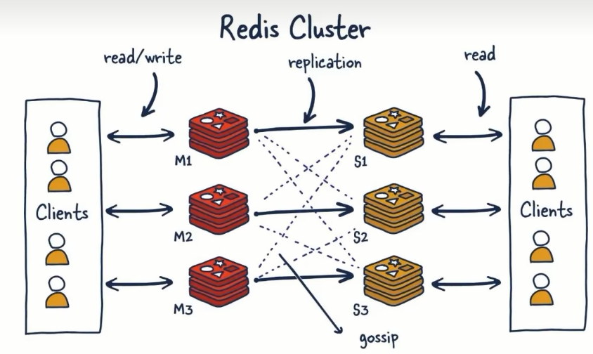

# Redis集群介绍

### 是什么

定义：$\textcolor{red}{\large 由于数据量过大，单个Master复制集难以承担}$，因此需要对多个复制集进行集群，形成水平扩展每个复制集只负责存储整个数据集
的一部分，这就是Redis的集群，其作用是提供在多个Redis节点间共享数据的程序集。

官网：https://redis.io/docs/reference/cluster-spec/

一图：

一句话：Redis集群是一个提供在多个Redis节点间共享数据的程序集，Redis集群可以支持多个master

### 能干嘛

- Redis集群支持多个master，每个master又可以挂载多个slave
  1. 读写分离
  2. 支持数据的高可用
  3. 支持海量数据的读写存储操作
- 由于Cluster自带Sentinel的故障转移机制，内置了高可用的支持，$\textcolor{red}{\large 无需再去使用哨兵功能}$
- 客户端与Redis的节点连接，不再需要连接集群中所有的节点，只需要任意连接集群中的一个可用节点即可
- $\textcolor{red}{\large 槽位slot}$负责分配到各个物理服务节点，由对应的集群来负责维护节点、插槽和数据之间的关系

