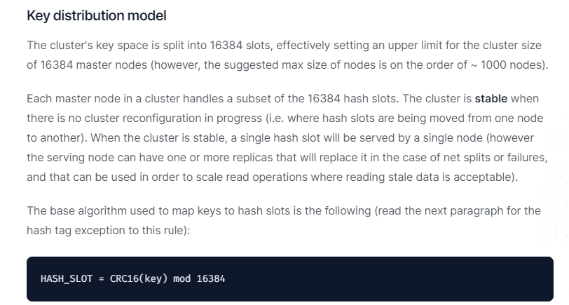
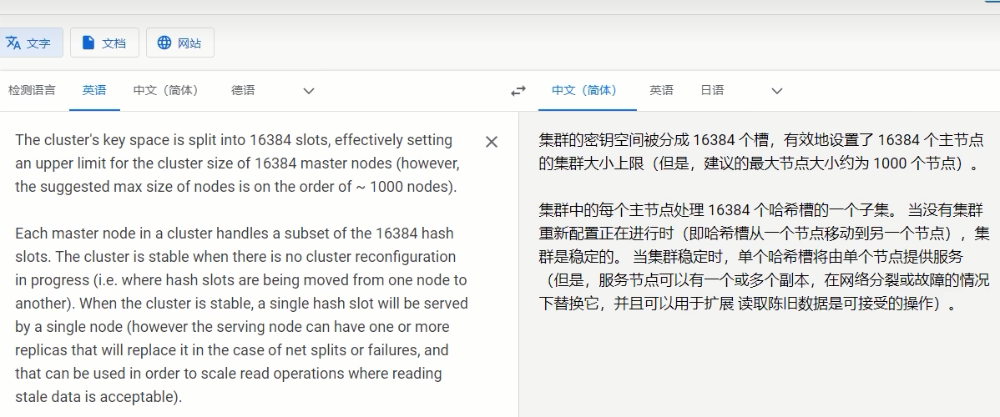

# 集群算法-分片-槽位slot

### 官网出处：

翻译说明：

### redis集群的槽位slot

Redis集群的数据分片

Redis集群没有使用一致性hash 而是引入了哈希槽的概念。

Redis集群有16384个哈希槽每个key通过CRC16校验后对16384取模来决定放置哪个槽，集群的每个节点负责一部分hash槽，举个例子，比如当前集群有3个节点，那么：

### redis集群的分片

| 分片是什么        | 使用Redis集群时我们会将存储的数据分散到多台redis机器上，这称为分片。简言之，集群中的每个Redis实例都被认为是整个数据的一个分片。 |
| ------------ | ---------------------------------------- |
| 如何找到给定key的分片 | 为了找到给定key的分片，我们对key进行CRC16(key)算法处理并通过对总分片数量取模。然后，$\textcolor{red}{\large使用确定性哈希函数}$，这意味着给定的key$\textcolor{red}{\large将多次始终映射到同一个分片}$，我们可以推断将来读取特定key的位置。 |

 ### 分片和槽位的优势

$\textcolor{blue}{\large 最大优势，方便扩缩容和数据分派查找}$

这种结构很容易添加或者删除节点，比如如果我想添加个节点D，我需要从节点A，B，C中得部分槽位到D上。如果我想一出节点A，需要将A中的槽移动到B和C节点上，然后将没有任何槽的节点从集群中移除即可。由于一个结点将哈希槽移动到另一个节点不会停止服务，所以无论添加删除或者改变某个节点的哈希槽的数量都不会造成集群不可用的状态。

