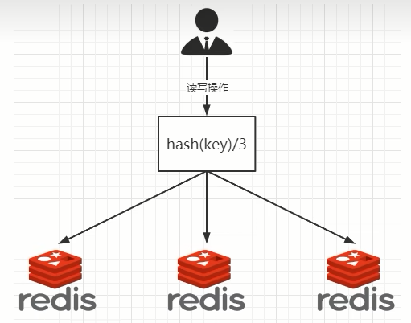
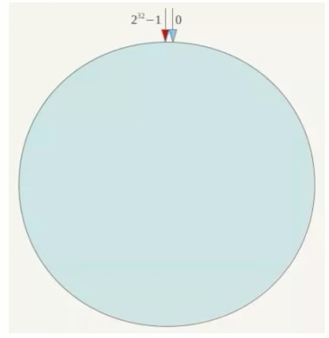
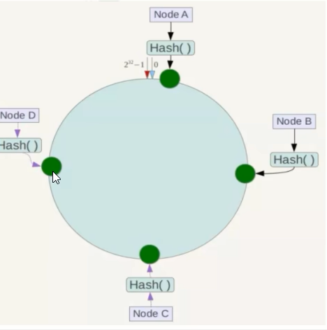
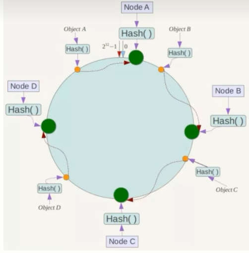
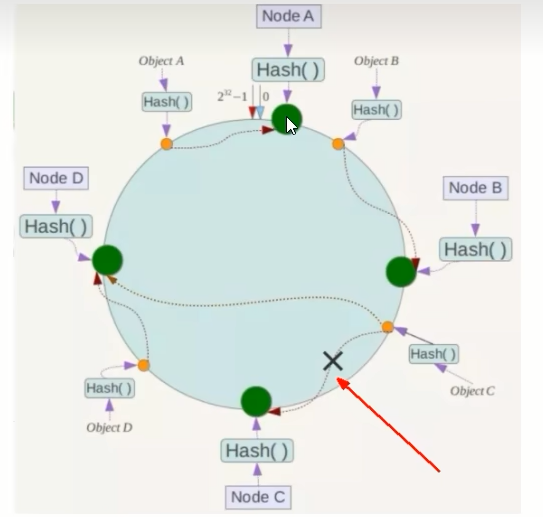
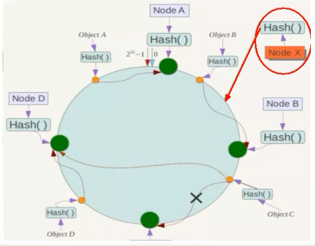
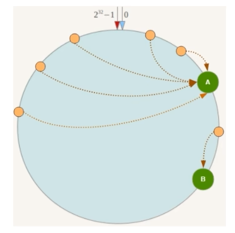
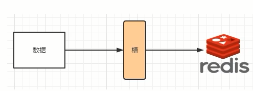

# slot槽位映射方案

slot槽位映射，一般业界有三种解决方案

1. 哈希取余分区(小厂)

   

   2亿条记录就是2亿个k,v，我们单机不行必须要分布式多机，假设有3台机器构成一个集群，用户每次读写操作都是根据公式：hash(key) % N个机器台数，计算出哈希值，用来决定数据映射到哪一个节点上。

   $\textcolor{blue}{\large 优点}$：简单粗暴，直接有效，只需要预估好数据规划好节点，例如3台、8台、10台，就能保证一段时间的数据 支撑。使用Hash算法让固定的一部分请求落到同一台服务器上，这样每台服务器固定处理一部分请求 (并维护这些请求的信息)， 起到负载均衡+分而治之的作用。

   $\textcolor{blue}{\large 缺点}$：原来规划好的节点，进行扩容或者缩容就比较麻烦了额，不管扩缩，每次数据变动导致节点有变动，映射关系需要重新进行计算，在服务器个数固定不变时没有问题，如果需要弹性扩容或故障停机的情况下，原来的取模公式就会发生变化: Hash(key)/3会 变成Hash(key) /?。此时地址经过取余运算的结果将发生很大变化，根据公式获取的服务器也会变得不可控。
   某个redis机器宕机了，由于台数数量变化，会导致hash取余全部数据重新洗牌。

2. 一致性哈希算法分区(中厂)

   - 是什么？

     一致性Hash算法背景是在1997年由麻省理工学院提出的，设计目标是**为了解决分布式缓存数据变动和映射问题**，某个机器宕机了，分母数量改变了，自然取余数不行了 

   - 能干嘛？

     提出一致性Hash解决方案。目的是当服务器个数发生变动时，尽量减少影响客户端到服务器的映射关系

   - 3大步骤

     $\textcolor{blue}{\large 算法构建一致性哈希环}$ 

     一致性哈希算法必然有个hash函数并按照算法产生hash值，这个算法的所有可能哈希值会构成一个全量集，这个集合可以成为一个hash空间[0,2^32-1]，这个是一个线性空间，但是在算法中，我们通过适当的逻辑控制将它首尾相连(O= 2^32),这样让它逻辑上形成了一个环形空间。
     它也是按照使用取模的方法，**前面笔记介绍的节点取模法是对节点（服务器）的数量进行取模。而一致性Hash算法是对2^32取模，简单来说，一致性Hash算法将整个哈希值空间组织成一个虚拟的圆环**，如假设某哈希函数H的值空间为0-2^32-1(即哈希值是一个32位无符号整形），整个哈希环如下图:整个空间**按顺时针方向组织**，圆环的正上方的点代表0，O点右侧的第一个点代表1，以此类推，2、3、4、……直到2^32-1，也就是说0点左侧的第一个点代表2^32-1，0和2个32-1在零点中方向重合，我们把这个由2^32个点组成的圆环称为Hash环。

     

     $\textcolor{blue}{\large 服务器IP节点映射}$ 

     将集群中各个IP节点映射到环上的某一个位置。
     将各个服务器使用Hash进行一个哈希，具体可以选择服务器的IP或主机名作为关键字进行哈希，这样每台机器就能确定其在哈希环上的位置。假如4个节点NodeA、B、C、D，经过IP地址的**哈希函数**计算(hash(ip))，使用IP地址哈希后在环空间的位置如下:

     

     $\textcolor{blue}{\large key落到服务器的落键规则}$ 

     当我们需要存储一个kv键值对时，首先计算key的hash值，hash(key)，将这个key使用相同的函数Hash计算出哈希值并确定此数据在环上的位置，**从此位置沿环顺时针“行走”**，第一台遇到的服务器就是其应该定位到的服务器，并将该键值对存储在该节点上。
     如我们有Object A、 Object B、 Object C. object D四个数据对象，经过哈希计算后，在环空间上的位置如下:根据一致性Hash算法，数据A会被定为到Node A上，B被定为到Node B上，C被定为到Node C上，D被定为到Node D上。

     

   - 优点

     $\textcolor{green}{\large 一致性哈希算法的容错性}$ ：假设Node C宕机，可以看到此时对象A、B、D不会受到影响。一般的，在一致性Hash算法中，如果一台服务器不可用，则受影响的数据仅仅是此服务器到其环空间中前一台服务悉**〈即沿着逆时针方向行走遇到的第一台服务器）之间数据**，其它不会受到影响。简单说，就是C挂了，受到影响的只是B、C之间的数据**且这些数据会转移到D进行存储**。

     

     $\textcolor{green}{\large 一致性哈希算法的扩展性}$ 

     数据量增加了，需要增加一台节点NodeX，X的位置在A和B之间，那收到影响的也就是A到X之间的数据，重新把A到X的数据录入到X上即可，不会导致hash取余全部数据重新洗牌。

     

   - 缺点

     $\textcolor{green}{\large 一致性哈希算法的数据倾斜问题}$ 

     一致性Hash算法在服务**节点太少时**，容易因为节点分布不均匀而造成**数据倾斜**（被缓存的对象大部分集中缓存在某一台服务器上)问题，例如系统中只有两台服务器:

     

   - 小总结

     为了在节点数目发生改变时尽可能少的迁移数据

     将所有的存储节点排列在收尾相接的Hash环上，每个key在计算Hash后会顺时针找到临近的存储节点存放。而当有节点加入或退出时仅影响该节点在Hash环上顺时针相邻的后续节点。

     $\textcolor{green}{\large 优点}$ ：加入和删除节点只影响哈希环中顺时针方向的相邻的节点，对其他节点无影响。

     $\textcolor{green}{\large 缺点}$ ：数据的分布和节点的位置有关，因为这些节点不是均匀的分布在哈希环上的，所以数据在进行存储时达不到均匀分布的效果。

3. $\textcolor{red}{\large 哈希槽分区}$(大厂)

   - 是什么？ HASH_SLOT = CRC16(key) mod 16384

     1. 为什么出现

        哈希槽实质就是一个数组，数组[0, 2^14 - 1]形成hash slot空间

     2. 能干什么

        解决均匀分配的问题，在$\textcolor{red}{\large 数据和节点之间又加入了一层，把这层称为哈希槽(slot)，用于管理数据和节点之间的关系}$，现在就相当于节点上放的是槽，槽里面放的是数据。

        槽解决的是粒度问题，相当于把粒度变大了，这样便于数据移动。哈希解决的是映射问题，使用key的哈希值来计算所在的槽，便于数据分配

     3. 多少个hash

        一个集群只能有16384个槽，编号0-16383(0-2^14-1)。这些槽会分配给集群中的所有主节点，分配策略没有要求。

        集群会记录节点和槽的对应关系，解决了节点和槽的关系后，接下来就需要对key求哈希值，然后对16384取模，余数是几key就落入对应的槽里。HASH_SLOT = CRC16(key) mod 16384。以槽为单位移动数据，因为槽的数目是固定的，处理起来比较容易，这样数据移动问题就解决了。

   - 哈希槽计算

