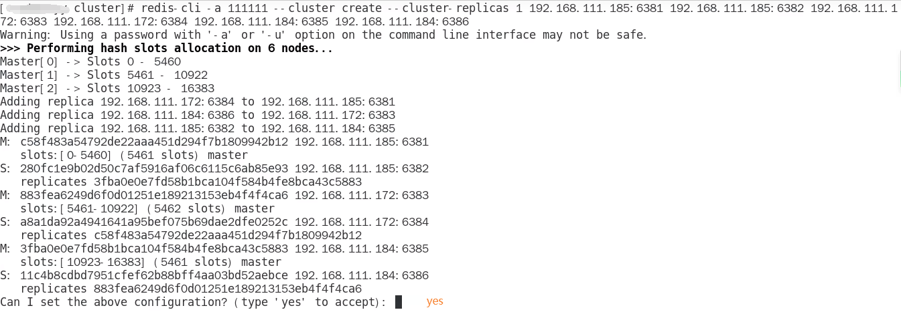
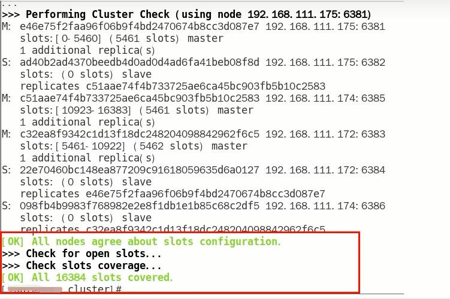
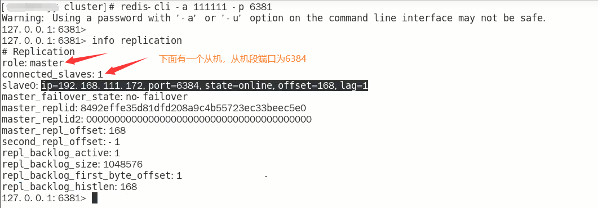
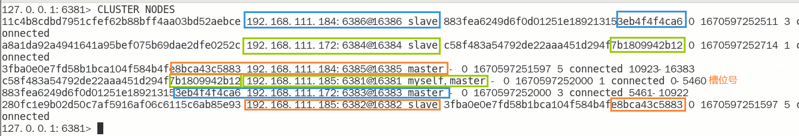
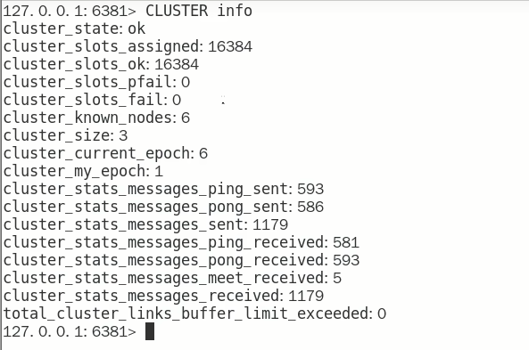

# 3主3从Redis集群配置

### 找3台真实虚拟机，各自新建

mkdir -p /myredis/cluster

### 新建6个独立的Redis实例服务

IP： 192.168.0.100 + 端口6381/6382

​	vim /myredis/cluster/redisCluster6381.conf

```conf
bind 0.0.0.0
daemonize yes
protected-mode no
port 6381
logfile "/myredis/cluster/cluster6381.log"
pidfile /myredis/cluster6381.pid
dir /myredis/cluster
dbfilename dump6381.rdb
appendonly yes
appendfilename "appendonly6381.aof"
requirepass 123456
masterauth 123456

cluster-enabled yes
cluster-config-file nodes-6381.conf
cluster-node-timeout 5000
```

​	vim /myredis/cluster/redisCluster6382.conf

IP：192.168.0.100 + 端口6383/6384

​	vim /myredis/cluster/redisCluster6383.conf

​	vim /myredis/cluster/redisCluster6384.conf

IP：192.168.0.100 + 端口6385/6386

​	vim /myredis/cluster/redisCluster6385.conf

​	vim /myredis/cluster/redisCluster6386.conf

启动6台主机实例

​	redis-server /myredis/cluster/redisCluster6381.conf

​	...

​	redis-server /myredis/cluster/redisCluster6386.conf

### 通过redis-cli 命令为6台机器构建集群关系

**构建主从关系命令**

```conf
// 一定要注意，此处要修改自己的IP为真实IP
redis-cli -a 123456 --cluster create --cluster-replicas 1 192.168.111.175:6381 192.168.111.175:6382 192:168.111.172:6383 192.168.111.172:6384 192.168.111.174:6385 192.168.111.174:6386
```

--cluster- replicas 1 表示为每个master创建一一个slave节点



**一切OK的话，3主3从搞定**



### 6381作为切入点，查看并检验集群状态

**连接进6381作为切入点，$\textcolor{red}{\large 查看节点状态}$**



**cluster nodes**



**CLUSTER INFO**




