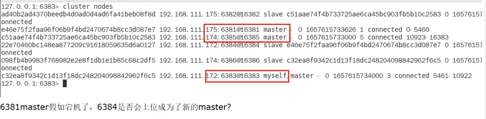
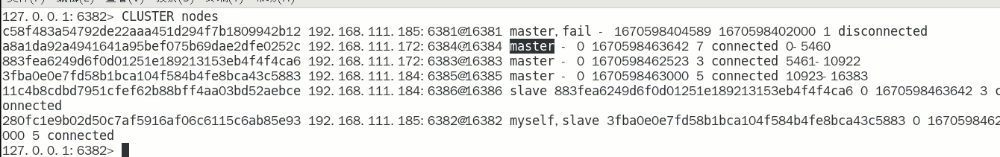
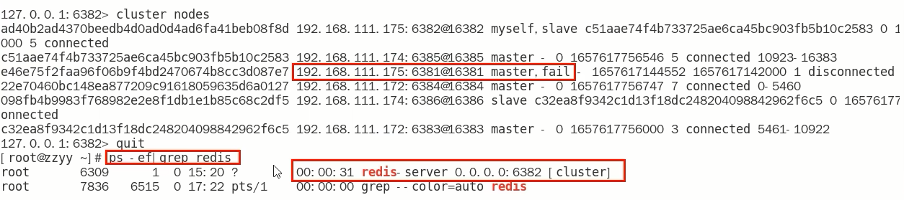
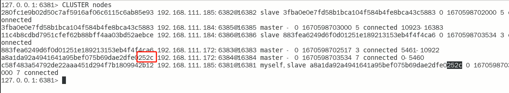
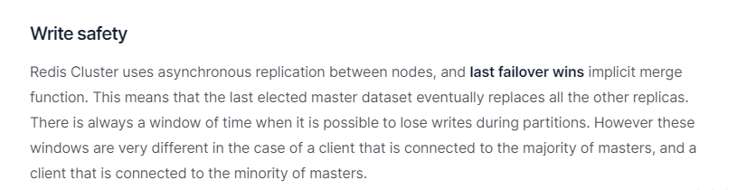
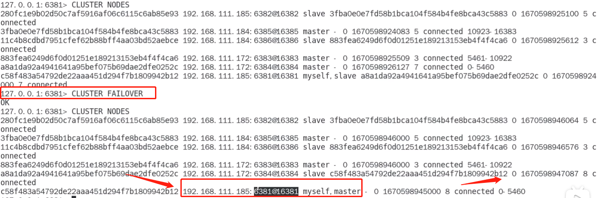

# 主从容错切换迁移

### 容错切换迁移

- 主6381和从机切换，先停止主机6381

  6381主机停了，对应的真实从机上位

  6381作为1号主机分配的从机以实际情况为准，具体是几号机器就是几号机器

- 再次查看集群信息，本次6381主6384从

  

- 停止主机6381，再次查看集群信息

  

  6384成功上位

- 随后，6381原来的主机回来了，是否会上位？

  恢复前：

  恢复后：

  $\textcolor{red}{\large 6381不会上位并以从节点形式回归}$

### 集群不保证数据一致性100%OK，是会有数据丢失的情况

Redis集群不保证强一致性这意味着在特定的条件下，Redis集群可能会丢掉一些被系统收到的写入请求命令

### 手动故障转移or节点从属调整该如何处理

上面6381宕机后，6381鸡儿6384主从对调了，和原始设计图不一样了,该如何调换主从位置呢

重新登录6381机器 

常用命令：cluster failover

