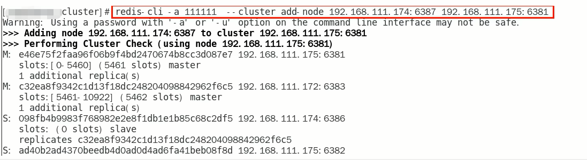
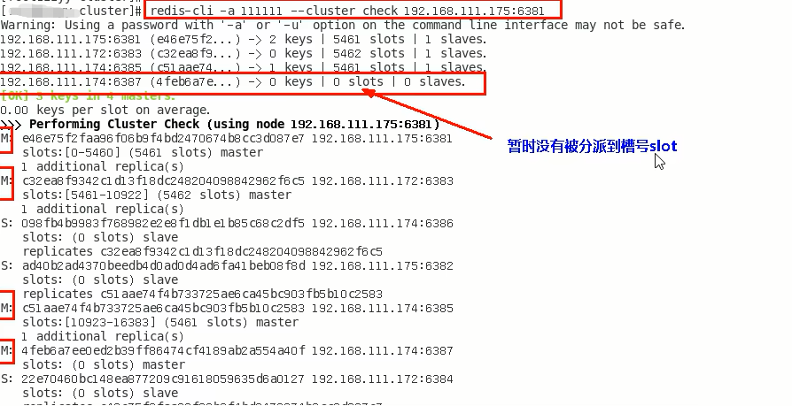
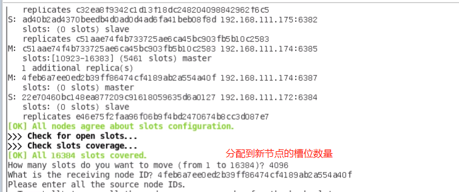
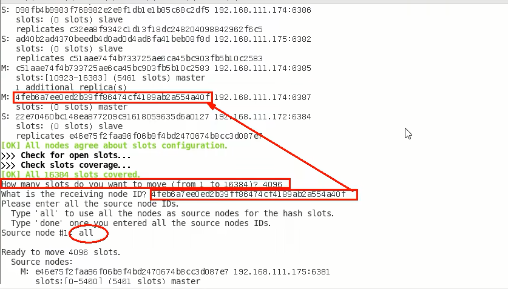

# 主从扩容缩容案例

### 新建6387、6388两个服务实例配置文件+新建后启动

IP：192.168.11.174+端口6387/端口6388

vim /myredis/cluster/redisCluster6387.conf

vim /myredis/cluster/redisCluster6388.conf

### 启动87/88两个新的节点实例，此时他们自己都是master

redis-server /myredis/cluster/redisCluster6387.conf

redis-server /myredis/cluster/redisCluster6388.conf

### 将新增的6387节点(空槽位)作为master节点加入集群

将新增的6387作为master节点加入原有集群

redis-cli -a 密码 --cluster $\textcolor{red}{\large add-node}$ 自己实际IP地址:$\textcolor{blue}{\large 6387}$ 自己实际IP地址:$\textcolor{red}{\large 6381}$

6387就是将要作为master新增节点
6381 就是原来集群节点里面的领路人，相当于6387拜拜6381的码头从而找到组织加入集群redis-cli -a 111111 --cluster add-node 192.168.111.174:6387 192.168.111.175:6381

### 检查集群情况第一次

redis-cli -a 密码 --cluster check 真实ip地址:6381

例如：redis-cli -a 123456--cluster check 192.168.111.175:6381

### 重新分派槽位( $\textcolor{red}{\large reshard}$)

重新分派槽号
命令:redis-cli -a 密码 --cluster reshard IP地址:端口号

redis-cli -a 123456 --cluster reshard 192.168.111.175:6381

