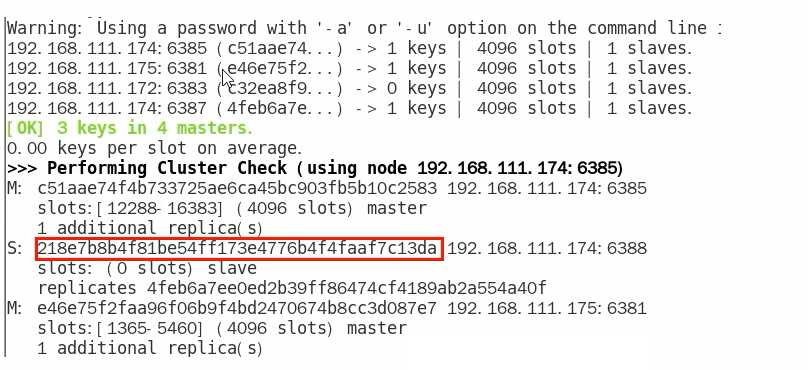
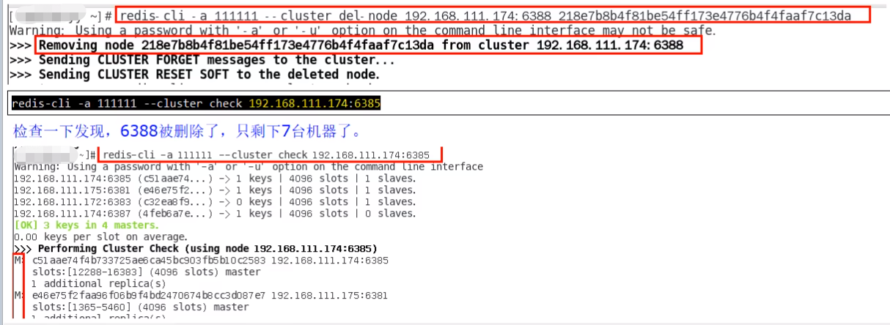
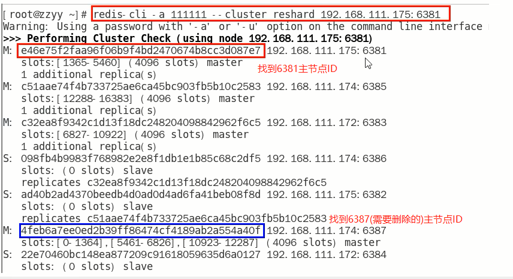
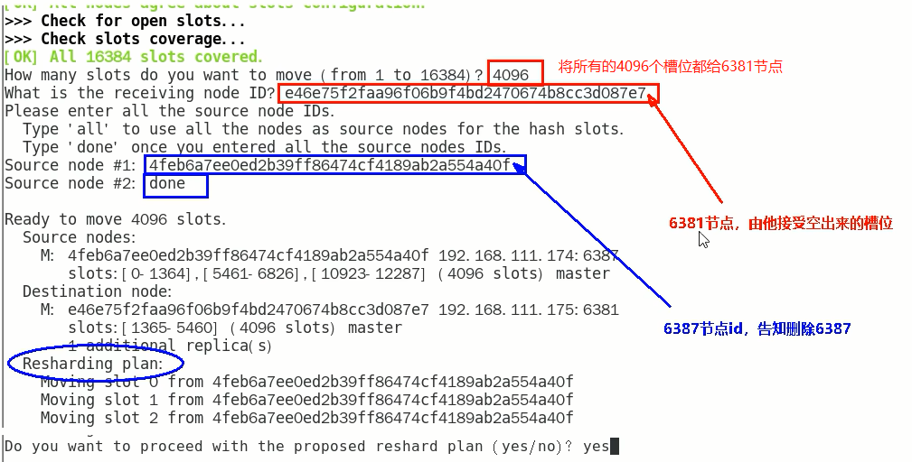
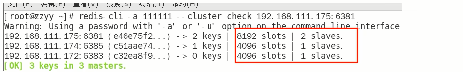
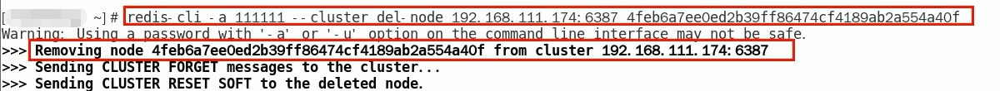
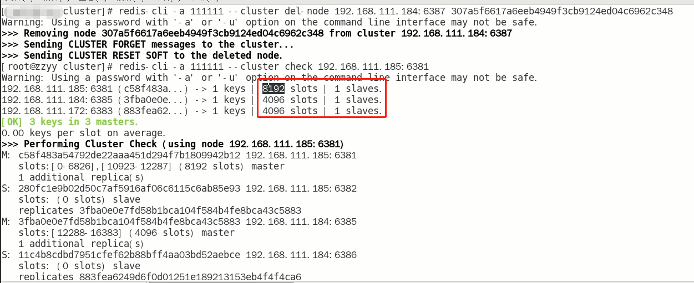

# 主从缩容案例

### 目的：6387和6388下线

- 检查集群情况第一次，先获得从节点6388的节点ID

  redis-cli -a 123456 --cluster check 192.168.111.174:6388

- 从集群中将4号结点6388删除

  redis-cli -a 123456 --cluster del-node 192.168.111.174:6388 218e7b8b4f81be54ff173e4776b4f4faaf7c13da

  

- 将6387的槽号清空，重新分配，本例将清出来的槽号都给6381

  redis-cli -a 123456 --cluster reshard 192.168.111.175:6381

  

  

- 检查集群情况第二次

  redis-cli -a 123456 --cluster check 192.168.111.175:6381

  4096个槽位都指给6381，它变成了8192个槽位，相当于全部都给6381了，不然要输入三次 Source node

  

- 将6387删除

  redis-cli -a 123456 --cluster del-node 192.168.111.174:6387 307a5f6617a6eeb4949f3cb9124ed04c6962c348

  

- 检查集群情况第三次 6387/6388被彻底删除

  redis-cli -a 123456 --cluster check 192.168.111.174:6381

  

