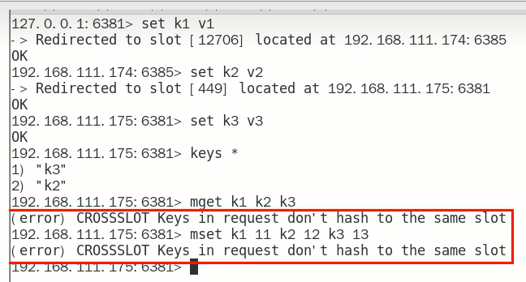
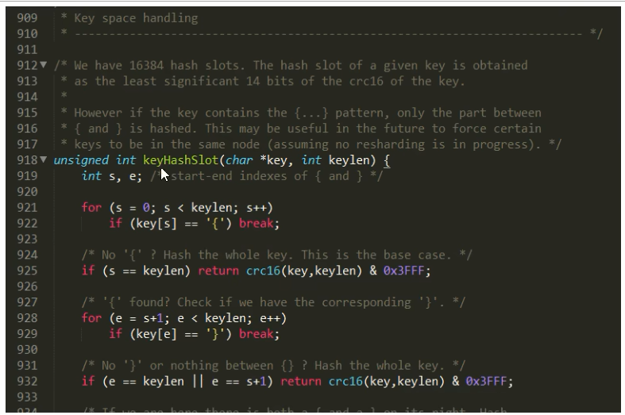

# 集群常用操作命令和CRC16算法分析

### 不在同一个slot槽位下的多键操作支持不好，通识占位符登场

不在同一个slot槽位下的键值无法使用mset、mget等多键操作

可以通过{}来定义同一个组的概念，使key中{}内相同内容的键值对放到一个slot槽位去，对照下图类似k1k2k3都映射为x，自然槽位一样

### Redis集群有16384个哈希槽，每个key通过CRC16校验后对16384取模来决定放置哪个槽。集群的每个节点负责一部分hash槽。

**CRC16源码浅谈**

cluster.c源码分析一下

### 常用命令

- 集群是否完整才能对外提供服务

  

  | 默认YES，现在集群架构是3主3从的redis cluster由3个master平分16384个slot，每个master的小集群负责1/3的slot，对应一部分数据。cluster-require-full-coverage:默认值yes，即需要集群完整性，方可对外提供服务通常情况，如果这3个小集群中，任何一个(1主1从）挂了，你这个集群对外可提供的数据只有2/3了，整个集群是不完整的， redis默认在这种情况下，是不会对外提供服务的。 |
  | ---------------------------------------- |
  | 如果你的诉求是，集群不完整的话也需要对外提供服务，需要将该参数设置为no，这样的话你挂了的那个小集群是不行了，但是其他的小集群仍然可以对外提供服务。 |

  cluster-require-full-coverage

- CLUSTER COUNTKEYSINSLOT 槽位数字编号

  CLUSTER COUNTKEYSINSLOT 12706

  返回结果：

  ​	1 该槽位被占用

  ​	0 该槽位没有被占用

- CLUSTER KEYSLOT 键名称

  CLUSTER KEYSLOT k1

  返回对应key的槽位数据，key不存在则返回0

