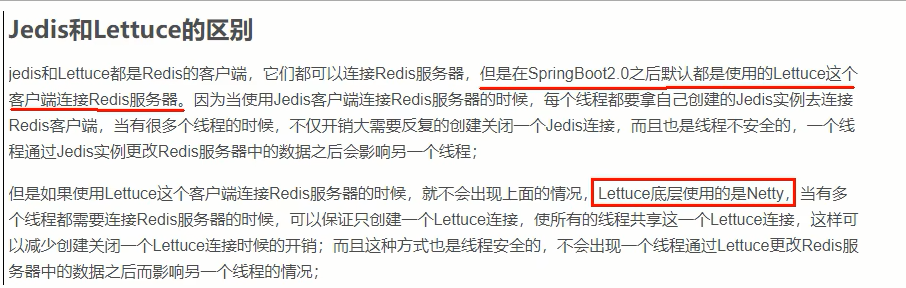

# SpringBoot集成Redis简介

### 总体概述

jedis-lettuce-RedisTemplate三者的联系

### 本地Java连接Redis常见问题，小白注意

1. bind配置请注释掉
2. 保护模式设置为no
3. Linux系统的防火墙设置
4. Redis服务器的IP地址和密码是否正确
5. 忘记写访问redis的服务端口号和auth密码

### 集成Jedis

是什么：Jedis Client是Redis官网推荐的一个面向Java客户端，库文件实现了对各类API进行封装调用

步骤：

1. 建module

2. 改pom

   ```pom
   <?xml version="1.0" encoding="UTF-8"?>
   <project xmlns="http://maven.apache.org/POM/4.0.0" xmlns:xsi="http://www.w3.org/2001/XMLSchema-instance"
            xsi:schemaLocation="http://maven.apache.org/POM/4.0.0 https://maven.apache.org/xsd/maven-4.0.0.xsd">
       <modelVersion>4.0.0</modelVersion>
       <parent>
           <groupId>org.springframework.boot</groupId>
           <artifactId>spring-boot-starter-parent</artifactId>
           <version>2.7.11</version>
           <relativePath/> <!-- lookup parent from repository -->
       </parent>
       <groupId>com.luojia</groupId>
       <artifactId>redis7_study</artifactId>
       <version>0.0.1-SNAPSHOT</version>
       <name>redis7_study</name>
       <description>Demo project for Spring Boot</description>
       <properties>
           <project.build.sourceEncoding>UTF-8</project.build.sourceEncoding>
           <maven.compiler.source>1.8</maven.compiler.source>
           <maven.compiler.target>1.8</maven.compiler.target>
           <junit.version>4.12</junit.version>
           <log4j.version>1.2.17</log4j.version>
           <lombok.version>1.16.18</lombok.version>
       </properties>

       <dependencies>
           <!--SpringBoot 通用依赖模块-->
           <dependency>
               <groupId>org.springframework.boot</groupId>
               <artifactId>spring-boot-starter-web</artifactId>
           </dependency>
           <!-- jedis -->
           <dependency>
               <groupId>redis.clients</groupId>
               <artifactId>jedis</artifactId>
               <version>4.3.1</version>
           </dependency>
           <!-- 通用基础配置 -->
           <dependency>
               <groupId>junit</groupId>
               <artifactId>junit</artifactId>
               <version>${junit.version}</version>
           </dependency>
           <dependency>
               <groupId>log4j</groupId>
               <artifactId>log4j</artifactId>
               <version>${log4j.version}</version>
           </dependency>
           <dependency>
               <groupId>org.projectlombok</groupId>
               <artifactId>lombok</artifactId>
               <version>${lombok.version}</version>
           </dependency>

           <dependency>
               <groupId>org.springframework.boot</groupId>
               <artifactId>spring-boot-starter-test</artifactId>
               <scope>test</scope>
           </dependency>
       </dependencies>
       <build>
           <plugins>
               <plugin>
                   <groupId>org.springframework.boot</groupId>
                   <artifactId>spring-boot-maven-plugin</artifactId>
               </plugin>
           </plugins>
       </build>
   </project>
   ```

3. 写YML

   ```yaml
   server.port=7777
   spring.application.name=redis7_study
   ```

4. 主启动

5. 业务类

### 集成letter

1. 是什么

   Lettuce是一个Redis的Java驱动包，Lettuce翻译为生菜，就是吃的那种生成，所以它的logo如下：


2. lettuce VS Jedis

   


