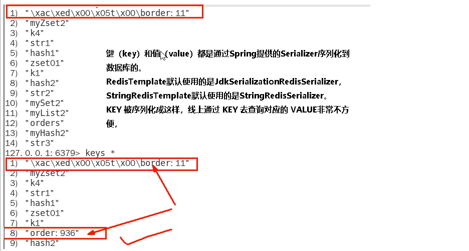
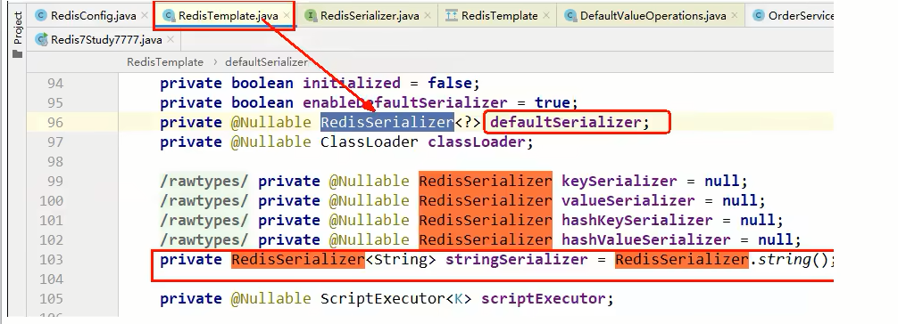
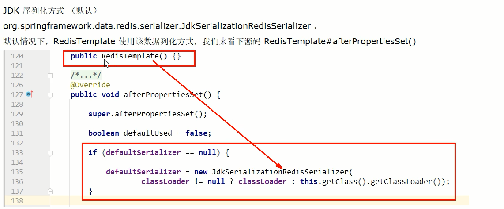

# RedisTemplate-推荐使用

### 连接单机

boot整合Redis基础演示

建module

改pom

```xml
<!-- SpringBoot 与Redis整合依赖 -->
        <dependency>
            <groupId>org.springframework.boot</groupId>
            <artifactId>spring-boot-starter-data-redis</artifactId>
        </dependency>
        <dependency>
            <groupId>org.apache.commons</groupId>
            <artifactId>commons-pool2</artifactId>
        </dependency>
        <!-- swagger2 -->
        <dependency>
            <groupId>io.springfox</groupId>
            <artifactId>springfox-swagger2</artifactId>
            <version>2.9.2</version>
        </dependency>
        <dependency>
            <groupId>io.springfox</groupId>
            <artifactId>springfox-swagger-ui</artifactId>
            <version>2.9.2</version>
        </dependency>
```

写YML

```yam
server.port=7777

spring.application.name=redis7_study

# ===========================logging===========================
logging.level.root=info
logging.1evel.com.luojia.redis7_study.redis7=info
1ogging.pattern.console=%d{yyyy-MM-dd HH:m:ss.SSS} [%thread] %-5level %1ogger- %msg%n

1ogging.file.name=F:\workspace\数据结构和算法\Learning-in-practice\Redis\redis7-study
1ogging.pattern.fi1e=%d{yyyy-MM-dd HH:mm:ss.SSS} [%thread] %-5level %logger- %msg%n

# ===========================swagge===========================
spring.swagger2.enabled=true
#在springboot2.6.X结合swagger2.9.X会提示documentationPluginsBootstrapper空指针异常，
#原因是在springboot2.6.X中将SpringMVC默认路径匹配策略MAntPathMatcher更改为athPatternParser,
#导致出错，解决办法是matching-strategy 切换回之前ant_path_matcher
spring.mvc.pathmatch.matching-strategy=ant_path_matcher

# ===========================redis单机===========================
spring.redis.database=0
#修改为自己真实IP
spring.redis.host=127.0.0.1
spring.redis.port=6379
spring.redis.password=123456
spring.redis.lettuce.pool.max-active=8
spring.redis.1ettuce.pool.max-wait=-1ms
spring.redis.1ettuce.pool.max-idle=8
spring.redis.lettuce.pool.min-idle=0
```

主启动

业务类

- 配置类

  ```java
  package com.luojia.redis7_study.config;

  import org.springframework.context.annotation.Bean;
  import org.springframework.context.annotation.Configuration;
  import org.springframework.data.redis.connection.lettuce.LettuceConnectionFactory;
  import org.springframework.data.redis.core.RedisTemplate;
  import org.springframework.data.redis.serializer.GenericJackson2JsonRedisSerializer;
  import org.springframework.data.redis.serializer.StringRedisSerializer;

  @Configuration
  public class RedisConfig {

      /**
       * *redis序列化的工具定置类，下面这个请一定开启配置
       * *127.0.0.1:6379> keys *
       * *1) “ord:102” 序列化过
       * *2)“\xaclxedlxeelx05tixeelaord:102” 野生，没有序列化过
       * *this.redisTemplate.opsForValue(); //提供了操作string类型的所有方法
       * *this.redisTemplate.opsForList();// 提供了操作List类型的所有方法
       * *this.redisTemplate.opsForset(); //提供了操作set类型的所有方法
       * *this.redisTemplate.opsForHash(); //提供了操作hash类型的所有方认
       * *this.redisTemplate.opsForZSet(); //提供了操作zset类型的所有方法
       * param LettuceConnectionFactory
       * return
       */
      @Bean
      public RedisTemplate<String, Object> redisTemplate(LettuceConnectionFactory lettuceConnectionFactory) {
          RedisTemplate<String,Object> redisTemplate = new RedisTemplate<>();
          redisTemplate.setConnectionFactory(lettuceConnectionFactory);
          // 设置key序列化方式string
          redisTemplate.setKeySerializer(new StringRedisSerializer());
          // 设置value的序列化方式json，使用GenericJackson2JsonRedisSerializer替换默认序列化
          redisTemplate.setValueSerializer(new GenericJackson2JsonRedisSerializer());

          redisTemplate.setHashKeySerializer(new StringRedisSerializer());
          redisTemplate.setHashValueSerializer(new GenericJackson2JsonRedisSerializer());
          redisTemplate.afterPropertiesSet();
          return redisTemplate;
      }
  }
  ```

  ```java
  package com.luojia.redis7_study.config;

  import org.springframework.beans.factory.annotation.Value;
  import org.springframework.context.annotation.Bean;
  import org.springframework.context.annotation.Configuration;
  import springfox.documentation.builders.ApiInfoBuilder;
  import springfox.documentation.builders.PathSelectors;
  import springfox.documentation.builders.RequestHandlerSelectors;
  import springfox.documentation.service.ApiInfo;
  import springfox.documentation.spi.DocumentationType;
  import springfox.documentation.spring.web.plugins.Docket;
  import springfox.documentation.swagger2.annotations.EnableSwagger2;

  import java.time.LocalDate;
  import java.time.format.DateTimeFormatter;

  @Configuration
  @EnableSwagger2
  public class SwaggerConfig {

      @Value("${spring.swagger2.enabled}")
      private Boolean enabled;

      @Bean
      public Docket createRestApi() {
          return new Docket (DocumentationType.SWAGGER_2)
                  .apiInfo(apiInfo())
                  .enable(enabled)
                  .select()
                  .apis(RequestHandlerSelectors.basePackage("com.luojia.redis7_study.config")) //你自己的package
                  .paths (PathSelectors.any())
                  .build();

      }

      public ApiInfo apiInfo() {
          return new ApiInfoBuilder()
                  .title("springboot利用swagger2构建api接口文档 "+"\t"
                          + DateTimeFormatter.ofPattern("yyyy-MM-dd").format(LocalDate.now()))
                  .description( "springboot+redis整合" )
                  .version("1.0")
                  .termsOfServiceUrl("https://github.com/Romantic-Lei")
                  .build();
      }

  }
  ```

- service

  ```java
  package com.luojia.redis7_study.service;

  import lombok.extern.slf4j.Slf4j;
  import org.springframework.beans.factory.annotation.Autowired;
  import org.springframework.data.redis.core.RedisTemplate;
  import org.springframework.stereotype.Service;

  import java.util.UUID;
  import java.util.concurrent.ThreadLocalRandom;

  @Service
  @Slf4j
  public class OrderService {

      @Autowired
      private RedisTemplate redisTemplate;

      public static final String ORDER_KEY="ord:";

      public void addOrder() {
          int keyId = ThreadLocalRandom.current().nextInt(1000) + 1;
          String serialNo = UUID.randomUUID().toString();
          String key = ORDER_KEY+keyId;
          String value = "JD" + serialNo;
          redisTemplate.opsForValue().set(key, value);
          log.info("***key:{}", key);
          log.info("***value:{}", value);

      }

      public String getOrderById(Integer keyId) {
          return (String)redisTemplate.opsForValue().get(ORDER_KEY+keyId);
      }
  }
  ```

- controller

  ```java
  package com.luojia.redis7_study.controller;

  import com.luojia.redis7_study.service.OrderService;
  import io.swagger.annotations.Api;
  import io.swagger.annotations.ApiOperation;
  import io.swagger.models.auth.In;
  import lombok.extern.slf4j.Slf4j;
  import org.springframework.beans.factory.annotation.Autowired;
  import org.springframework.web.bind.annotation.GetMapping;
  import org.springframework.web.bind.annotation.PostMapping;
  import org.springframework.web.bind.annotation.RestController;

  @RestController
  @Slf4j
  @Api(tags="订单接口")
  public class OrderController {

      @Autowired
      private OrderService orderService;

      @ApiOperation("新增订单")
      @PostMapping("/order/add")
      public void addOrder() {
          orderService.addOrder();
      }

      @ApiOperation("根据keyId查询订单")
      @GetMapping("/order/query")
      public String queryOrder(Integer keyId) {
          return orderService.getOrderById(keyId);
      }

  }
  ```

测试：

项目启动，连接swagger：http://localhost:7777/swagger-ui.html

$\textcolor{red}{\large 序列化问题}$：

为什么会这样？



RedisTemplate使用的是JDK序列化方式（默认）惹的祸




