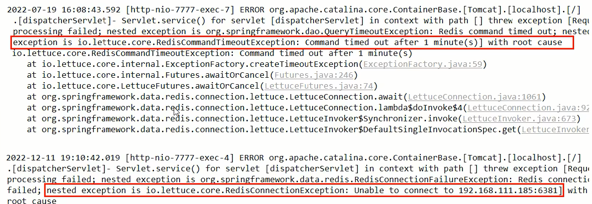
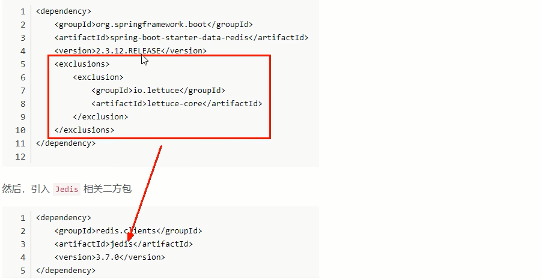
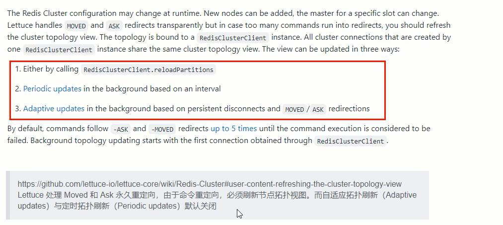

# RedisTemplate连接集群

- 启动Redis集群6台实例

- 第一次改写YML

  ```yaml
  # ===========================redis集群===========================
  spring.redis.password=123456
  # 获取失败 最大重定向次数
  spring.redis.cluster.max-redirects=3
  spring.redis.lettuce.pool.max-active=8
  spring.redis.1ettuce.pool.max-wait=-1ms
  spring.redis.1ettuce.pool.max-idle=8
  spring.redis.lettuce.pool.min-idle=0
  spring.redis.cluster.nodes=192.168.111.175:6381,192.168.111.175:6382,192.168.111.176:6383,192.168.111.176:6384
  ```


- 直接通过微服务访问Redis集群

  一切正常 （http://localhost:7777/swagger-ui.html）

- $\textcolor{red}{\large 问题来了}$

  1. 人为模拟，master-6381机器意外宕机，手动shutdown

  2. 先对redis集群用命令的方式，手动验证各种读写命令，看看6384是否上位

  3. Redis Cluster集群能自动感知并自动完成主备切换，对应的slave6384会被选举为新的master节点

  4. 通过redis客户端连接6384可以正常进行读写操作

  5. $\textcolor{green}{\large 微服务客户端再次读写访问试试}$

     - 故障现象

       SpringBoot客户端没有动态感知RedisCluster的最新集群信息

       金典故障 

       【故障演练】 Redis Cluster集群部署采用了3主3从拓扑结构，数据读写访问master节点，slave节点负责备份。$\textcolor{red}{\large 当master宕机主从切换成功，redis手动OK，but 2个经典故障}$

       

     - 导致原因
       SpringBoot 2.X版本，Redis默认的连接池采用Lettuce，当Redis集群节点发生变化后，Letture默认是不会刷新节点拓扑

     - 解决方案

       1. 排除lettuce采用Jedis（不推荐）

          

       2. 重写连接工厂实例（极度不推荐）

       3. 刷新节点集群拓扑动态感应

          

          解决方法：

          - 调用 RedisClusterClient.reloadPartitions
          - 后台基于时间间隔的周期刷新
          - 后台基于持续的 **断开** 和 **移动**、**重定向** 的自适应更新

     - ​

  ​


