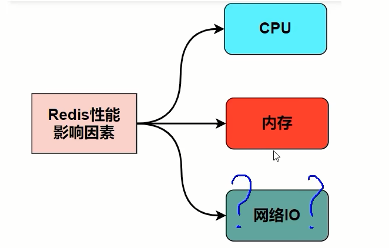
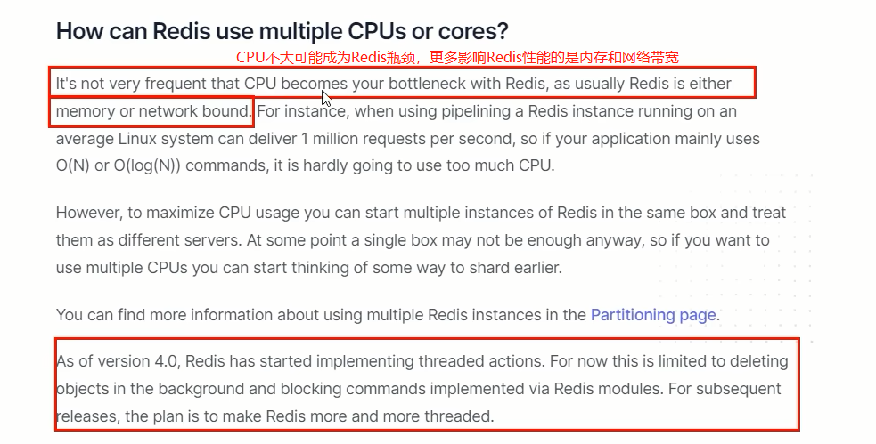
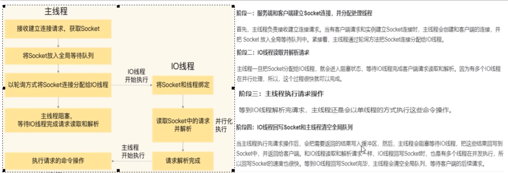
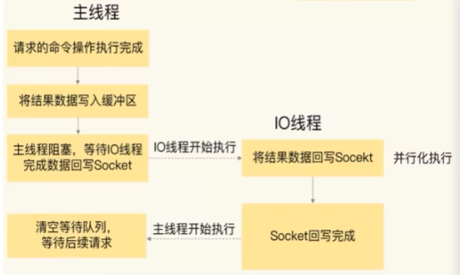

# redis6/7的多线程特性和IO多路复用入门

### 对于Redis$\textcolor{red}{\large 主要的性能瓶颈是内存或者网络带宽而并非 CPU。}$

### 所以Redis的瓶颈可以初步定为：网络IO

- $\textcolor{red}{\large redis6/7，真正的多线程登场}$

  $\textcolor{red}{在Redis6/7中，非常受关注的第一个新特性就是多线程。}$

  这是因为，Redis一直被大家熟知的就是它的单线程架构，虽然有些命令操作可以用后台线程或子进程执行(比如数据删除、快照生成、AOF重写)但是，从网络IO处理到实际的读写命令处理，都是由单个线程完成的。

  随着网络硬件的性能提升，Redis的性能瓶颈有时会出现在网络IO的处理上，也就是说，单个主线程处理网络请求的速度跟不上底层网络硬件的速度

  为了应对这个问题:

  $\textcolor{red}{采用多个IO线程来处理网络请求，提高网络请求处理的并行度，Redis6/7就是采用的这种方法。}$

  但是，Redis的多IO线程只是用来处理网络请求的，**对于读写操作命今Redis仍然使用单线程来处理**。这是因为，Redis处理请求时，网络处理经常是瓶颈，通过多个IO线程并行处理网络操作，可以提升实例的整体处理性能。而继续使用单线程执行命今换作，就不用为了保证Lua脚本、事各的原子性，额外开发多线程$\textcolor{red}{互斥加锁机制了(不管加锁操作处理)}$，这样一来，Redis线程模型实现就简单了

- 主线程和IO线程怎么协作完成请求处理的-精讲

  四个阶段：

  

  

### Unix网络编程中的五种IO模型

- Blocking IO - 阻塞IO

- NoneBlocking IO - 非阻塞IO

- IO multiplexing - IO 多路复用 

  - Linux世界一切皆是文件

    文件描述符，简称FD，句柄

    FileDescriptor：文件描述符 (File descriptor)是计算机科学中的一个术语，是一个用于表述指向文件的引用的抽象化概念。文件描述符在形式上是一个非负整数。实际上，它是一个索引值，指向内核为每一个进程所维护的该进程打开文件的记录表。当程序打开一个现有文件或者创建一个新文件时，内核向进程返回一个文件描述符。在程序设计中，文件描述符这一概念往往只适用于UNIX、Linux这样的操作系统。

  - 首次浅谈IO多路复用，IO多路复用是什么

    一种同步的IO模型，实现一个线程监视多个文件句柄,一旦某个文件句柄就绪就能够通知到对应应用程序进行相应的读写操作，没有文件句柄就绪时就会阻塞应用程序从而释放CPU资源

    概念：

    l/O：网络I/O，尤其在操作系统层面指数据在内核态和用户态之间的读写操作

    多路：多个客户端连接(连接就是套接字描述符，即 socket 或者 channel)

    复用：复用一个或几个线程
    lO多路复用：也就是说一个或一组线程处理多个TCP连接，使用单进程就能够实现同时处理多个客户端的连接，无需创建或者维护过多的进程/线程
    一句话：一个服务端进程可以同时处理多个套接字描述符。
    实现IO多路复用的模型有3种: 可以分select->poll->epoll三个阶段来描述。

  - ​

- signal driven IO - 信号驱动IO

- asynchronous IO - 异步IO

### 场景体验，说人话引出epoll

- 场景解析

  模拟一个tcp服务器处理30个客户socket。
  假设你是一个监考老师，让30个学生解答一道竞赛考题，然后负责验收学生答卷，你有下面几个选择:
  第一种选择(轮询)：按顺序逐个验收，先验收A，然后是B，之后是C、D。。。这中间如果有一个学生卡住，全班都会被耽误,你用循环挨个处理socket，根本不具有并发能力。
  第二种选择(来一个new一个，1对1服)：你创律30个分身线程，每个分身线程检查一个学生的答案是否正确。这种类似于为每一个用户创建一个进程或者线程处理连接。
  第三种选择(响应式处理，1对多服务)：你站在讲台上等，谁解答完谁举手。这时C、D举手，表示他们解答问题完毕，你下去依次检查C、D的答案然后继续回到讲台上等] 此时E、A又举手，然后去处理E和A。。。这种就是IO复用模型。 Linux下的select、poll和epoll就是干这个的。

- IO多路复用模型，简单明了版理解

  将用户socket对应的文件描述符(FileDescriptor)注册进epoll，然后epoll帮你监听哪些socket上有消息到达，这样就避免了大量的无用操作。此时的socket应该采用非阻塞模式。这样，整个过程只在调用select、poll、epoll这些调用的时候才会阻塞，收发客户消息是不会阻塞的，整个进程或者线程就被充分利用起来，这就是事件驱动，所谓的reactor反应模式。

  

  在单个线程通过记录跟踪每一个Sockek(I/0流)的状态来同时管理多个I/0流，一个服务端进程可以同时处理多个套接字描述符。
  目的是尽量多的提高服务器的吞吐能力。
  大家都用过nginx，nginx使用epoll接收请求，ngnix会有很多链接进来，epoll会把他们都监视起来，然后像拨开关一样，谁有数据就拨向谁然后调用相应的代码处理。redis类似同理，这就是IO多路复用原理，有请求就响应，没请求不打扰。

  ### 小总结

  只使用一个服务端进程可以同时处理多个套接字描述符连接

  ​

