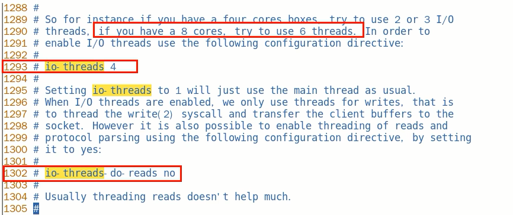

# Redis7是否开启了多线程

#### 如果你在实际应用中，发现Redis实例的<font color = red>CPU开销不大但吞吐量却没有提升</font>，可以考虑使用Redis7的多线程机制，加速网络处理，进而提升实例的吞吐量

```text
Redis7将所有数据放在内存中，内存的响应时长大约为100纳秒，对于小数据包，Redis服务器可以处理8W到10W的QPS。

这也是Redis处理的极限了，对于80%的公司来说，单线程的Redis已经足够使用了。
```




1. 设置io-thread-do-reads配置项为yes，表示启动多线程。
2. 设置线程个数。关于线程数的设置，官方的建议是如果为4核的CPU，建议线程数设置为2或3，如果为8核CPU建议线程数设置为6，安程数一定要小于机器核数，线程数并不是越大越好。

### 总结：

Redis自身出道就是优秀，基于内存操作、数据结构简单、多路复用和非阻塞I/O、避免了不必要的线程上下文切换等特性，在单线程的环境下依然很快；

但对于大数据的 key删除还是卡顿厉害，因此在Redis 4.0引入了多线程unlink key/flushall async等命令，主要用于Redis 数捷的异步删除；

而在Redis6/7中引入了I/0多线程的读写，这样就可以更加高效的处理更多的任务了，<font color = blue>Redis只是将I/O读写变成了多线程，而命令的执行依旧是由主线程串行执行的</font>，因此在多线程下操作 Redis不会出现线程安全的问题。

<font color = red>Redis无论是当初的单线程设计，还是如今与当初设计相背的多线程，目的只有一个:让 Redis变得越来越快。</font>


