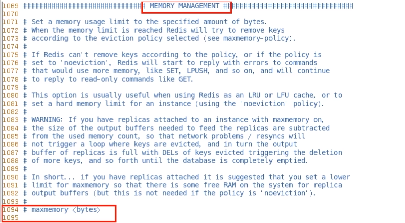
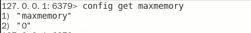
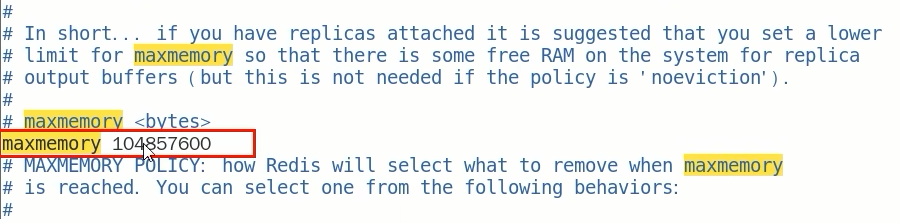
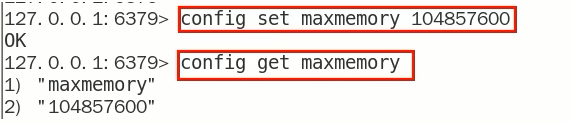
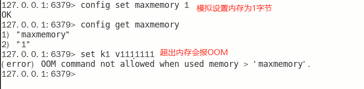

### redis默认内存是多少？在哪查看？如何设置修改？

- **查看Redis最大占用内存**

  

  打开redis配置文件，设置maxmemory参数，maxmemory是bytes字节类型，注意类型转换。

  通过命令查看默认的内存大小

  

  默认内存大小为0吗？那我们之前的数据是怎么保存进去的？

- **redis默认内存多少可用？**

  如果不设置最大内存或者设置最大内存大小为0，在64位操作系统下不限制内存大小，在32位操作系统下最多使用3GB内存

  注意：在64bit系统下，maxmemory设置为0表示不限制redis内存使用

- **一般生产上你如何配置**

  一般推荐Redis设置内存为最大物理内存的3/4

- **如何修改redis内存设置**

  通过修改文件配置

  

  通过命令修改，但是redis重启后会失效

  

- 什么命令查看redis内存使用情况

  info memory

  config get maxmemory

### 内存打满了，超出了设置的最大值会怎么样？

### 结论

设置了maxmemory的选项，假如redis内存使用达到了上限，没有加上过期时间就会导致数据写满maxmemory，为了避免类似情况，需要使用内存淘汰策略

