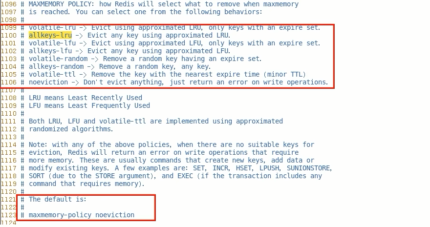
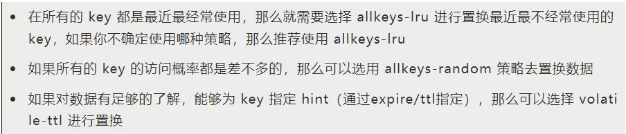

### redis配置文件

在MEMORY MANAGEMENT中

### LRU和LFU算法的区别是什么

LRU：最近最少使用页面置换算法，淘汰最长时间未被使用的页面，看页面最后一次被使用到发生调度的时间长短，首先淘汰最长时间未被使用的页面。

LFU：最近最不常用页面置换算法，淘汰一定时期内被访问次数最少的页面，看一定时间段内页面被使用的频率，淘汰一定时期内被访问次数最少的页

举个栗子

某次时期Time为10分钟，如果每分钟进行一次调页，主存块为3（即只能保存3个页面），若所需页面走向为2 1 2 1 2 3 4，假设到页面4时会发生缺页中断（装不下导致的缓存淘汰）

若按LRU算法，应换页面1(1页面最久未被使用)，但按LFU算法应换页面3(十分钟内,页面3只使用了一次)

可见LRU关键是看页面最后一次被使用到发生调度的时间长短，而LFU关键是看一定时间段内页面被使用的频率

### 淘汰策略有哪些(Redis7版本)

1. noeviction：不会驱逐任何key，表示即使内存达到上限也不进行置换，所有能引起内存增加的命令都会返回error
2. allkeys-lru：对所有key使用LRU算法进行删除，优先删除掉最近最不经常使用的key，用以保存新数据
3. volatile-lru：对所有设置了过期时间的key使用LRU算法进行删除
4. allkeys-random：对所有key随机删除
5. volatile-random：对所有设置了过期时间的key随机删除
6. volatile-ttl：删除马山要过期的key
7. allkeys-lfu：对所有key使用LFU算法进行删除
8. volatile-lfu：对所有设置了过期时间的key使用LFU算法进行删除

### 对上面淘汰策略的总结

2个维度：过期键中筛选；所有键中筛选

4个方面：LRU	LFU	random	ttl

8个选项

### 淘汰策略怎么选

### 如何配置？如何修改？

- 直接使用config命令
- 直接redis.conf配置文件

### redis缓存淘汰策略配置性能建议

- 避免存储BigKey
- 开启惰性删除，lazyfree-lazy-eviction=yes

