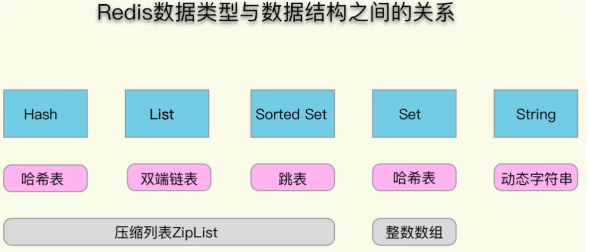
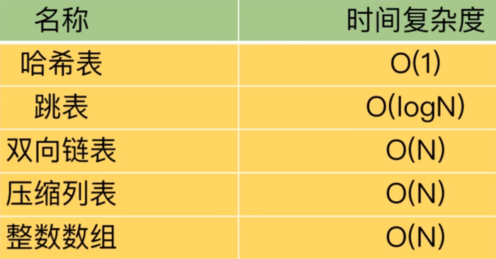

### redis6数据类型对应的底层数据结构

1.字符串

int:8个字节的长整型。
embstr:小于等于44个字节的字符串。
raw:大于44个字节的字符串。
Redis会根据当前值的类型和长度决定使用哪种内部编码实现。

2.哈希
ziplist(压缩列表):当哈希类型元素个数小于hash-max-ziplist-entries 配置(默认512)、同时所有值都小于hash-max-ziplist-value配置(默认64 字节)时，Redis会使用ziplist作为哈希的内部实现，ziplist使用更加紧凑的 结构实现多个元素的连续存储，所以在节省内存方面比hashtable更加优秀。

hashtable(哈希表):当哈希类型无法满足 ziplist的条件时，Redis会 用hashtable为哈希的内部实现。因为此时ziplist的读写效率会下降，而hashtahe的读写时间复度为O(1)。

3.列表
ziplist(压列表):当列表的元素个数小于list-max-ziplist-entries配置 默认512)，同时列表中每元素的值都小于list-max-ziplist-value配置时(默认64字节)Redis会选用ziplist来作为列表的内部实现来减少内存的使用。
inkedlist(链表):当列表类型无法满足ziplist的条件时，Redis会使用 linkedlist作为列表的内部实现。quicklist ziplist和linkedlist的结合以ziplist为节点的链表。

4.集合
intset(需数集合):当集合中的元素都是整数且元素个数小于set-max-ntset-entries置(默认512)时，Redis会用intset来为集合的内部实现，从而减少内存的使用hashtable(哈希表):当集合类型无法满足intset的条件时，Redis会使用hashtable作为集合的内部实现。

5.有序集合
ziplist(压缩列表):当有序集合的元素个数小于zset-max-ziplist- entres配置(默认128)，同时每元素的值都小于et-max-ziplist-value配 置(默认64字节)时Redis会用ziplist来作为有序集合的内部实现，ziplist 可以有效减少内存的使用。skiplist(跳跃表):当ziplist条件不满足时，有序集合会使用skiplist作 为内部实现，因为此时ziplist的读写效率会下降。

### redis6数据类型以及数据结构的关系

### redis7数据类型以及数据结构的关系

### redis数据类型以及数据结构的时间复杂度

