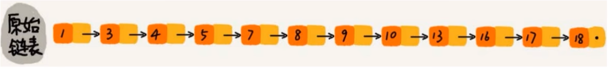
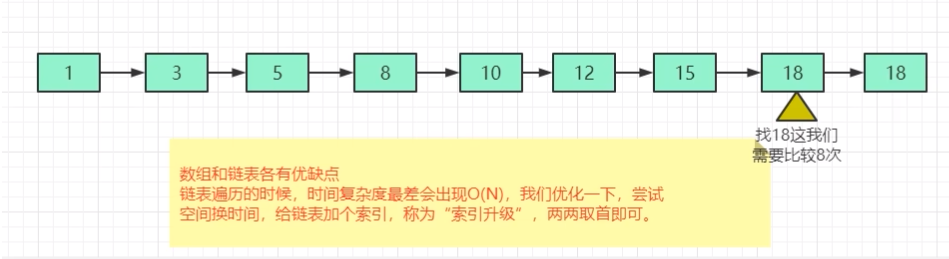
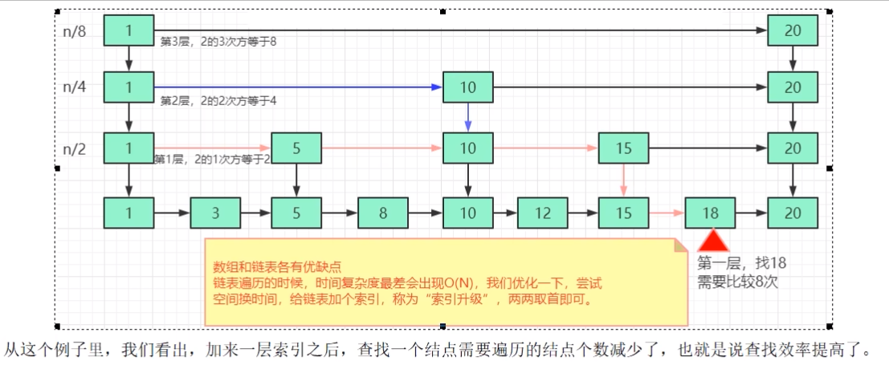
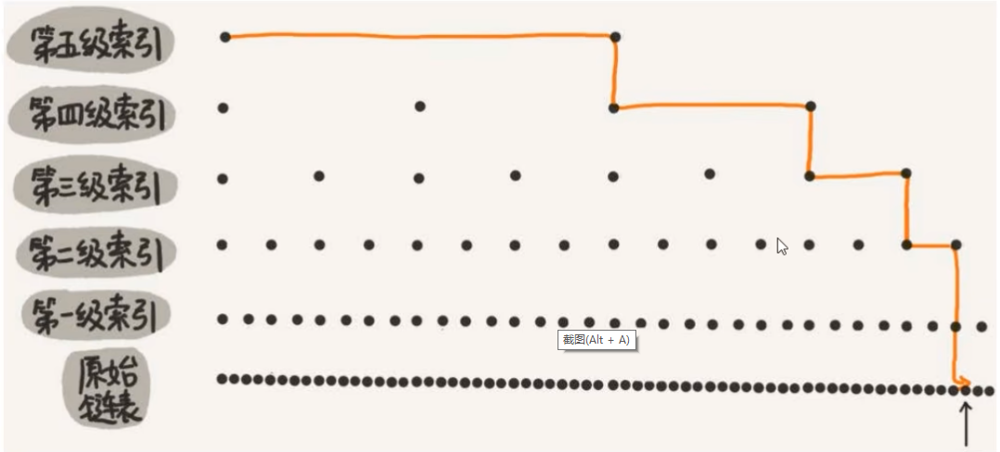
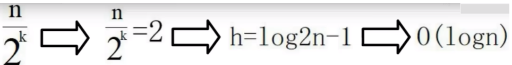

### 为什么引出跳表

- 先从一个单链表来说
  对于一个单链表来讲，即便链表中存储的数据是有序的，如果我们要想在其中查找某个数据，也只能从头到尾遍历链表。这样查找效率就会很低，时间复杂度会很高O(N)

  

- 痛点

  

  解决方法：升维，也即空间换时间

- 优化

  

- 案例：画一个包含64个节点的链表，按前面思路，建立五级索引

  

###  是什么

跳表是可以实现二分查找的有序链表

skiplist是一种以空间换取时间的结构。由于链表，无法进行二分查找，因此借鉴数据库索引的思想，提取出链表中关键节点(索引)，先在关键节点上查找，再进入下层链表查找，提取多层关键节点，就形成了跳跃表。

但是，由于索引也要占据一定空间的，所以，索引添加的越多，空间占用的越多

总结来说，跳表=链表+多级索引

### 跳表时间和空间复杂度介绍

1. 跳表的时间复杂度，O(logN)

   跳表查询的时间复杂度分析，如果链表里有N个结点，会有多少级索引呢？

   按照我们前面笔记，两两取首。每两个结点会抽出一个结点作为上一级索引的结点，以此估算:

   第一级索引的结点个数大约就是n/2

   第二级索引的结点个数大约就是n/4.

   第三级索引的结点个数大约就是n/8，依次类推......

   也就是说，第k级索引的结点个数是第k-1级索引的结点个数的1/2，那第k级索引结点的个数就是n/(2^k)

   假设索引有h级，最高级的索引有2个结点。通过上面的公式，

   我们可以得到n/(2^h)=2，从而求得h=log2n-1(log以2为底，n的对数)

   如果包含原始链表这一层，整个跳表的高度就是log2n(log以2为底，n的对数)

   

2. 

