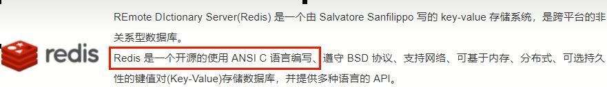
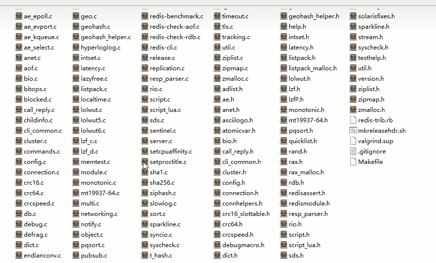
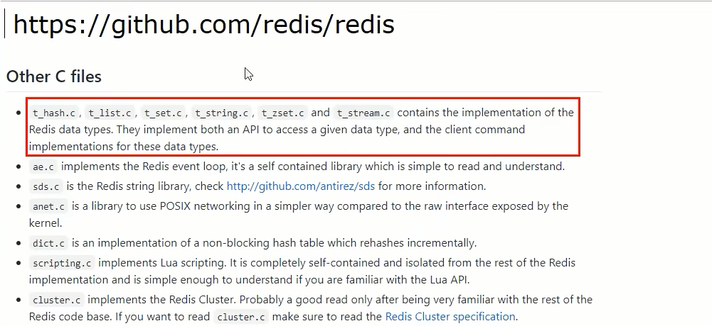

# src源码包下面该如何看？

### 源码在哪

\redis-7.0.5\src

https://github.com/redis/redis/tree/7.0/src

### 源码分析思路

工作和面试中需要什么，就看什么

### Redis基本的数据结构(骨架)

- github官网说明

  

  - Redis对象object.c
  - 字符串t_string.c
  - 列表t_list.c
  - 字典t_hash.c
  - 集合及有序集合t_set.c和t_zset.c
  - 数据流t_stream.c：Streams的底层实现结构listpack.c和rax.c；了解即可

- 简单动态字符串sds.c

- 整数集合intset.c

- 压缩列表ziplist.c

- 快速链表quicklist.c

- listpack

- 字典dict.c

### Redis数据库的实现

数据库的底层实现db.c

持久化rdb.c和aof.c

### Redis服务端和客户端实现

事件驱动ae.c和ae_epoll.c

网络连接anet.c和networking.c

服务端程序server.c

客户端程序redis-cli.c

### 其他

主从复制replication.c

哨兵sentinel.c

集群cluster.c

其他数据结构，如hyperLogLog.c、geo.c等

其他功能，如pub/sub、LUA脚本

