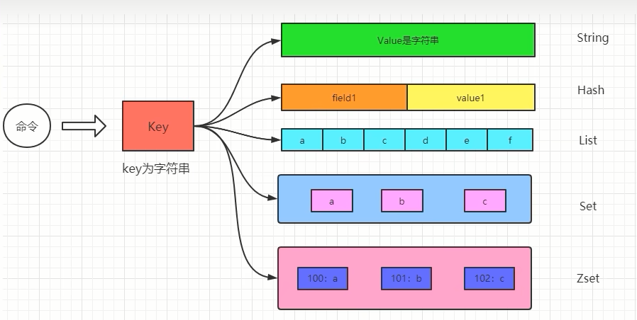
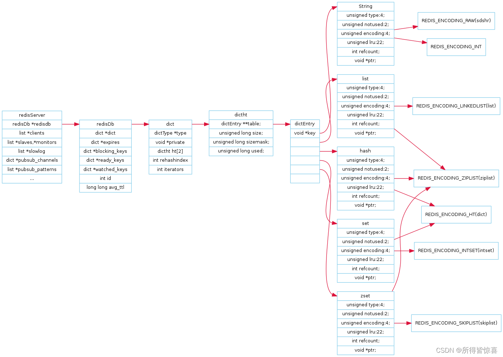
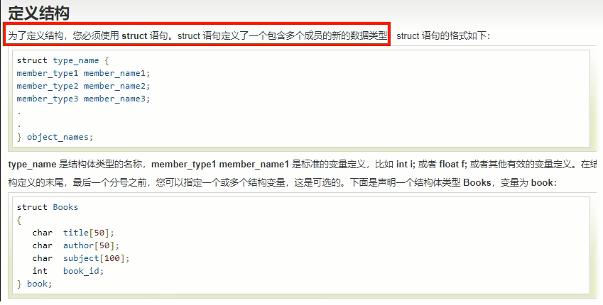
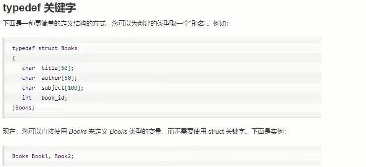
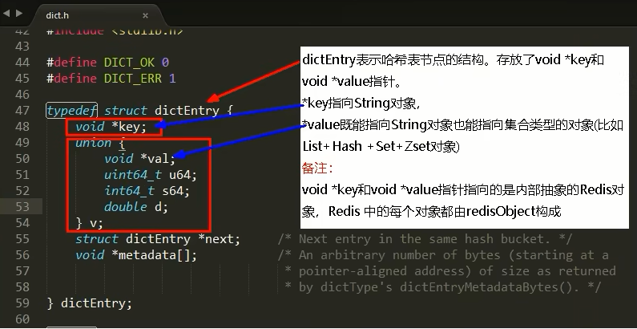
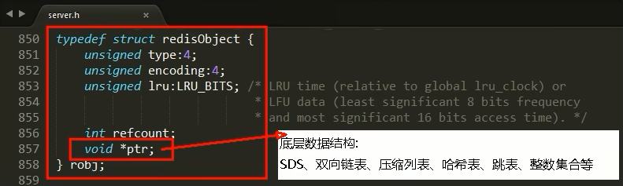
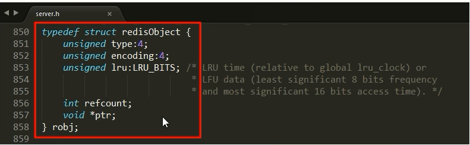

### 如何实现键值对（Key-Value）数据库的

redis 是 key-value 存储系统，其中key类型一般为字符串，value 类型则为redis对象(redisObject)

图说

### 10大类型说明（粗分）

传统的5大类型

- String
- List
- Hash
- Set
- ZSet

新介绍的5大类型

- bitmap -> 实质String
- HyperLogLog -> 实质String
- GEO -> 实质ZSet
- Stream -> 实质Stream
- bitfield -> 看具体key

上帝视角：

### Redis定义了redisObject结构体来表示string、hash、list、set、zset等数据类型

- C语言struct结构体语法简介

  

  

- Redis中每个对象都是一个redisObject结构

- 字典、KV是什么（重点）

  每个键值对都会有一个dictEntry：

  源码位置：dict.h

  

  重点：从dictEntry到redisObject
  

- redisObject +Redis数据类型+Redis 所有编码方式(底层实现)三者之间的关系

  

  

