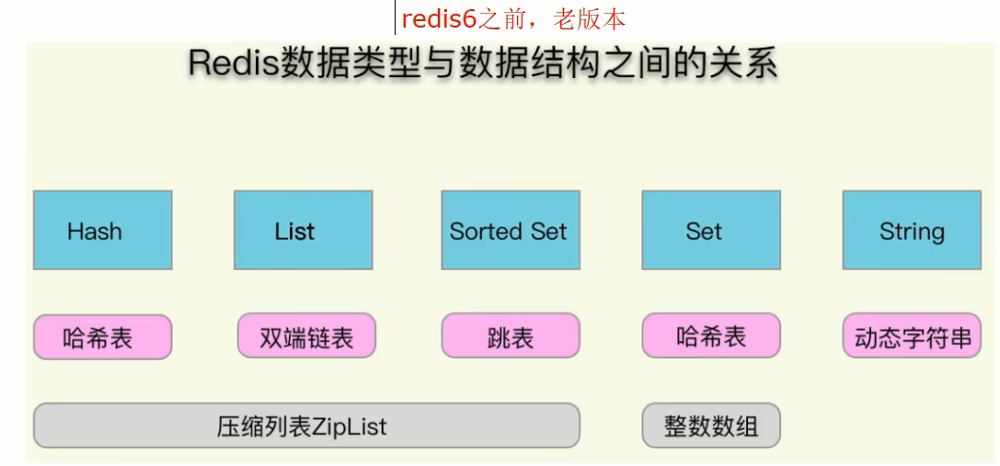
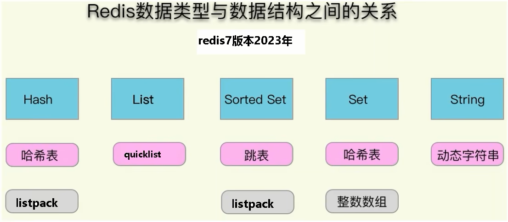

### 重点：redis数据类型与数据结构总纲图

1. 源码分析总体数据结构大纲

   - SDS动态字符串
   - 双向链表
   - 压缩列表ziplist
   - 哈希表Hashtable
   - 跳表skiplist
   - 整数集合intset
   - 快速列表quicklist
   - 紧凑列表listpack

2. redis6.0.5

   

   string = SDS

   Set = intset + hashtabLe

   ZSet = skiplist + ziplist

   List = quicklist + ziplist

   Hash = hashtable + ziplist

3. 2021.11.29之后，Redis7
   

   string = SDS

   Set = intset + hashtabLe

   ZSet = skiplist + listpack紧凑列表

   List = quicklist

   Hash = hashtable + listpack

