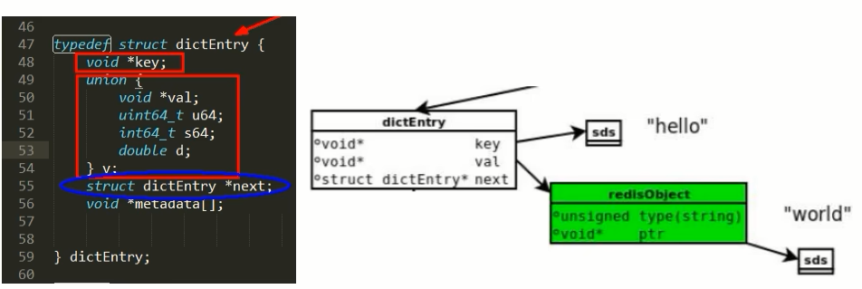
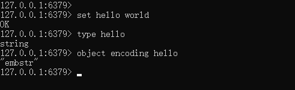
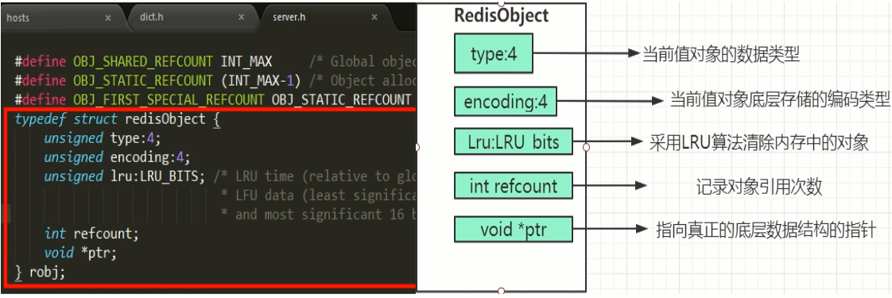
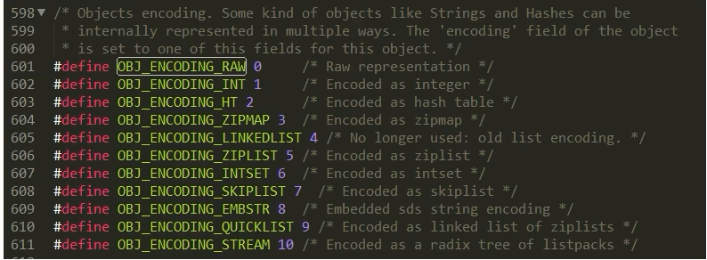
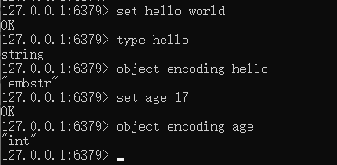
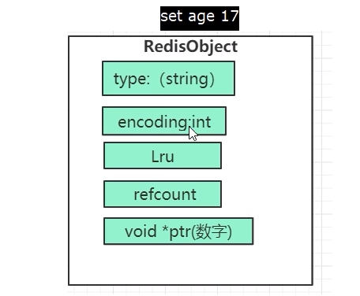

### 从set hello world说起

每个键值对都会有一个dictEntry

set hello word为例，因为Redis是KV键值对的数据库，每个键值对都会有一个dictEntry(源码位置:dict.h)，里面指向了key和value的指针,next 指向下一个dictEntry。

key是字符串，但是 Redis没有直接使用C的字符数组，而是存储在redis自定义的SDS中。

value 既不是直接作为字符串存储，也不是直接存储在 SDs中，而是存储在redisobject中。

实际上五种常用的数据类型的任何一种，都是通过 redisobject来存储的。

看看类型：type 键

看看编码：object encoding hello

### redisObject结构的作用

为了便于操作，Redis采用redisObjec结构来统一五种不同的数据类型，这样所有的数据类型就都可以以相同的形式在函数间传递而不用使用特定的类型结构。同时，为了识别不同的数据类型，redisObjec中定义了type和encoding字段对不同的数据类型加以区别。简单地说，redisObjec就是string、hash、list、set、zset的父类，可以在函数间传递时隐藏具体的类型信息，所以作者抽象了redisObjec结构来到达同样的目的。

- redisObject各字段的含义

  

  1 4位的type表示具体的数据类型
  2 4位的encoding表示该类型的物理编码方式见下表，同一种数据类型可能有不同的编码方式。(比如String就提供了3种:int embstr raw)

  

  3 lru字段表示当内存超限时采用LRU算法清除内存中的对象。

  4 refcount表示对象的引用计数。
  5 ptr指针指向真正的底层数据结构的指针。

- 案例

  set age 17

  

  

| type     | leixing                       |
| -------- | ----------------------------- |
| encoding | 编码，本案例是数值类型        |
| lru      | 最近被访问的时间              |
| refcount | 等于1，表示当前对象引用的次数 |
| ptr      | value值是多少，当前就是17     |

