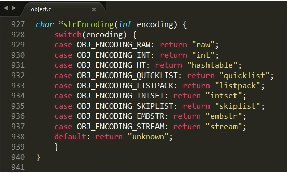
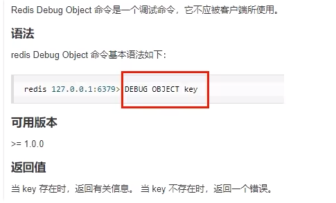
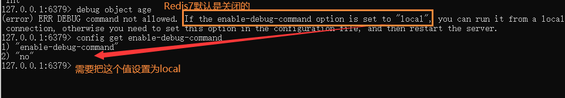
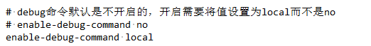
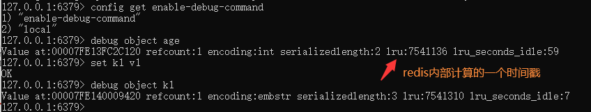

### 各个类型的数据结构的编码映射和定义

### Debug Object key 

- 命令：debug object key

  

  开启前：

  

  开启后：

  

  

  Value at：内存地址
  refcount：引用次数
  encoding：物理编码类型
  serializedlength：序列化后的长度（注意这里的长度是序列化后的长度，保存为rdb文件时使用了该算法，不是真正存储在内存的大小)，会对字串做一些可能的压缩以便底层优化
  lru：记录最近使用时间戳
  lru_seconds_idle：空闲时间（每get一次，最近使用时间戳和空闲时间都会刷新）

