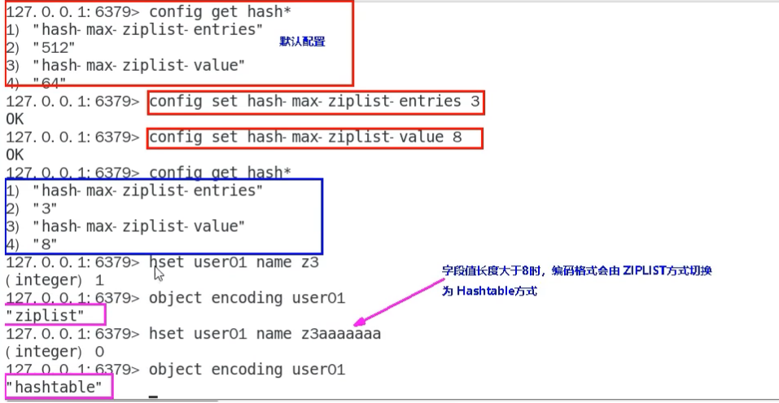

### Hash的两种编码格式

Redis6以前：ziplist、Hashtable

Redis7：listpack、Hashtable

## Redis6

hash-max-ziplist-entries: 使用压缩列表保存时哈希集合中的最大元素个数。

hash-max-ziplist-value: 使用压缩列表保存时哈希集合中单个元素的最人长度。

Hash类型键的字段个数 小于 hash-max-ziplist-entries 并且每个字段名和字段值的长度 小于 hash-max-ziplist-value 时，
Redis才会使用 OBJ_ENCODING_ZIPLIST来存该键，前述条件任意一个不满足则会转换为 OBJ_ENCODING_HT的编码方式

