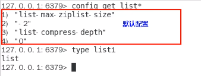

## Redis6

(1) ziplist压缩配置: list-compress-depth 0

表示一个quicklist两端不被压缩的节点个数。这里的节点是指quicklist双向链表的节点，而不是指ziplist里面的数据项个数参数list-compress-depth的取值含义如下:
0：是个特殊值，表示都不压缩。这是Redis的默认值。
1：表示quicklist两端各有1个节点不压缩，中间的节点压缩
2：表示quicklist两端各有2个节点不压缩，中间的节点压缩

以此类推... ...

