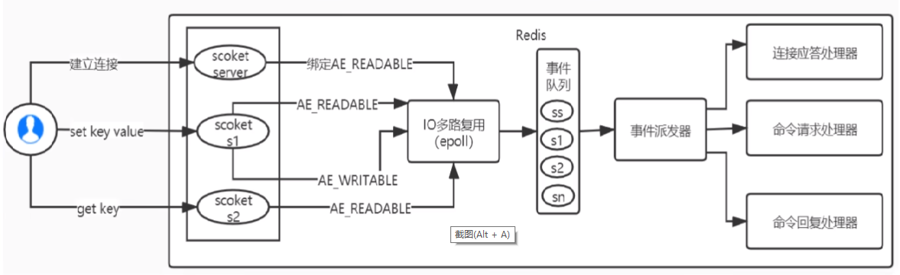
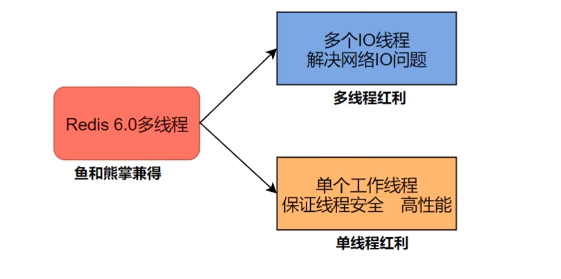

### 是什么

I/O：网络IO

多路：多个客户端连接(连接就是套接字描述符，即 socket 或者 channel)，指的是多条TCP连接

复用：用一个进程来处理多条的连接，使用单进程就能够实现同时处理多个客户端的连接

一句话：

实现了用一个进程来处理大量的用户连接，IO多路复用类似一个规范和接口，落地实现，可以分select ->poll -> epoll 三个阶段来描述

### Redis单线程如何处理那么多并发客户端连接，为什么单线程，为什么快

Redis的IO多路复用

Redis利用epoll来实现IO多路复用，将连接信息和事件放到队列中，一次放到文件事件分派器，事件分派器将事件分发给事件处理器。

redis 是跑在单线程中的，所有的操作都是按照顺序线性执行的，但是由于读写操作等待用户输入或输出都是阻塞的，所以I/O操作在一股情况下往往不能直接返回，这会导致某一文件的I/O阻塞导致整个进程无法对其它客户提供服务，而 I/O 多路复用就是为了解决这个问题而出现

所谓 I/O 多路复用机制，就是说通过一种机制，可以监视多个描述符，一旦某个描述符就绪(一般是读就绪或写就绪)，能够通知程序进行相应的读写操作。这种机制的使用需要 select、poll 、epoll 来配合。多个连接共用一个阻塞对象，应用程序只需要在一个阻塞对象上等待，无需阻塞等待所有连接。当某条连接有新的数据可以处理时，操作系统通知应用程序，线程从阻塞状态返回，开始进行业务处理。

Redis 服务采用 Reactor 的方式来实现文件事件处理器(每一个网络连接其实都对应一个文件描述符)

Redis基于Reactor模式开发了网络事件处理器，这个处理器被称为文件事件处理器。它的组成结构为4部分:

多个套接字、

IO多路复用程序.

文件事件分派器、

事件处理器。

因为文件事件分派器队列的消费是单线程的，所以Redis才叫单线程模型

### 《Redis设计与实现》

从Redis6开始，将网络数据读写、请求协议解析通过多个IO线程的来处理，对于真正的命令执行来说，仍然使用单线程操作，一举两得，便宜占尽!!!

### Unix网络编程中的五种IO模型

1. Blocking IO 阻塞IO
2. NoneBlocking IO 非阻塞IO
3. IO multiplexing IO多路复用
4. signal driven IO 信号驱动IO
5. asynchronous IO 异步IO

同步：调用者要一直等待调用结果的通知后才能进行后续的执行现在就要，我可以等，等出结果为止

异步：指被调用方先返回应答让调用者先回去然后再计算调用结果，计算完最终结果后再通知并返回给调用方。异步调用想要获得结果一般通过回调

同步和异步的理解：同步、异步的讨论对象是被调用者(服务提供者)，重点在于获得调用结果的消息通知方式上

阻塞：调用方一直在等待而且别的事情什么都不做，当前进/线程会被挂起，啥都不干

非阻塞：调用在发出去后，调用方先去忙别的事情，不会阻塞当前进/线程，而会立即返回

阻塞和非阻塞的理解：阻塞、非阻塞的讨论对象是调用者(服务请求者)，重点在于等消息时候的行为，调用者是否能干其它事

4种组合方式

同步阻塞：服务员说快到你了，先别离开我后台看一眼马上通知你。客户在海底捞火锅前台干等着，啥都不干。

同步非阻塞：服务员说快到你了，先别离开客户在海底捞火锅前台边刷抖音边等着叫号。

异步阻塞：服务员说还要再等等，你先去逛逛，一会儿通知你。客户怕过号在海底捞火锅前台拿着排号小票啥都不干，一直等着店员通知

异步非阻塞：服务员说还要再等等，你先去逛逛，一会儿通知你。拿着排号小票+刷着抖音，等着店员通知

