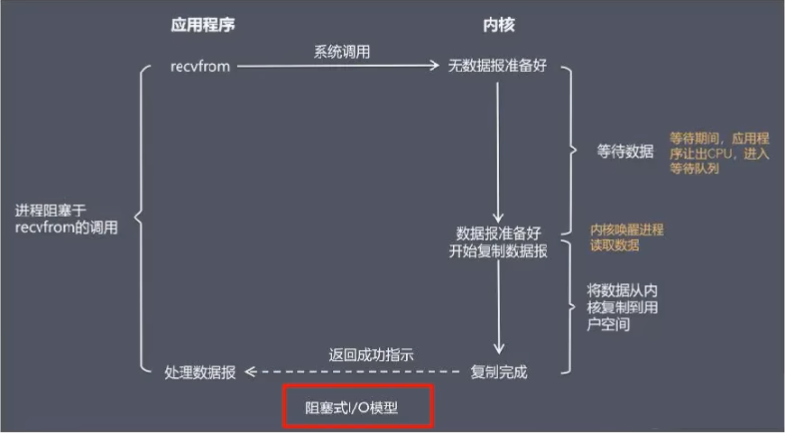
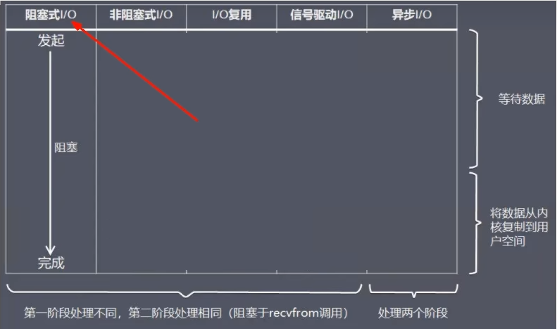

当用户进程调用了recvfrom这个系统调用，kernel就开始了IO的第一个阶段：准备数据(对于网络IO来说，很多时候数据在一开始还没有到达。比如，还没有收到一个完整的UDP包。这个时候kernel就要等待足够的数据到来)。这个过程需要等待，也就是说数据被拷贝到操作系统内核的缓冲区中是需要一个过程的。而在用户进程这边，整个进程会被阻塞(当然，是进程自己选择的阻塞)。当kernel一直等到数据准备好了，它就会将数据从kernel中拷贝到用户内存，然后kermel返回结果，用户进程才解除block的状态，重新运行起来。所以，<font color = 'red'>BIO的特点就是在IO执的两个阶段都被block了。</font>



### 先演示accept

accept监听是典型的阻塞式监听

```Java
package com.luojia.redislock.iomultiplex.bio.accept;

import cn.hutool.core.util.IdUtil;

import java.io.IOException;
import java.net.ServerSocket;
import java.net.Socket;

public class RedisServer {

    public static void main(String[] args) throws IOException {
        ServerSocket serverSocket = new ServerSocket(6379);

        while (true) {
            System.out.println("模拟RedisServer启动-----111 等待连接");
            // 没有监听到数据的情况下，会一直卡在这里
            Socket accept = serverSocket.accept();
            System.out.println("-----111 连接成功： " + IdUtil.simpleUUID());
            System.out.println();
        }
    }
}
```

```java
package com.luojia.redislock.iomultiplex.bio.accept;

import java.io.IOException;
import java.net.Socket;

public class RedisClient01 {
    public static void main(String[] args) throws IOException {
        System.out.println("---------RedisClient01 start");
        Socket socket = new Socket("127.0.0.1", 6379);
        System.out.println("---------RedisClient01 over");
    }
}
```

```java
package com.luojia.redislock.iomultiplex.bio.accept;

import java.io.IOException;
import java.net.Socket;

public class RedisClient02 {

    public static void main(String[] args) throws IOException {
        System.out.println("---------RedisClient02 start");
        Socket socket = new Socket("127.0.0.1", 6379);
        System.out.println("---------RedisClient02 over");
    }
}
```

### 再演示

read读取

```java
package com.luojia.redis7_study.iomultiplex.accept;

import cn.hutool.core.util.IdUtil;
import java.io.IOException;
import java.io.InputStream;
import java.net.ServerSocket;
import java.net.Socket;

public class RedisServerBIO {

    public static void main(String[] args) throws IOException {
        ServerSocket serverSocket = new ServerSocket(6379);

        while (true) {
            System.out.println("-----111 等待连接");
            // 阻塞1，等待客户端连接
            Socket socket = serverSocket.accept();
            System.out.println("-----222 成功连接");

            InputStream inputStream = socket.getInputStream();
            int length = -1;
            byte[] bytes = new byte[1024];
            System.out.println("-----333 等待读取");
            // 阻塞2，等待客户端发送数据
            while ((length = inputStream.read(bytes)) != -1) {
                System.out.println("---444 成功读取" + new String(bytes, 0, length));
                System.out.println("=============" + "\t" + IdUtil.simpleUUID());
                System.out.println();
            }
            inputStream.close();
            socket.close();
        }
    }
}
```

```java
package com.luojia.redis7_study.iomultiplex.accept;

import java.io.IOException;
import java.io.OutputStream;
import java.net.Socket;
import java.util.Scanner;

public class RedisClient01 {
    public static void main(String[] args) throws IOException {
        Socket socket = new Socket("127.0.0.1", 6379);
        OutputStream outputStream = socket.getOutputStream();

        while (true) {
            Scanner scanner = new Scanner(System.in);
            String str = scanner.next();
            if (str.equalsIgnoreCase("quit")) {
                break;
            }
            socket.getOutputStream().write(str.getBytes());
            System.out.println("-----RedisClient01 input quit keyword to finish-----");
        }
        outputStream.close();
        socket.close();
    }
}
```

```java
package com.luojia.redis7_study.iomultiplex.accept;

import java.io.IOException;
import java.io.OutputStream;
import java.net.Socket;
import java.util.Scanner;

public class RedisClient02 {
    public static void main(String[] args) throws IOException {
        Socket socket = new Socket("127.0.0.1", 6379);
        OutputStream outputStream = socket.getOutputStream();

        while (true) {
            Scanner scanner = new Scanner(System.in);
            String str = scanner.next();
            if (str.equalsIgnoreCase("quit")) {
                break;
            }
            socket.getOutputStream().write(str.getBytes());
            System.out.println("-----RedisClient02 input quit keyword to finish-----");
        }
        outputStream.close();
        socket.close();
    }
}
```

存在的问题：

上面的模型存在很大的问题，如果客户端与服务端建立了连接，如果这个连接的客户端迟迟不发数据，程序就会一直阻塞在read()方法上，这样其他客户端也不能进行连接也就是一次只能处理一个客户端，对客户很不友好
知道问题所在了，请问如何解决? ?

#### 利用多线程解决

只要连接了一个socket，操作系统分配一个线程来处理，<font color = 'red'>这样read()方法堵塞在每具体线程上而不堵寒主线程，就能操作多个socket了</font>，哪个线程中的socket有数据，就读哪个socket，各取所需，灵活统一。

程序服务端只负责监听是否有客户端连接，使用 accept() 阻塞

客户端1连接服务端，就开辟一个线程 (thread1) 来执行 read() 方法，程序服务端继续监听

客户端2连接服务端，也开辟一个线程 (thread2) 来执行 read() 方法，程序服务端继续监听

客户端3连接服务端，也开辟一个线程 (thread3) 来执行 read() 方法，程序服务端继续监听
。。。。。。
任何一个线程上的socket有数据发送过来，read()就能立马读到，cpu就能进行处理。

```java
package com.luojia.redis7_study.iomultiplex.read.mthread;

import cn.hutool.core.util.IdUtil;

import java.io.IOException;
import java.io.InputStream;
import java.net.ServerSocket;
import java.net.Socket;

public class RedisServerBIOMultiThread {

    public static void main(String[] args) throws IOException {
        ServerSocket serverSocket = new ServerSocket(6379);

        while (true) {
            System.out.println("-----RedisServerBIOMultiThread 111 等待连接");
            // 阻塞1，等待客户端连接
            Socket socket = serverSocket.accept();
            System.out.println("-----RedisServerBIOMultiThread 222 成功连接");

            new Thread(() -> {
                try {
                    InputStream inputStream = socket.getInputStream();
                    int length = -1;
                    byte[] bytes = new byte[1024];
                    System.out.println("-----333 等待读取");
                    // 阻塞2，等待客户端发送数据
                    while ((length = inputStream.read(bytes)) != -1) {
                        System.out.println("---444 成功读取" + new String(bytes, 0, length));
                        System.out.println("=============" + "\t" + IdUtil.simpleUUID());
                        System.out.println();
                    }
                    inputStream.close();
                    socket.close();
                } catch (IOException e) {
                    e.printStackTrace();
                }
            }).start();
        }
    }
}
```

 但是上面异步读取数据也有问题

多线程模型
每来一个客户端，就要开辟一个线程，如果来1万个客户端，那就要开辟1万个线程。在操作系统中用户态不能直接开辟线程，需要调用内核来创建的一个线程，这其中还涉及到用户状态的切换(上下文的切换)，十分耗资源。

知道问题所在了，请问如何解决? ?

<font color = 'blue'>第一个办法：使用线程池</font>

这个在客户端连接少的情况下可以使用，但是用户量大的情况下，你不知道线程池要多大，太大了内存可能不够，也不可行。

<font color = 'blue'>第二个办法：NIO（非阻塞式IO）方式</font>

因为read()方法堵塞了，所有要开辟多个线程，如果什么方法能使read()方法不堵塞，这样就不用开辟多个线程了，这就用到了另一个IO模型，NIO（非阻塞式IO)

### 总结

Tomcat7之前就是用BIO多线程来解决多连接

在阻塞式I/O模型中，应用程序在从调用recvfrom开始到它返回有数据报准备好这段时间是阻塞的，recvfrom返回成功后，应用进程才能开始处理数据报。




