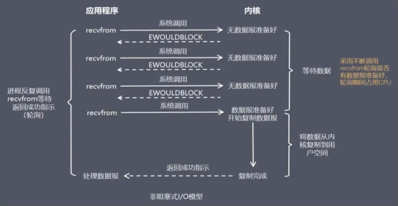
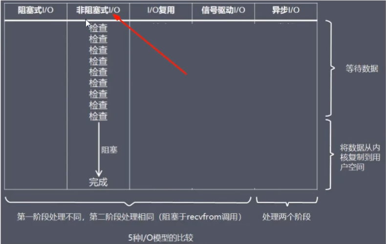

当用户进程发出read操作时，如果kernel中的数据还没有准备好，那么它并不会block用户进程，而是立刻返回一个error。从用户进程角度讲，它发起一个read操作后，并不需要等待，而是马上就得到了一个结果。用户进程判断结果是一个error时，它就知道数据还没有准备好，于是它可以再次发送read操作。一旦kernel中的数据准备好了，并且又再次收到了用户进程的system call，那么它马上就将数据拷贝到了用户内存，然后返回。<font color = 'red'>所以，NIO特点是用户进程需要不断的主动询问内核数据准备好了吗?一句话，用轮询替代阻塞!</font>



### 面试回答

<font color = 'red'>在NIO模式中，一切都是非阻塞的：</font>

accept()方法是<font color = 'blue'>非阻塞的</font>，如果没有客户端连接，就返回无连接标识

read()方法是<font color = 'blue'>非阻塞的</font>，如果read()方法读取不到数据就返回空闲中标识，如果读取到数据时只阻塞read()方法读数据的那段时间

在NIO模式中，只有一个线程：
当一个客户端与服务端进行连接，这个socket就会加入到一个数组中，隔一段时间遍历一次，看这个socket的read()方法能否读到数据，<font color = 'red'>这样一个线程就能处理多个客户端的连接和读取了</font>

```Java
package com.luojia.redis7_study.iomultiplex.nio;

import java.io.IOException;
import java.net.InetSocketAddress;
import java.nio.ByteBuffer;
import java.nio.channels.ServerSocketChannel;
import java.nio.channels.SocketChannel;
import java.util.ArrayList;
import java.util.concurrent.TimeUnit;

public class RedisServerNIO {

    static ArrayList<SocketChannel> socketList = new ArrayList<>();
    static ByteBuffer byteBuffer = ByteBuffer.allocate(1024);

    public static void main(String[] args) throws IOException {
        System.out.println("-------RedisServerNIO 启动中......");
        ServerSocketChannel serverSocket = ServerSocketChannel.open();
        serverSocket.bind(new InetSocketAddress("127.0.0.1", 6379));
        // 设置为非阻塞模式
        serverSocket.configureBlocking(false);

        while (true) {
            for (SocketChannel element : socketList) {
                int read = element.read(byteBuffer);
                if (read > 0) {
                    System.out.println("-----读取数据：" + read);
                    byteBuffer.flip();
                    byte[] bytes = new byte[read];
                    byteBuffer.get(bytes);
                    System.out.println(new String(bytes));
                    byteBuffer.clear();
                }
                // try { TimeUnit.SECONDS.sleep(1); } catch (InterruptedException e) { e.printStackTrace(); }
            }

            SocketChannel socketChannel = serverSocket.accept();
            if (socketChannel != null) {
                System.out.println("-----成功连接：");
                socketChannel.configureBlocking(false);// 设置为非阻塞模式
                socketList.add(socketChannel);
                System.out.println("-----socketList size: " + socketList.size());
            }
        }
    }
}
```

```Java
package com.luojia.redis7_study.iomultiplex.nio;

import java.io.IOException;
import java.io.OutputStream;
import java.net.Socket;
import java.util.Scanner;

public class RedisClient01 {

    public static void main(String[] args) throws IOException {
        Socket socket = new Socket("127.0.0.1", 6379);
        OutputStream outputStream = socket.getOutputStream();

        while (true) {
            Scanner scanner = new Scanner(System.in);
            String str = scanner.next();
            if (str.equalsIgnoreCase("quit")) {
                break;
            }
            socket.getOutputStream().write(str.getBytes());
            System.out.println("-----RedisClient01 input quit keyword to finish-----");
        }
        outputStream.close();
        socket.close();
    }
}
```

### 存在的问题和优缺点

NIO成功的解决了BIO需要开启多线程的问题，NIO中一个线程就能解决多个socket，但是还存在2个问题。

<font color = 'blue'>问题一：</font>

这个模型在客户端少的时候十分好用，但是客户端如果很多，比如有1万个客户端进行连接，那么每次循环就要遍历1万个socket，如果一万个socket中只有10个socket有数据，也会遍历一万个socket，就会做很多无用功，每次遍历遇到read返回-1时仍然是一次浪费资源的系统调用。

<font color = 'blue'>问题二：</font>

<font color = 'red'>而且这个遍历过程是在用户态进行的</font>，用户态判断socket是否有数据还是调用内核的read()方法实现的，这就涉及到用户态和内核态的切换，每遍历一个就要切换一次，开销很大是因为这些问题的存在。

优点：不会阻塞在内核的等待数据过程，每次发起的 I/O 请求可以立即返回，不用阻塞等待，实时性较好。

缺点：轮询将会不断地询问内核，这将占用大量的 CPU 时间，系统资源利用率较低，所以一般 Web 服务器不使用这种I /O 模型。

结论：让Linux内核搞定上述需求，我们将一批文件描述符通过一次系统调用传给内核由内核层去遍历，才能真正解决这个问题。<font color = 'red'>IO多路复用应运而生，也即将上述工作直接放进Linux内核，不再两态转换而是直接从内核获得结果，因为内核是非阻塞的。</font>

### 非阻塞IO总结




