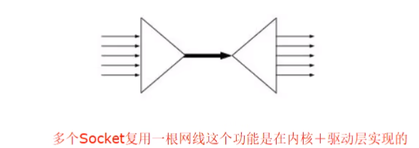
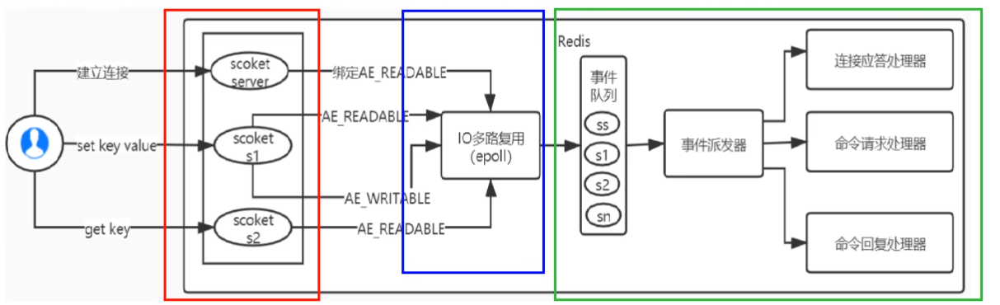
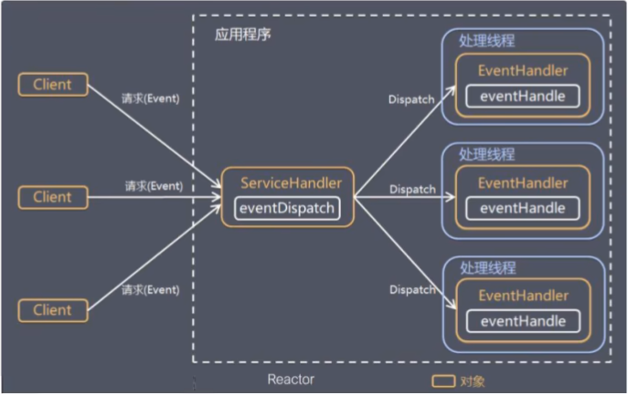

###  IO多路复用是什么

I/O多路复用在英文中其实叫I/O multiplexing

I/O multiplexing 这里面的 multiplexing 指的其实是在单个线程通过记录跟踪每一个Sock(I/0流)的状态来同时管理多个I/0流，目的是尽量多的提高服务器的吞吐能力。

大家都用过nginx，nginx使用epoll接收请求，ngnix会有很多链接进来，epoll会把他们都监视起来，然后像拨开关一样，谁有数据就拨向谁，然后调用相应的代码处理。redis类似同理

#### IO多路复用

IO multiplexing就是我们说的select，poll，epoll，有些技术书籍也称这种IO方式为event driven IO事件驱动IO。就是通过一种机制，一个进程可以监视多个描述符，一旦某个描述符就绪（一般是读就绪或者写就绪），能够通知程序进行相应的读写操作。可以基于一个阻塞对象并同时在多个描述符上等待就绪，而不是使用多个线程(每个文件描述符一个线程，每次new一个线程)，这样可以大大节省系统资源。所以，I/O 多路复用的特点是通过一种机制一个进程能同时等待多个文件描述符而这些文件描述符（套接字描述符）其中的任意一个进入读就绪状态，select， poll，epoll等函数就可以返回。

#### 说人话

模拟一个tcp服务器处理30个客户socket,一个监考老师监考多个学生，谁举手就应答谁。

假设你是一个监考老师，让30个学生解答一道竞赛考题，然后负责验收学生答卷，你有下面几个选择:

第一种选择：按顺序逐个验收，先验收A，然后是B，之后是C、D。。。这中间如果有一个学生卡住，全班都会被耽误,你用循环挨个处理socket.根本不具有并发能力。

第二种选择：你创建30个分身线程，每个分身线程检查一个学生的答案是否正确。 这种类似于为每一个用户创建一个进程或者线程处理连接。

第三种选择：你站在讲台上等，谁解答完谁举手。这时C、D举手，表示他们解答问题完毕，你下去依次检查C、D的答案，然后继续回到讲台上等。
此时E、A又举手，然后去处理E和A。。。这种就是IO复用模型。Linux下的select、poll和epoll就是干这个的。

将用户socket对应的fd注册进epol，然后epol都帮你监听哪些socket上有消息到达，这样就避了大量的无用换作。此时的socket应该采用非阻塞模式。这样，整个过程只在调用select、poll、epoll这些调用的时候才会阻塞，收发客户消息是不会阻塞的，整个进程或者线程就被充分利用起来，这就是事件驱动，所谓的reactor反应模式。

### 能干嘛

Redis单线程如何处理那么多并发客户端连接，为什么单线程，为什么快

Redis利用epoll来实现IO多路复用，将连接信息和事件放到队列中，依次放到事件分派器，事件分派器将事件分发给事件处理器。

Redis 服务采用 Reactor 的方式来实现文件事件处理器(每一个网络连接其实都对应一个文件描述符)谓 I/0 多路复用机制，就是说通过一种机制，可以监视多个描述符，一旦某个描述符就绪(一般是读就绪或写就绪)，能够通知程序进行相应读写操作。这种机制的使用需要 select 、 poll 、 epoll 来配合。多个连接共用一个阻塞对象，应用程序只需要在一个阻塞对象上等待，无需阻塞等待所有连接。当某条连接有新的数据可以处理时，操作系统通知应用程序，线程从阻塞状态返回，开始进行业务处理。

所谓 I/O 多路复用机制，就是说通过一种考试监考机制，1个老师可以监视多个考生，一旦某个考生举手想要交卷了，能够通知监考老师进行相应的收卷子或批改检查操作。所以这种机制需要调用班主任(select/poll/epoll)来配合。多个考生被同一个班主任监考，收完一个考试的卷子再处理其它人，无需等待所有考生，谁先举手就先响应谁，当又有考生举手要交卷，监考老师看到后从进台走到考生位置，开始进行收卷处理

#### reactor设计模式

基于 I/O 复用模型，多个连接共用一个阻塞对象，应用程序只需要在一个阻塞对象上等待，无需阻塞等待所有连接。当某条连接有新的数据可以处理时，操作系统通知应用程序，线程从阻塞状态返回，开始进行业务处理。

Reactor 模式，是指通过一个或多个输入同时传递给服务处理器的服务请求的事件驱动处理模式。服务端程序处理传入多路请求，并将它们同步分派给请求对应的处理线程，Reactor 模式也叫 Dispatcher 模式。即 I/0 多路复用统一监听事件，收到事件后分发(Dispatch 给某进程)，是编写高性能网络服务器的必备技术。

Reactor 模式中有 2 个关键组成:
1) Reactor： Reactor 在一个单独的线程中运行，负责监听和分发事件，分发给适当的处理程序来对 IO 事件做出反应。 它就像公司的电话接线员它接听来自客户的电话并将线路转移到适当的联系人;
2)Handlers:处理程序执行I/O事件要完成的实际事件，类似于客户想要与之交谈的公司中的实际办理人。Reactor 通过调度适当的处理程序来响应 I/O 事件，处理程序执行非阻塞操作。

