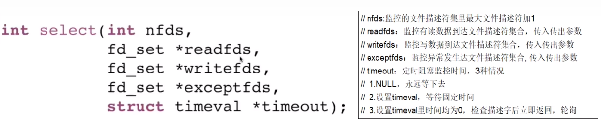
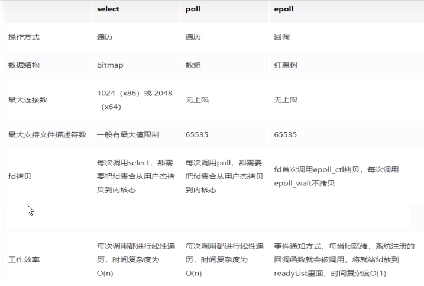

### select，poll，epoll都是I/O多路复用的具体实现

### select方法

select函数监视的文件描述符分3类，分别是readfds、writefds和exceptfds，将用户传入的数组拷贝到内核空间，调用后select函数会阻塞，直到有描述符就绪（有数据可读、可写、或者有except)或超时(timeout指定等待时间，如果立即返回设为null即可)，函数返回。

当select函数返回后，可以通过遍历fdset，来找到就绪的描述符。

#### 优点

select其实就是把NIO中用户态要遍历的fd数组(我们的每一个socket链接，安装进ArrayList里面的那个)拷贝到了内核态，让内核态来遍历，因为用户态判断socket是否有数据还是要调用内核态的，所有拷贝到内核态后，这样遍历判断的时候就不用一直用户态和内核态频繁切换了。

从代码中可以看出，select系统调用后，返回了一个置位后的&rset，这样用户态只需进行很简单的二进制比较，就能很快知道哪些socket需要read数据，有效提高了效率

#### 缺点

select函数的缺点
1. bitmap默认大小为1024，虽然可以调整但还是有限度的
2. rset每次循环都必须重新置位为0，不可重复使用
3. 尽管将rset从用户态拷贝到内核态由内核态判断是否有数据，但是还是有拷贝的开销
4. 当有数据时select就会返回，但是select函数并不知道哪个文件描述符有数据了，后面还需要再次对文件描述符数组进行遍历。效率比较低

1、bitmap最大1024位，一个进程最多只能处理1024个客户端

2、&rset不可重用，每次socket有数据就相应的位会被置位

3、文件描述符数组拷贝到了内核态(只不过无系统调用切换上下文的开销。(内核层可优化为异步事件通知))，仍然有开销。select调用需要传入fd数组，需要拷贝一份到内核，高并发场景下这样的拷贝消耗的资源是惊人的。(可优化为不复制)

4、select并没有通知用户态哪一个socket有数据，仍然需要O(n)的遍历。select仅仅返回可读文件描述符的个数，具体哪个可读还是要用户自己遍历。(可优化为只返回给用户就绪的文件描述符，无需用户做无效的遍历)

#### select小总结

select方式，既做到了一个线程处理多个客户端连接(文件描述符），又减少了系统调用的开销(多个文件描述符只有一次select的系统调用＋N次就绪状态的文件描述符的read系统调用

### poll方法

#### 优点

1、poll使用pollfd数组来代替select中的bitmap，数组没有1024的限制，可以一次管理更多的client。它和 select的主要区别就是，去掉了select只能监听1024个文件描述符的限制。
2、当pollfds数组中有事件发生，相应的revents置位为1，遍历的时候又置位回零，实现了pollfd数组的重用

#### 问题

poll解决了select缺点中的前两条，其本质原理还是select的方法，还存在select中原来的问题
1、pollfds数组拷贝到了内核态，仍然有开销
2、poll并没有通知用户态哪一个socket有数据，仍然需要O(n)的遍历

### epoll方法

#### 结论

多路复用快的原因在于，操作系统提供了这样的系统调用，使得原来的while循环里多次系统调用，变成了一次系统调用＋内核层遍历这些文件描述符。

epoll是现在最先进的IO多路复用器，Redis、Nginx，linux中的Java NIO都使用的是epoll。

这里“多路”指的是多个网络连接，“复用”指的是复用同一个线程。

1、一个socket的生命周期中只有一次从用户态拷贝到内核态的过程，开销小

2、使用event事件通知机制，每次socket中有数据会主动通知内核，并加入到就绪链表中，不需要遍历所有的socket

在多路复用IO模型中，会有一个内核线程不断地去轮询多个socket的状态，只有当真正读写事件发送时，才真正调用实际的IO读写操作。因为在多路复用IO模型中，只需要使用一个线程就可以管理多个socket，系统不需要建立新的进程或者线程，也不必维护这些线程和进程，并且只有真正有读写事件进行时，才会使用IO资源，所以它大大减少了资源占用。多路I/O复用模型是利用select、poll、epoll可以同时监察多个流的I/0事件的能力，在空闲的时候，会把当前线程阻塞掉，当有一个或多个流有I/O事件时，就从阻塞态中唤醒，于是程序就会轮询一遍所有的流（epoll是只轮询那些真正发出了事件的流），并且只依次顺序的处理就绪的流，这种做法就避免了大量的无用操作。采用多路I/О复用技术可以让单个线程高效的处理多个连接请求（尽量减少网络IO的时间消耗)，且Redis在内存中操作数据的速度非常快，也就是说内存内的操作不会成为影响Redis性能的瓶颈

三个方法对比

