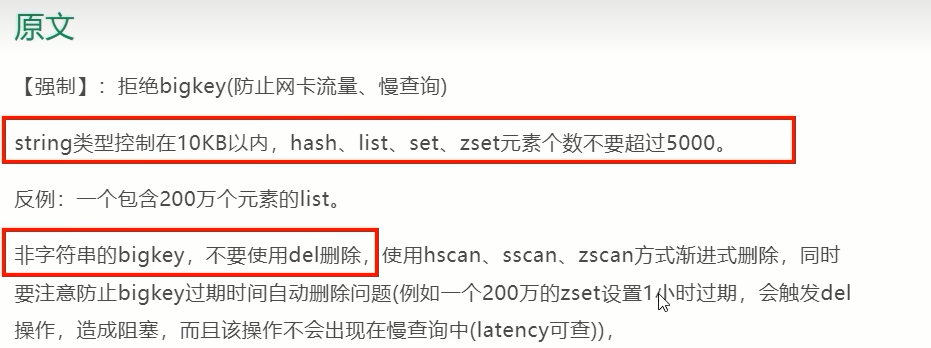

# 多大算BigKey

通常我们说的BigKey，不是在值的Key很大，而是指的Key对应的value很大

### 参考《阿里云Redis开发规范》

### string和二级结构

- string是value，最大512MB但是≥10KB就是bigkey

- list、hash、set和zset，value个数超过5000就是bigkey

  list：一个列表最多可以包含2^32-1个元素(4294967295，每个列表超过40亿个元素)。

  hash：Redis中每个hash可以存储2^32-1个键值对(40多亿)

  set：集合中最大的成员数为2^32-1(4294967295，每个集合可存储40多亿个成员)

