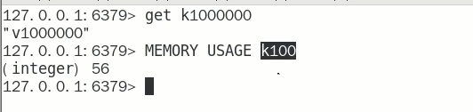

# Bigkey危害、产生与发现

### bigkey的危害

内存不均，集群迁移困难

超时删除，大key删除作梗

网络流量阻塞

### 如何产生

- 社交类

  明星粉丝列表，典型案例粉丝逐步递增

- 汇总统计

  某个报表，日月年经年累计

### 如何发现

- redis-cli --bigkey

  <font color = blue>好处，见最下面总结</font>
  给出每种数据结构Top 1 bigkey。同时给出每种数据类型的键值个数＋平均大小

  <font color = blue>不足</font>
  想查询大于10kb的所有key，--bigkeys参数就无能为力了，<font color = red>需要用到memory usage来计算每个键值的字节数</font>

  <font color = red>redis-cli --bigkeys -a 111111</font>
  <font color = red>redis-cli -h 127.0.0.1 -p 6379 -a 111111 --bigkeys</font>

  ```java
  加上 -i 参数，每隔100 条 scan指令就会休眠0.1s.ops就不会剧烈抬升，但是扫描的时间会变长
  redis-cli -h 127.0.0.1 -p 7001 --bigkeys -i 0.1
  ```

  

- memory usage 键

  英文官网：https://redis.io/commands/memory-usage/

  中文官网：https://redis.io/commands/memory-usage/

  计算每个键值的字节数

  


