# 大key如何删除

### 参考《阿里云Redis开发规范》

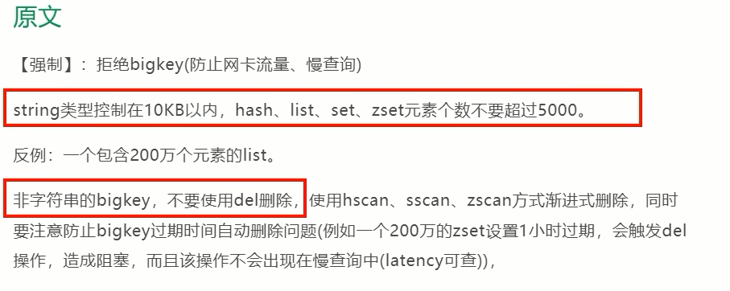

### scan官网说明

- https://redis.io/commands/scan/
- https://redis.com.cn/commands/scan.html

### 普通命令

- String

  一般用del，如果过于庞大使用unlink key 删除

- hash

  - 使用hscan每次获取少量field-value，再使用hdel删除每个field

  - 命令

    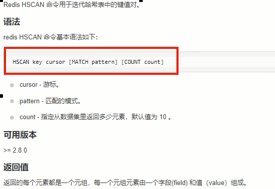

  - 阿里手册

    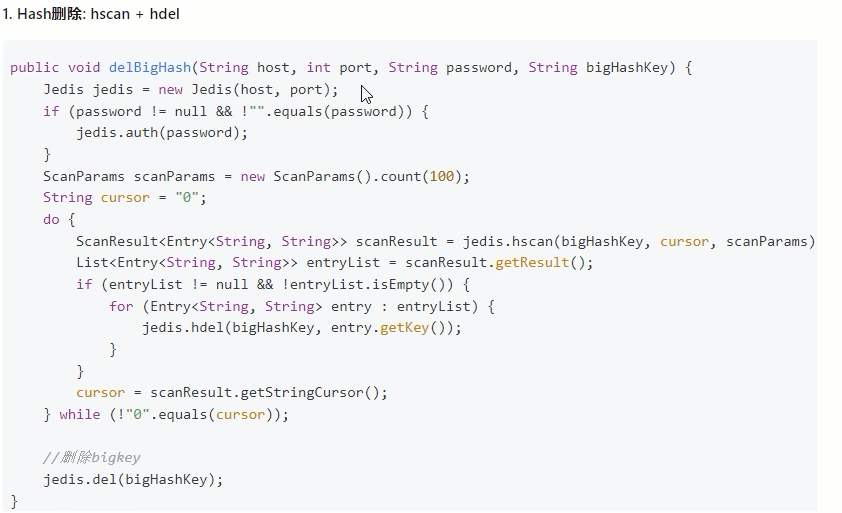

- list

  - 使用ltrim渐进式逐步删除，直到全部删除完成

  - 命令

    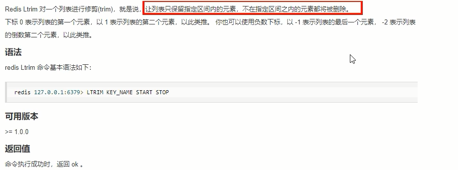

    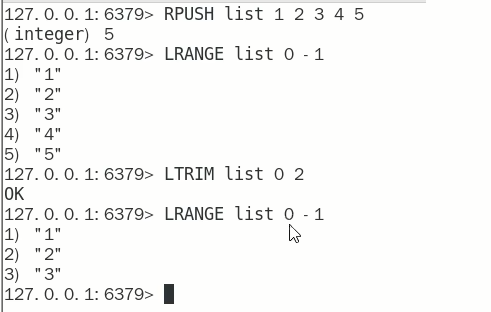

  - 阿里手册

    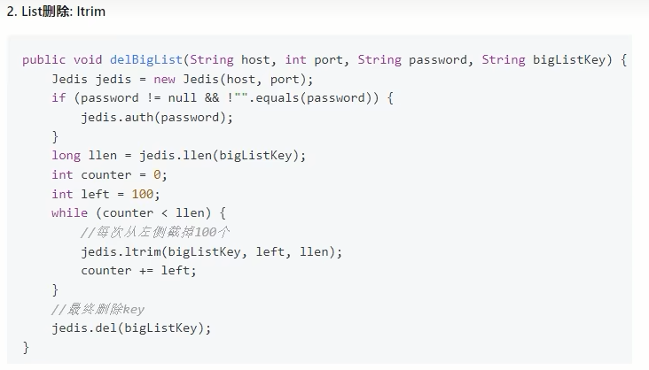

- set

  - 使用sscan每次获取部分元素，在使用srem命令删除每个元素

  - 命令

    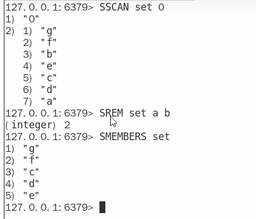

  - 阿里手册

    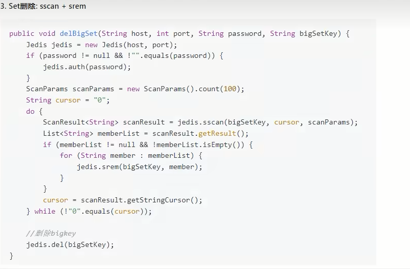

- zset

  - 使用zscan每次获取部分元素，在使用zremrangebyrank命令删除每个元素

  - 命令

    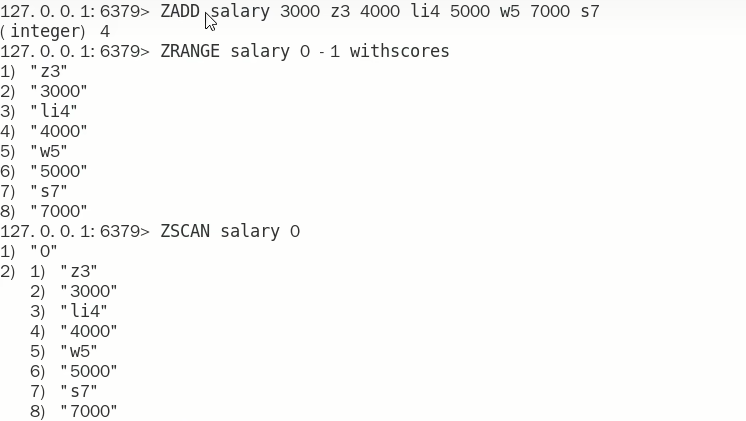

    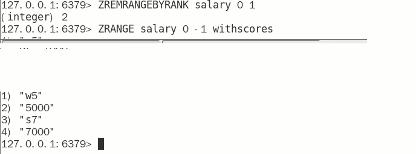

  - 阿里手册

    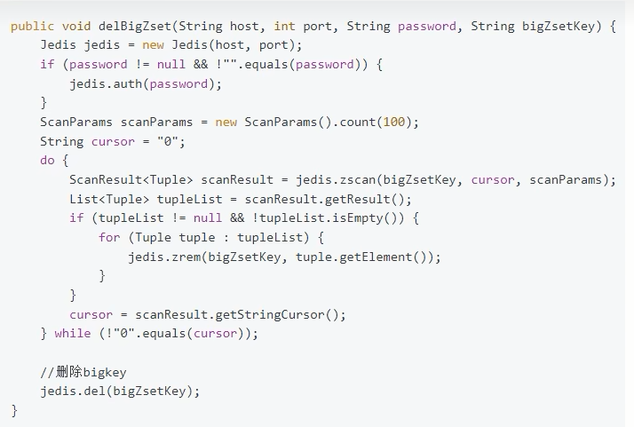

    

