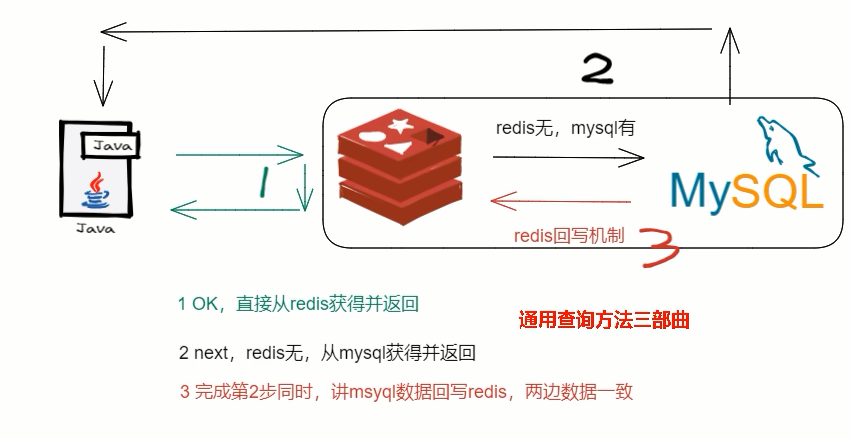

# 面试题

- 你只要用缓存，就可能涉及到redis缓存与数据库双存储双写，你只要是双写，就一定会有数据一致性的问题，那么你如何解决一致性问题？

  

- 双写一致性，你先动缓存redis还是数据库MySQL哪一个？why？

  

- 延时删除你做过吗？会有哪些问题？

- 有这么一种情况，微服务查询redis无 MySQL有，为保证数据双写一致性回写redis你需要注意什么？双检加锁策略你了解过吗？如何尽量避免缓存击穿？

  

- redis和MySQL双写100%会出纰漏，做不到强一致性，你如何保证最终一致性？

