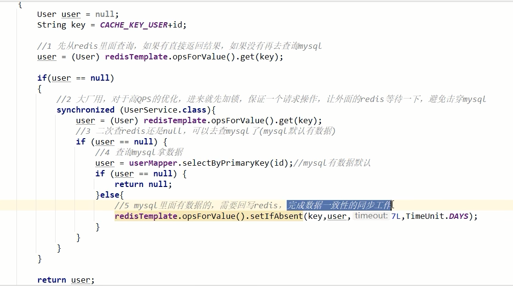

# 缓存双写一致性的理解

### 如果redis中有数据

​	需要和数据库中的值相同

### 如果redis中无数据

​	数据库中的值要是最新值，且准备回写redis

### 缓存按照操作来分，细分2种

- 只读缓存

- 读写缓存

  - 同步直写策略

    写数据库之后也同步写redis缓存，缓存和数据库中的数据一致；

    对于读写缓存来说，要想保证缓存和数据库中的数据一致，就要采用同步直写策略

  - 异步缓写策略

    正常业务中，MySQL数据变了，但是可以在业务上容许出现一定时间后才作用于redis，比如仓库、物流系统

    异常情况出现了， 不得不将失败的动作重新修补，有可能需要借助kafka或者RabbitMQ等消息中间件，实现重试重写

    

- 采用双检加锁策略

  多个线程同时去查询数据库的这条数据，那么我们可以在第一个查询数据的请求上使用一个互斥锁来锁住它。其他的线程走到这一步拿不到锁就等着，等第一个线程查询到了数据，然后做缓存。

  后面的线程进来发现已经有缓存了，就直接走缓存。

  

