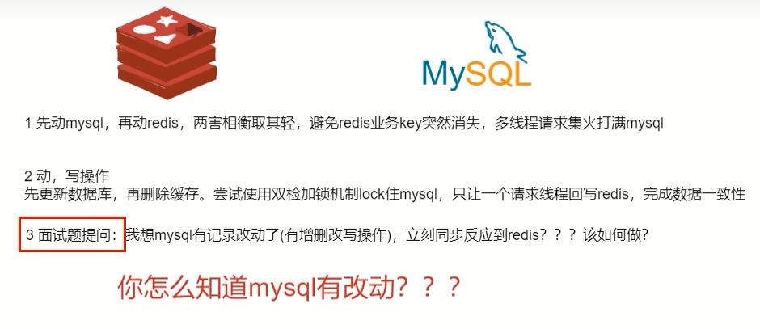

# 复习+面试

# canal介绍

### 是什么

官网地址：https://github.com/alibaba/canal/wiki

canal [ka'nael]，中文翻译为水道/管道/沟渠/运河，主要用途是于MySQL数据库增量日志数据的订阅、消费和解析，是阿里巴巴开发并开源的，采用Java语言开发;

历史背景是早期阿里巴巴因为杭州和美国双机房部署，存在跨机房数据同步的业务需求，实现方式主要是基于业务trigger (触发器)获取增量变更。从2010年开始，阿里巴巴逐步尝试采用解析数据库日志获取增量变更进行同步，由此衍生出了canal项目;

### 能干嘛

基于日志增量订阅和消费的业务包括

- 数据库镜像
- 数据库实时备份
- 索引构建和实时维护(拆分异构索引、倒排索引等)
- 业务 cache 刷新
- 带业务逻辑的增量数据处理

### 去哪下

下载地址：https://github.com/alibaba/canal/releases/tag/canal-1.1.6

