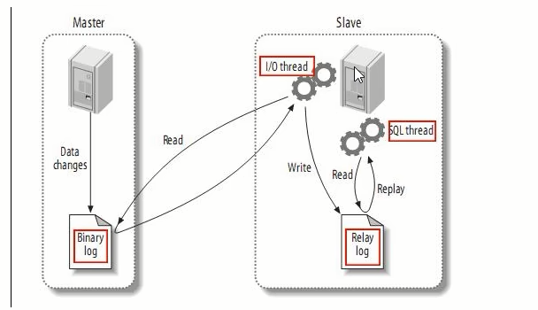
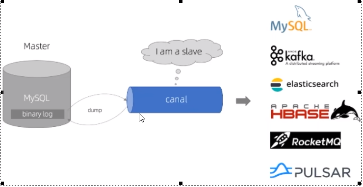

### 工作原理，面试回答

- 传统的MySQL主从复制工作原理

MySQL的主从复制将经过如下步骤:
1、当master主服务器上的数据发生改变时，则将其改变写入二进制事件日志文件中；
2、salve 从服务器会在一定时间间隔内对master主服务器上的二进制日志进行探测，探测其是否发生过改变；
如果探测到master主服务器的二进制事件日志发生了改变,则开始一个I/O Thread请求master二进制事件日志；
3、同时master主服务器为每个I/0 Thread启动一个dump Thread, 用于向其发送二进制事件日志；
4、slave 从服务器将接收到的二进制事件日志保存至自己本地的中继日志文件中；
5、salve 从服务器将启动SQL Thread从中继日志中读取二进制日志，在本地重放，使得其数据和主服务器保持一致；
6、后I/O Thread和SQL Thread将进入睡眠状态，等待下一次被唤醒。

- canal工作原理

工作原理

- canal 模拟MySQL slave的交互协议，伪装自己为MySQL slave，向MySQL master发送dump协议
- MySQL master收到dump请求，开始推送binary log给slave (即canal )canal 解析binary log对象(原始为byte流)

