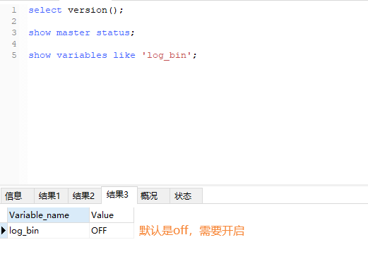

# 双写一致性-MySQL

### Java案例，来源出处

https://github.com/alibaba/canal/wiki/ClientExample

- 查看MySQL版本

  select version(); // 5.7.17

- 当前的主机二进制日志

  show master status;

- 查看 show variables like 'log_bin';

  默认未开启

  修改配置文件，win环境下修改my.ini文件

  ```ini
  log-bin=mysql-bin
  binlog-format=Row
  ```

  

- 


