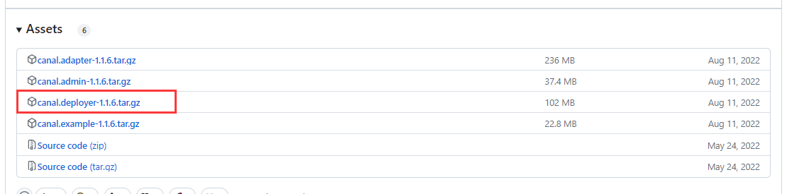
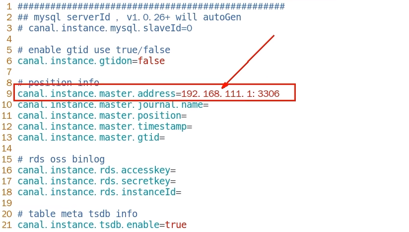
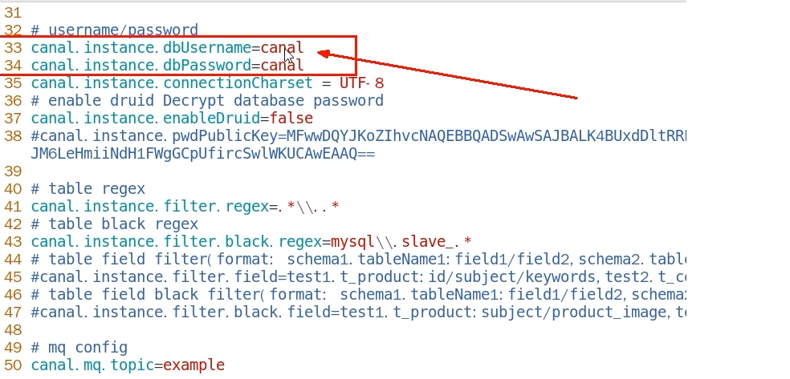
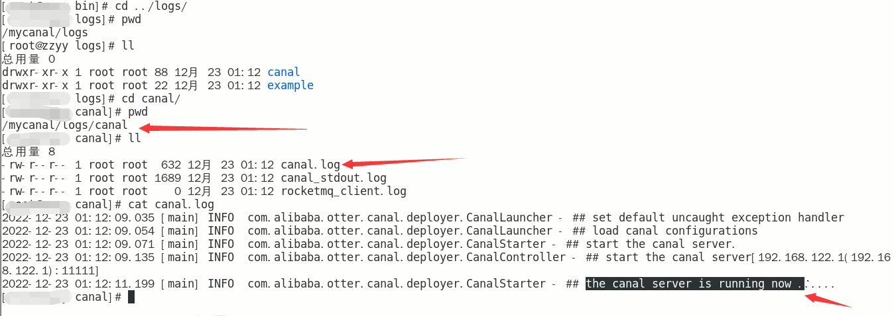
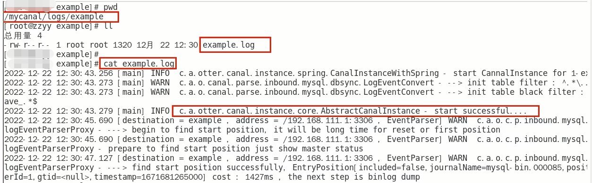

# canal服务端

### 下载

官网地址：https://github.com/alibaba/canal/releases/tag/canal-1.1.6

### 解压

解压后整体放入到/mycanal路径下

### 配置

修改 /mycanal/conf/example路径下instance.properties文件

换成自己的MySQL主机master的IP地址

换成自己的在MySQL新建的canal账户

### 启动

在/mycanal/bin路径下执行 -> ./startup.sh

### 查看

判断canal是否启动成功

- 查看server日志

  

- 查看样例 example的日志

  

