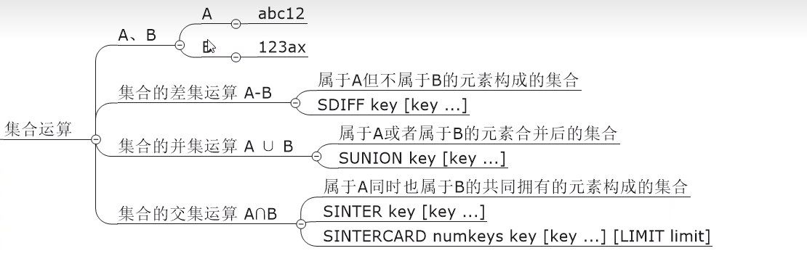
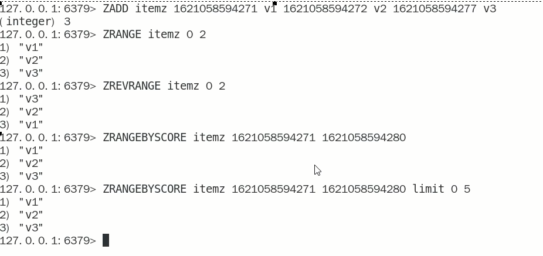

# 统计的类型

### 亿级系统中，常见的四种统计

- 聚合统计

  - 统计多个集合元素的聚合结果，就是前面讲解过的交差并等集合统计

  - 复习命令

    

  - 交差并集和聚合函数的应用

- 排序统计

  抖音短视频最新评论留言的场景，请你设计一个展现列表。（考察数据结构和设计思路）

  设计案例和回答思路：

  以抖音vcr最新的留言评价为案例，所有评论需要两个功能，按照时间排序(正序、反序)+分页显示能够排序+分页显示的redis数据结构是什么合适?

  zset

  

  在面对需要展示最新列表、排行榜等场景时，如果数据更新频繁或者需要分页显示，建议使用ZSet

- 二值统计

  集合元素的取值就只有0和1两种。在钉钉上签到打卡的场景中，我们只用记录有签到(1)或没有签单(0)

  见bitmap

- 基数统计

  指统计一个集合中不重复的元素个数

  见HyperLogLog

