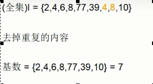
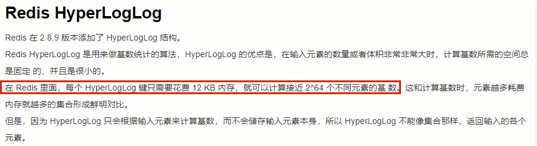
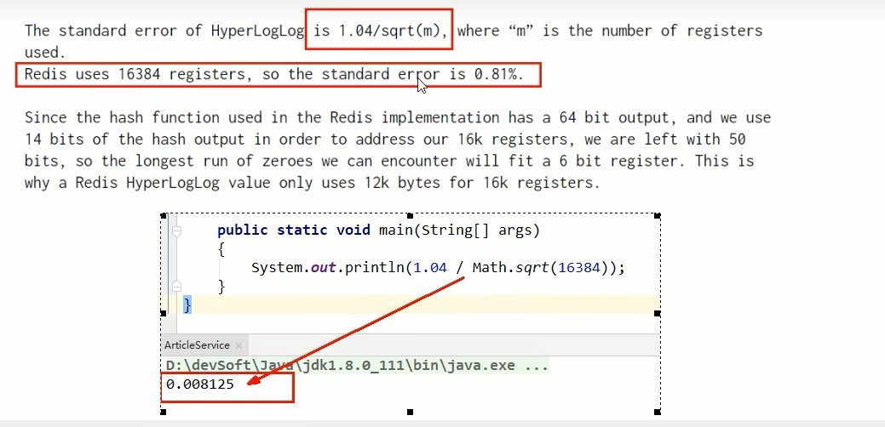

# HyperLogLog

### 名词、行话谈资

- 什么是UV

  Unique Visitor，独立访客，一般理解为客户端IP

  需要去重考虑

- 什么是PV

  Page View，页面浏览量

  不用去重

- 什么是DAU

  Daily Active User，日活跃量用户，登录或者使用了某个产品的用户数（去重复登录的用户）

  常用于反映网站、互联网应用或者网络游戏的运营情况

- 什么是MAU

  Monthly Active User，月活跃用户量

### 看需求

很多计数类场景，比如每日注册IP数、每日访问IP数、页面实时访问数PV、访问用户数UV等。

因为主要的目标高效、巨量地进行计数，所以对存储的数据的内容并不太关心。也就是说它只能用于统计巨量数量，不太涉及具体的统计对象的内容和精准性。

统计单日一个页面的访问量(PV)，单次访问就算一次。

统计单日一个页面的用户访问量(UV)，即按照用户为维度计算，单个用户一天内多次访问也只算一次。

多个key的合并统计，某个门户网站的所有模块的PV聚合统计就是整个网站的总PV。

### 是什么(基础篇写过)

- 基数：是一种数据集，去重复后的真实个数

  案例

  

- 取重复统计功能的基数估算算法-就是HyperLogLog

  

- 基数统计

  用于统计一个集合中不重复的元素个数，就是对集合去重复后剩余元素的计算

- 一句话：脱水后的真实数据

### HyperLogLog如何做的，如何演化出来的？

**基数统计就是HyperLogLog**

**去重复统计你先会想到哪些方式？**

- HashSet

- bitmap

  如果数据是较大亿级统计,使用bitmaps同样会有这个问题。

  bitmap是通过用位bit数组来表示各元素是否出现，每个元素对应一位，所需的总内存为N个bit。

  基数计数则将每一个元素对应到bit数组中的其中一位，比如bit数组010010101(按照从零开始下标，有的就是1、4、6、8)。新进入的元素只需要将已经有的bit数组和新加入的元素进行按位或计算就行。这个方式能大大减少内存占用且位操作迅速。

  But，假设一个样本案例就是一亿个基数位值数据，一个样本就是一亿
  如果要统计1亿个数据的基数位值，大约需要内存100000000/8/1024/1024约等于12M,内存减少占用的效果显著。这样得到统计一个对象样本的基数值需要12M。

  如果统计1000个对象样本(1w个亿级),就需要117.1875G将近120G，可见使用bitmaps还是不适用大数据量下(亿级)的基数计数场景，但是bitmaps方法是精确计算的。

- 结论

  样本元素越多内存消耗急剧增大，难以管控+各种慢，对于亿级统计不太合适，量变引起质变

- 办法

  概率算法：

  通过牺牲准确率来换取空间，对于不要求绝对准确率的场景下可以使用，因为概率算法不直接存储数据本身，通过一定的概率统计方法预估基数值，同时保证误差在一定范围内，由于又不储存数据故此可以大大节约内存.
  HyperLogLog就是一种概率算法的实现。

**原理说明**

- 只是进行不重复的基数统计，不是集合也不保存数据，只记录数量而不是具体内容

- 有误差

  HyperLogLog提供不精确的去重计数方案

  只牺牲准确率来换取空间，误差仅仅只是0.81%左右

- 这个误差率如何来的？

  http://antirez.com/news/75

  Redis之父安特雷兹回答：

  

