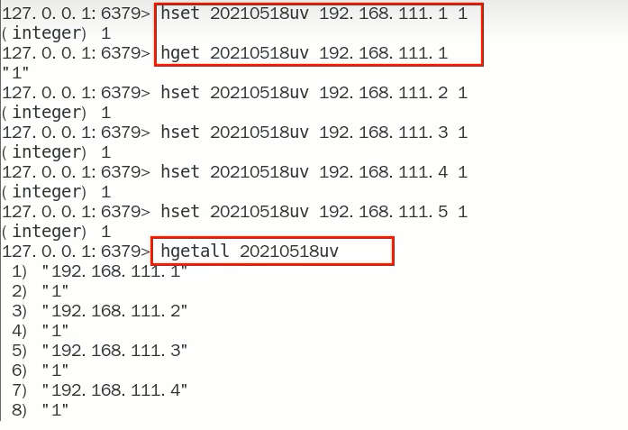
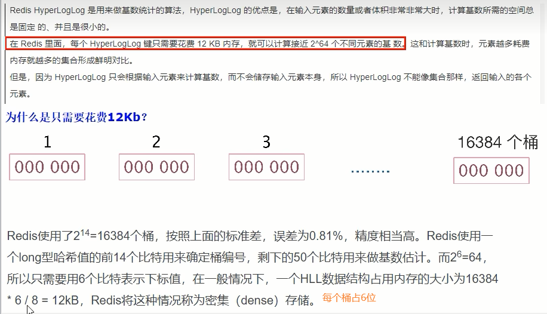

# 首页亿级UV的Redis设计方案

### 需求

UV的统计需要去重，一个用户一天内的多次访问只能算作一次

淘宝、天猫首页的UV，平均每天是1~1.5个亿

每天存1.5个亿的IP，访问者来了后先去查是否存在，不存在就加入

### 方案讨论

- 用MySQL，一个亿的数据，扛不住啊。。。高并发下，3000万的数据就需要分库分表了

- 用redis的hash结构存储

  

  redis——hash = <keyDay,<ip,1> >
  按照ipv4的结构来说明，每个ipv4的地址最多是15个字节(ip = "192.168.111.1"，最多XXX.XXX.XXX.XXX)
  某一天的1.5亿*15个字节=2G，一个月60G， redis死定了。太占内存了

- HyperLogLog

  

