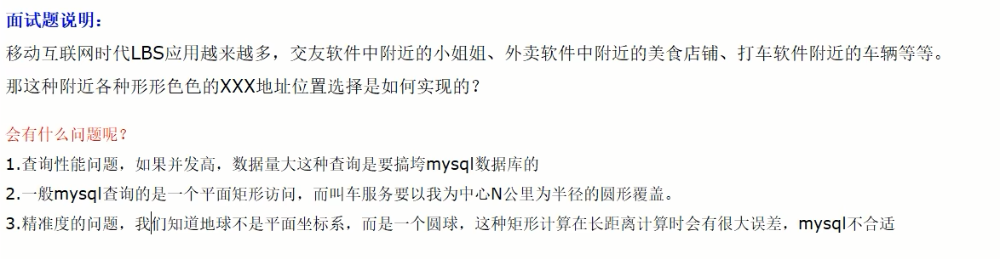
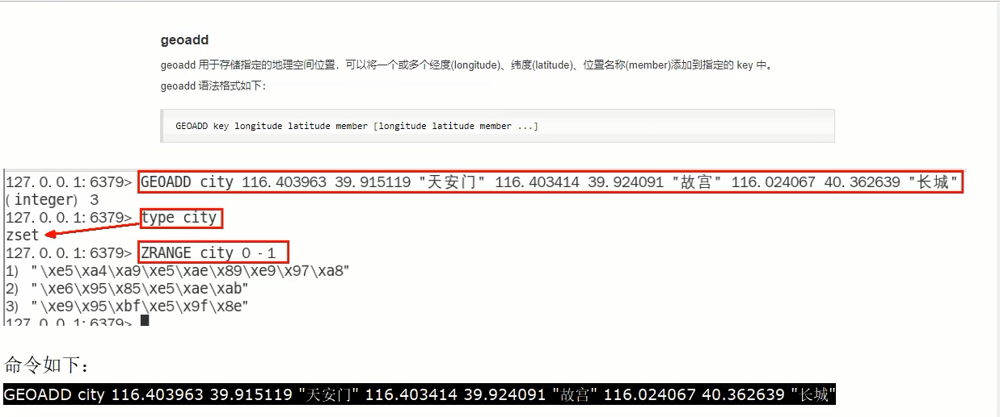
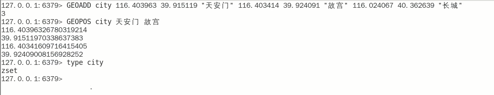
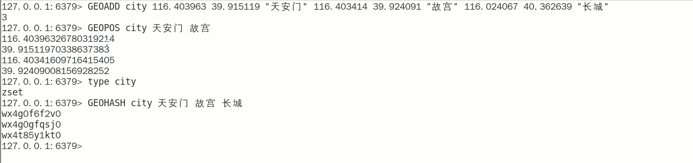
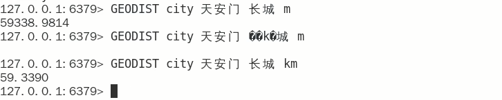
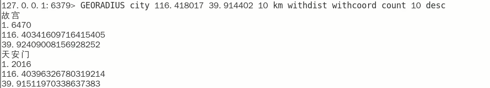
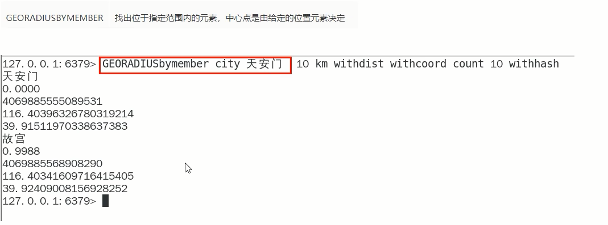

# GEO

### Redis之GEO

面试题简介

### 命令复习

- GEOADD 添加经纬度坐标

  

- GEOPOS返回经纬度

  

- GEOHASH返回坐标的geohash表示

  geohash算法生成的base32编码值，3维变2维变1维

  

- GEODIST两个位置之间的距离

  

- GEORADIUS

  以半径为中心，查找附近的XXX

  

- GEORADIUSBYMEMBE

  

