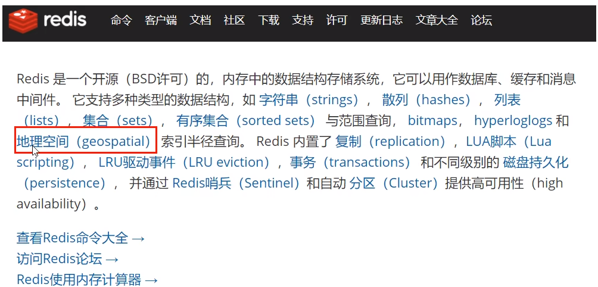

# 附近酒店的推送

### 需求分析

推送当前位置，指定范围内的酒店信息

### 架构设计

Redis的新类型GEO



http://www.redis.cn/commands/geoadd.html

### 编码实现

关键点：GEORADIUS，以给定的经纬度为中心，找出某一半径内的元素

```java
public string geoAdd() {
    Map<String，point> map = new HashMap<>();
    map.put("天安门", new Point( x: 116.403963, y: 39.915119));
    map.put("故宫", new point( x: 116.403414, y: 39.924091));
    map.put("长城", new Point( x: 116.024067, y: 40.362639));
    redisTemplate.opsForGeo().add(CITY,map);
    return map.tostring();
}

public Point position(string member){
    // 获取经纬度坐标,这里的member可以有多个，返回的list也可以有多个
    list<Point> list = redisTemplate.opsForGeo().position(CITY, member);
    return list.get(0);
}

public string hash(string member) {
    //geohash算法生成的base32编码值,这里的member可以有多个，返回的list也可以有多个
    List<string> list = redisTemplate.opsForGeo().hash(CITY,member);
    return list.get(o);
}

public Distance distance( string member1，string member2) {
    //获取两个给定位置之间的距离
    Distance distance = redisTemplate.opsForGeo().distance(CITY,member1,member2,RedisGeoCommands.DistanceUnit.KILOMETERS);
    return distance;
}

public GeoResults radiusByxy() {
    //通过经度，纬度查找附近的，北京王府井位置116.418017, 39.914402
    Circle circle = new Circle(116. 418017, 39 .914402, Metrics . KILOMETERS . getMultiplier());
    //返@50条:
    RedisGeoCommands.GeoRadiusCommandArgs args =
RedisGeoCommands.GeoRadiusCommandArgs.newGeoRadiusArgs().includeDistance().includeCoordinates().sortAscending().limit(50);
    GeoResults<RedisGeoCommands.GeoLocation<String>> geoResults=
this.redisTemplate.opsForGeo().radius(CITY, circle, args);
    return geoResults;
}

public GeoResults radiusByMember() {
    //通过地方查找附近
    String member="天安门";
    //返回50条
    RedisGeoCommands.GeoRadiusCommandArgs args = RedisGeoCommands.GeoRadiusCommandArgs.newGeoRadiusArgs().includeDistance().includeCoordinates( ).sortAscending().limit(5e) ;
    //半径10公里内
    Distance distance=new Distance(10，Metrics.KILOMETERS);
    GeoResults<RedisbeoCommands.GeoLocation<String>> geoResults= this.redisTemplate.opsForbeol().radius(CITY,member,distance,angs);
    return geoResults;
}
```


