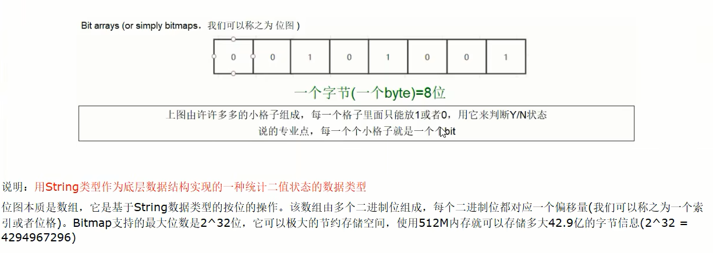
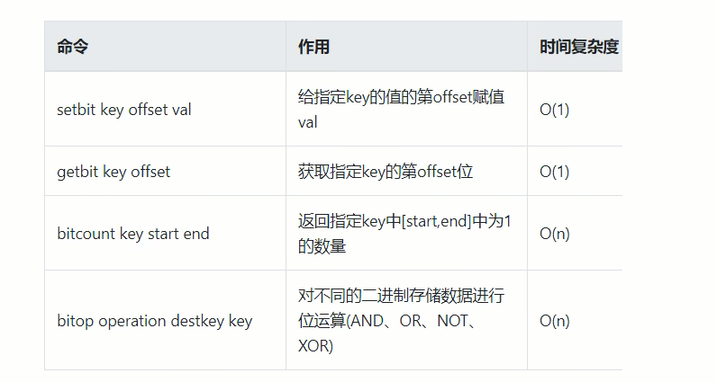

# Bitmap
### 大厂真实案例

日活统计

连续签到打卡

最近一周的活跃用户

统计指定用户一年之中的登录天数

某用户按照一年365天，哪几天登陆过，哪几天没有登录？

### 是什么

由0和1状态表现的二进制位的bit数组



### 能干嘛

用于状态统计，Y、N类似AtomicBoolean

#### <font color='red'> 看需求：</font>

- 用户是否登录过Y、N，比如京东每日签到送京豆

- 电影、广告是否被点击播放过

- 钉钉打卡上下班，签到统计

### 京东签到领取京豆

- 需求说明

  ```tex
  签到日历仅展示当月签到数据
  签到日历需展示最近连续签到天数
  假设当前日期是20210618，且20210616未签到
  
  若20210617已签到且0618未签到，则连续签到天数为1
  
  若20210617已签到且0618已签到，则连续签到天数为2
  
  连续签到天数越多，奖励越大
  所有用户均可签到
  截至2020年3月31日的12个月，京东年度活跃用户数3.87亿，同比增长24.8%，环比增长超2500万，此外，2020年3月移动端日均活跃用户数同比增长46%假设10%左右的用户参与签到，签到用户也高达3千万。。。
  ```

- 小厂方法，传统MySQL方式

  - 建表语句

  ```sql
  CREATE TABLE user_sign
  keyid BIGINT NOT NULL PRIMARY KEY AUTO INCREMENT,
  user_key VARCHAR(200), #京东用户ID
  sign_date DATETIME,#签到日期(20220618)
  sign_count INT #连续签到天数
  
  INSERT INTO user_sign(user_key,sign_date,sign_count)
  VALUES ('28216618-XXXX-XXXX-XXXX-XXXXXXXXXXXX','2022-06-18 15:11:12',1);
          
  SELECT
  	sign_count
  FROM
  	user_sign
  WHERE 
  	user_key =20216618-XXXX-XXXX-XXXX-XXXXXXXXXXXX 
  	AND sign date BETWEEN '2020-06-17 00:00:00' AND '2020-06-18 23:59:59'
  ORDER BY
  	sign_date DESC
  	LIMIT 1;
  ```

  - 困难和解决思路

    方法正确但是难以落地实现。
    签到用户量较小时这么设计能行，但京东这个体量的用户(估算3000W签到用户，一天一条数据，一个月就是9亿数据)对于京东这样的体量，如果一条签到记录对应着当日签到记录，那会很恐怖......

    <font color='red'> 如何解决这个痛点?</font>

    1. 一条签到记录对应一条记录，会占据越来越大的空间。
    2. 一个月最多31天，刚好我们的int类型是32位，那这样一个int类型就可以搞定一个月，32位大于31天，当天来了就是1没来就是0。
    3. 一条数据直接存储一个月的签到记录，不再是存储一天的签到记录。

- 大厂方法，基于Redis的Bitmap实现签到日历

  建表-按位-redis-bitmap

  在签到统计时，每个用户一天的签到用1个bit位就能表示

  一个月(假设是31天)的签到情况用31个bit位就可以，一年的签到也只需要用365个bit位，根本不用太复杂的集合类型

### 命令复习



具体使用见基础篇

案例结合Bitmap类型签到+结合布隆过滤器实现


