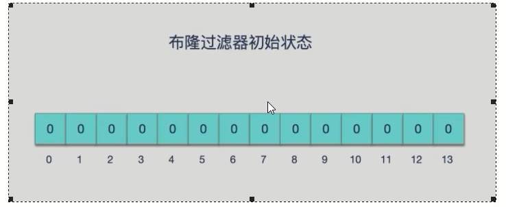
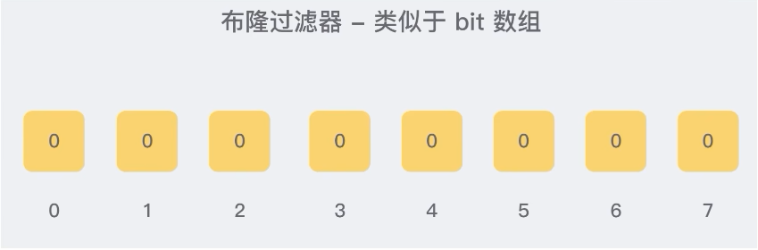

# 布隆过滤器基本介绍

### 是什么

由一个初值都为零的bit数组和多个哈希函数构成，用来快速判断集合中是否存在某个元素



设计思想 -> 

```text
目的：减少内存占用；
方式：不保存数据信息，只是在内存中做一个是否存在的标记flag
```

本质就是判断具体数据是否存在于一个大的集合中

备注：

布隆过滤器是一种<font color = 'red'>类似set的</font>数据结构，只是统计结果在<font color = 'green'>巨量数据下有点小瑕疵，不够完美</font>

```text
布隆过滤器(英语: Bloom Filter) 是 1970 年由布隆提出的。
它实际上是一个很长的二进制数组(00000000)+一系列随机hash算法映射函数，主要用于判断一个元素是否在集合中。
通常我们会遇到很多要判断一个元素是否在某个集合中的业条场景，一般想到的是将集合中所有元素保存起来，然后通过比较确定。链表、树、哈希表等等数据结构都是这种思路。但是随着集合中元素的增加，我们需要的存储空间也会呈现线性增长，最终达到瓶颈。同时检索速度也越来越慢，上述三种结构的检索时间复杂度分别为O(n),0(logn),0(1)。这个时候隆过滤器 (Bloom Filter)就应运而生
```



### 能干嘛-特点考点

高效地插入和查询，占用空间少，返回的结果是不确定性+不够完美

重点：<font color = 'red'>一个元素如果判断结果：存在时，元素不一定存在，但是判断结果为不存在时，则一定不存在。</font>

布隆过滤器可以添加元素，但是<font color = 'red'>不能删除元素，</font>由于涉及hashcode判断依据，删除元素会导致误判率增加。

小总结：有，是可能有；无，是肯定无；（可以保证的是，如果布隆过滤器判断一个元素不在一个集合中，那这个元素一定不会在集合中）


