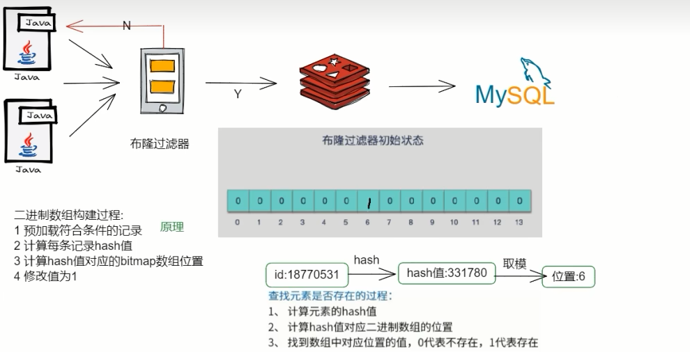
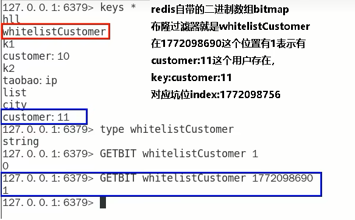
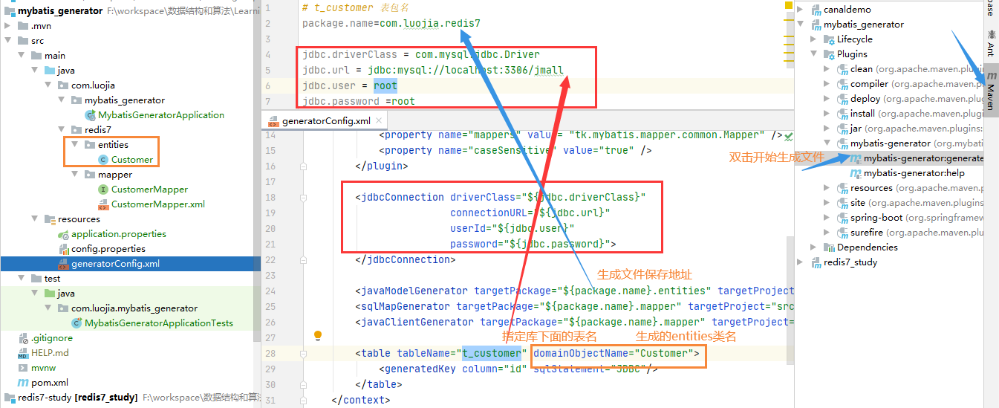

# 手写布隆过滤器

### 布隆过滤器的使用场景

1. <font color = 'red'> 解决缓存穿透的问题，和redis结合bitmap使用</font>

   <font color = 'blue'>缓存穿透是什么</font>
   一般情况下，先查询缓存redis是否有该条数据，缓存中没有时，再查询数据库。当数据库也不存在该条数据时，每次查询都要访问数据库，这就是缓存穿透。

   缓存穿透带来的问题是，当有大量请求查询数据库不存在的数据时，就会给数据库带来压力，甚至会拖垮数据库。

   <font color = 'blue'>可以使用布隆过滤器解决缓存穿透的问题</font>

   把已存在数据的key存在布隆过滤器中，相当于redis前面挡着一个布隆过滤器。

   当有新的请求时，先到布隆过滤器中查询是否存在:

   如果布隆过滤器中不存在该条数据则直接返回;

   如果布隆过滤器中已存在，才去查询缓存redis，如果redis里没查询到则再查询Mysql数据库

2. 黑名单校验，识别垃圾邮件

   发现存在黑名单中的，就执行特定操作。比如:识别垃圾邮件，只要是邮箱在黑名单中的邮件，就识别为垃圾邮件。

   假设黑名单的数量是数以亿计的，存放起来就是非常耗费存储空间的，布隆过滤器则是一个较好的解决方案。

   把所有黑名单都放在布隆过滤器中，在收到邮件时，判断邮件地址是否在布隆过滤器中即可。

### 手写布隆过滤器

- <font color = 'red'> 结合bitmap类型手写一个简单的布隆过滤器，体会设计思想</font>

- 整体架构

  

- 步骤设计

  redis的setbit/getbit

  

  setBit的构建过程

  - @PostConstruct初始化白名单数据
  - 计算元素的hash值
  - 通过上一步hash值算出对应的二进制数据的坑位
  - 将对应坑位的值修改为数字1，表示存在

  getbit查询是否存在

  - 计算元素的hash值
  - 通过上一步hash值算出对应的二进制数组的坑位
  - 返回对应坑位的值，零表示无，1表示存在

- SpringBoot+Redis+mybatis案例基础与一键编码环境整合

  MyBatis通用Mapper4

  mybatis-generator ： http://mybatis.org/generator/

  MyBatis通用Mapper4官网 ： https://github.com/abel533/Mapper

  一键生成

  - t_customer用户表SQL

    ```sql
    CREATE TABLE `t_customer` (
      `id` int(20) NOT NULL AUTO_INCREMENT,
      `cname` varchar(50) NOT NULL,
      `age` int(10) NOT NULL,
      `phone` varchar(20) NOT NULL,
      `sex` tinyint(4) NOT NULL,
      `birth` timestamp NOT NULL DEFAULT CURRENT_TIMESTAMP ON UPDATE CURRENT_TIMESTAMP,
      PRIMARY KEY (`id`),
      KEY `idx_cname` (`cname`)
    ) ENGINE=InnoDB AUTO_INCREMENT=10 DEFAULT CHARSET=utf8mb4;
    ```

  - 建SpringBoot的module  mybatis_generator

  - 改pom

    ```xml
    <?xml version="1.0" encoding="UTF-8"?>
    <project xmlns="http://maven.apache.org/POM/4.0.0" xmlns:xsi="http://www.w3.org/2001/XMLSchema-instance"
    	xsi:schemaLocation="http://maven.apache.org/POM/4.0.0 https://maven.apache.org/xsd/maven-4.0.0.xsd">
    	<modelVersion>4.0.0</modelVersion>
    	<parent>
    		<groupId>org.springframework.boot</groupId>
    		<artifactId>spring-boot-starter-parent</artifactId>
    		<version>2.6.10</version>
    		<relativePath/> <!-- lookup parent from repository -->
    	</parent>
    
    	<groupId>com.luojia</groupId>
    	<artifactId>mybatis_generator</artifactId>
    	<version>0.0.1-SNAPSHOT</version>
    	<name>mybatis_generator</name>
    	<description>Demo project for Spring Boot</description>
    
    	<properties>
    		<project.build.sourceEncoding>UTF-8</project.build.sourceEncoding>
    		<maven.compiler.source>1.8</maven.compiler.source>
    		<maven.compiler.target>1.8</maven.compiler.target>
    		<java.version>1.8</java.version>
    		<hutool.version>5.5.8</hutool.version>
    		<druid.version>1.1.18</druid.version>
    		<mapper.version>4.1.5</mapper.version>
    		<pagehelper.version>5.1.4</pagehelper.version>
    		<mysql.version>5.1.39</mysql.version>
    		<swagger2.version>2.9.2</swagger2.version>
    		<swagger-ui.version>2.9.2</swagger-ui.version>
    		<mybatis.spring.version>2.1.3</mybatis.spring.version>
    	</properties>
    
    	<dependencies>
    		<dependency>
    			<groupId>org.springframework.boot</groupId>
    			<artifactId>spring-boot-starter-web</artifactId>
    		</dependency>
    		<!-- mybatis 通用mapper tk单独使用，自己到这版本号 -->
    		<dependency>
    			<groupId>org.mybatis</groupId>
    			<artifactId>mybatis</artifactId>
    			<version>3.4.6</version>
    		</dependency>
    		<!-- mybatis-spring -->
    		<dependency>
    			<groupId>org.mybatis.spring.boot</groupId>
    			<artifactId>mybatis-spring-boot-starter</artifactId>
    			<version>${mybatis.spring.version}</version>
    		</dependency>
    		<!-- mybatis Generator -->
    		<dependency>
    			<groupId>org.mybatis.generator</groupId>
    			<artifactId>mybatis-generator-core</artifactId>
    			<version>1.4.0</version>
    			<scope>compile</scope>
    			<optional>true</optional>
    		</dependency>
    		<!-- 通用mapper -->
    		<dependency>
    			<groupId>tk.mybatis</groupId>
    			<artifactId>mapper</artifactId>
    			<version>${mapper.version}</version>
    		</dependency>
    		<!-- persistence -->
    		<dependency>
    			<groupId>javax.persistence</groupId>
    			<artifactId>persistence-api</artifactId>
    			<version>1.0.2</version>
    		</dependency>
    		<dependency>
    			<groupId>org.projectlombok</groupId>
    			<artifactId>lombok</artifactId>
    			<optional>true</optional>
    		</dependency>
    		<dependency>
    			<groupId>org.springframework.boot</groupId>
    			<artifactId>spring-boot-starter-test</artifactId>
    			<scope>test</scope>
    			<exclusions>
    				<exclusion>
    					<groupId>org.junit.vintage</groupId>
    					<artifactId>junit-vintage-engine</artifactId>
    				</exclusion>
    			</exclusions>
    		</dependency>
    	</dependencies>
    
    	<build>
    		<resources>
    			<resource>
    				<directory>${basedir}/src/main/java</directory>
    				<includes>
    					<include>**/*.xml</include>
    				</includes>
    			</resource>
    			<resource>
    				<directory>${basedir}/src/main/resources</directory>
    			</resource>
    		</resources>
    		<plugins>
    			<plugin>
    				<groupId>org.springframework.boot</groupId>
    				<artifactId>spring-boot-maven-plugin</artifactId>
    				<configuration>
    					<excludes>
    						<exclude>
    							<groupId>org.projectlombok</groupId>
    							<artifactId>lombok</artifactId>
    						</exclude>
    					</excludes>
    				</configuration>
    			</plugin>
    			<plugin>
    				<groupId>org.mybatis.generator</groupId>
    				<artifactId>mybatis-generator-maven-plugin</artifactId>
    				<version>1.3.6</version>
    				<configuration>
    					<configurationFile>${basedir}/src/main/resources/generatorConfig.xml</configurationFile>
    					<overwrite>true</overwrite>
    					<verbose>true</verbose>
    				</configuration>
    				<dependencies>
    					<dependency>
    						<groupId>mysql</groupId>
    						<artifactId>mysql-connector-java</artifactId>
    						<version>${mysql.version}</version>
    					</dependency>
    					<dependency>
    						<groupId>tk.mybatis</groupId>
    						<artifactId>mapper</artifactId>
    						<version>${mapper.version}</version>
    					</dependency>
    				</dependencies>
    			</plugin>
    		</plugins>
    	</build>
    </project>
    ```

  - 建YML，本次不需要

  - mgb配置相关src/main/resource路径下新建

    config.properties

    ```properties
    # t_customer 表包名
    package.name=com.luojia.redis7
    
    jdbc.driverClass = com.mysql.jdbc.Driver
    jdbc.url = jdbc:mysql://localhost:3306/jmall
    jdbc.user = root
    jdbc.password = 123
    ```

    ```xml
    <?xml version="1.0" encoding="UTF-8"?>
    <!DOCTYPE generatorConfiguration
            PUBLIC "-//mybatis.org//DTD MyBatis Generator Configuration 1.0//EN"
            "http://mybatis.org/dtd/mybatis-generator-config_1_0.dtd">
    
    <generatorConfiguration>
        <properties resource="config.properties"/>
    
        <context id= "Mysql" targetRuntime="MyBatis3Simple" defaultModelType="flat" >
            <property name="beginningDelimiter" value="`" />
            <property name="endingDelimiter" value="`" />
    
            <plugin type="tk.mybatis.mapper.generator.MapperPlugin">
                <property name="mappers" value= "tk.mybatis.mapper.common.Mapper" />
                <property name="caseSensitive" value="true" />
            </plugin>
    
            <jdbcConnection driverClass="${jdbc.driverClass}"
                            connectionURL="${jdbc.url}"
                            userId="${jdbc.user}"
                            password="${jdbc.password}">
            </jdbcConnection>
    
            <javaModelGenerator targetPackage="${package.name}.entities" targetProject="src/main/java" />
            <sqlMapGenerator targetPackage="${package.name}.mapper" targetProject="src/main/java" />
            <javaClientGenerator targetPackage="${package.name}.mapper" targetProject="src/main/java" type="XMLMAPPER" />
    
            <table tableName="t_customer" domainObjectName="Customer">
                <generatedKey column="id" sqlStatement="JDBC"/>
            </table>
        </context>
    </generatorConfiguration>
    ```

  - 一键生成

    双击插件mybatis- generator:generate，生成entity+mapper接口+xml实现SQL

    

  SpringBoot+MyBatis+Redis缓存实战编码

  改造之前的Redis_study

  改pom

  ```xml
  <?xml version="1.0" encoding="UTF-8"?>
  <project xmlns="http://maven.apache.org/POM/4.0.0" xmlns:xsi="http://www.w3.org/2001/XMLSchema-instance"
           xsi:schemaLocation="http://maven.apache.org/POM/4.0.0 https://maven.apache.org/xsd/maven-4.0.0.xsd">
      <modelVersion>4.0.0</modelVersion>
      <parent>
          <groupId>org.springframework.boot</groupId>
          <artifactId>spring-boot-starter-parent</artifactId>
          <version>2.7.11</version>
          <relativePath/> <!-- lookup parent from repository -->
      </parent>
      <groupId>com.luojia</groupId>
      <artifactId>redis7_study</artifactId>
      <version>0.0.1-SNAPSHOT</version>
      <name>redis7_study</name>
      <description>Demo project for Spring Boot</description>
      <properties>
          <project.build.sourceEncoding>UTF-8</project.build.sourceEncoding>
          <maven.compiler.source>1.8</maven.compiler.source>
          <maven.compiler.target>1.8</maven.compiler.target>
          <junit.version>4.12</junit.version>
          <log4j.version>1.2.17</log4j.version>
          <lombok.version>1.16.18</lombok.version>
          <mapper.version>4.1.5</mapper.version>
          <mysql.version>5.1.47</mysql.version>
          <druid.version>1.1.16</druid.version>
          <mybatis.spring.boot.version>1.3.0</mybatis.spring.boot.version>
      </properties>
  
      <dependencies>
          <!--SpringBoot 通用依赖模块-->
          <dependency>
              <groupId>org.springframework.boot</groupId>
              <artifactId>spring-boot-starter-web</artifactId>
          </dependency>
          <!-- jedis -->
          <dependency>
              <groupId>redis.clients</groupId>
              <artifactId>jedis</artifactId>
              <version>4.3.1</version>
          </dependency>
          <!-- lettuce -->
          <!--<dependency>
              <groupId>io.lettuce</groupId>
              <artifactId>lettuce-core</artifactId>
              <version>6.2.1.RELEASE</version>
          </dependency>-->
  
          <!-- SpringBoot 与Redis整合依赖 -->
          <dependency>
              <groupId>org.springframework.boot</groupId>
              <artifactId>spring-boot-starter-data-redis</artifactId>
          </dependency>
          <dependency>
              <groupId>org.apache.commons</groupId>
              <artifactId>commons-pool2</artifactId>
          </dependency>
          <!-- swagger2 -->
          <dependency>
              <groupId>io.springfox</groupId>
              <artifactId>springfox-swagger2</artifactId>
              <version>2.9.2</version>
          </dependency>
          <dependency>
              <groupId>io.springfox</groupId>
              <artifactId>springfox-swagger-ui</artifactId>
              <version>2.9.2</version>
          </dependency>
          <!-- Mysql 数据库驱动 -->
          <dependency>
              <groupId>mysql</groupId>
              <artifactId>mysql-connector-java</artifactId>
              <version>${mysql.version}</version>
          </dependency>
          <!-- springboot集成druid连接池-->
          <dependency>
              <groupId>com.alibaba</groupId>
              <artifactId>druid-spring-boot-starter</artifactId>
              <version>1.1.0</version>
          </dependency>
          <dependency>
              <groupId>com.alibaba</groupId>
              <artifactId>druid</artifactId>
              <version>${druid.version}</version>
          </dependency>
          <!-- mybatis和SpringBoot整合 -->
          <dependency>
              <groupId>org.mybatis.spring.boot</groupId>
              <artifactId>mybatis-spring-boot-starter</artifactId>
              <version>${mybatis.spring.boot.version}</version>
          </dependency>
          <dependency>
              <groupId>cn.hutool</groupId>
              <artifactId>hutool-all</artifactId>
              <version>5.2.3</version>
          </dependency>
          <!-- persistence -->
          <dependency>
              <groupId>javax.persistence</groupId>
              <artifactId>persistence-api</artifactId>
              <version>1.0.2</version>
          </dependency>
          <!-- 通用Mapper -->
          <dependency>
              <groupId>tk.mybatis</groupId>
              <artifactId>mapper</artifactId>
              <version>${mapper.version}</version>
          </dependency>
          <dependency>
              <groupId>org.springframework.boot</groupId>
              <artifactId>spring-boot-autoconfigure</artifactId>
          </dependency>
  
          <!-- 通用基础配置 -->
          <dependency>
              <groupId>junit</groupId>
              <artifactId>junit</artifactId>
              <version>${junit.version}</version>
          </dependency>
          <dependency>
              <groupId>log4j</groupId>
              <artifactId>log4j</artifactId>
              <version>${log4j.version}</version>
          </dependency>
          <dependency>
              <groupId>org.slf4j</groupId>
              <artifactId>slf4j-api</artifactId>
              <version>1.7.26</version>
          </dependency>
          <dependency>
              <groupId>org.slf4j</groupId>
              <artifactId>slf4j-log4j12</artifactId>
              <version>1.7.26</version>
          </dependency>
          <dependency>
              <groupId>org.projectlombok</groupId>
              <artifactId>lombok</artifactId>
              <version>${lombok.version}</version>
          </dependency>
  
          <dependency>
              <groupId>org.springframework.boot</groupId>
              <artifactId>spring-boot-starter-test</artifactId>
              <scope>test</scope>
          </dependency>
      </dependencies>
  
      <build>
          <plugins>
              <plugin>
                  <groupId>org.springframework.boot</groupId>
                  <artifactId>spring-boot-maven-plugin</artifactId>
              </plugin>
          </plugins>
      </build>
  </project>
  ```

  YML：在src/main/resources/目录下新建mapper文件夹，并拷贝CustomerMapper.xml

  主启动

  ```java
  package com.luojia.redis7_study;
  
  import org.springframework.boot.SpringApplication;
  import org.springframework.boot.autoconfigure.SpringBootApplication;
  import tk.mybatis.spring.annotation.MapperScan;
  
  @SpringBootApplication
  @MapperScan("com.luojia.redis7_study.mapper")
  public class Redis7StudyApplication {
  
      public static void main(String[] args) {
          SpringApplication.run(Redis7StudyApplication.class, args);
      }
  }
  ```

  业务类

  

- 


