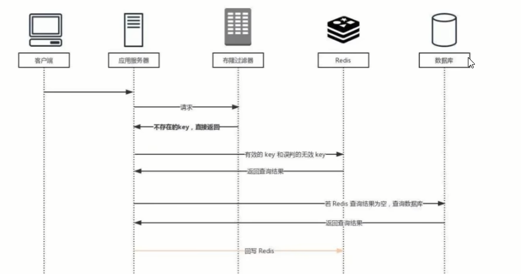

# 缓存穿透

### 是什么

请求去查询一条记录，先查redis无，后查mysql无，都查询不到该条记录但是请求每次都会打到数据库上面去，导致后台数据库压力暴增，这种现象我们称为缓存穿透，这个redis变成了一个摆设。

简单说就是本来无一物，两库都没有，既不在Redis缓存库，也不在mysql，数据库存在被多次暴击风险

### 解决

缓存穿透 -> 恶意攻击 -> 可以空对象缓存或者使用布隆过滤器



**方案1：**空对象缓存或者缺省值

```text
第一种解决方案，回写增强
如果发生了缓存穿透，我们可以针对要查询的数据，在Redis里存一个和业务部门商量后确定的缺省值(比如,零、负数、defaultNull等)
比如，键uid;abcdxxx，值defaultNull作为案例的key和value
先去redis查键uid:abcdxxx没有，再去mysql查没有获得，这就发生了一次穿透现象。
but，可以增强回写机制
mysql也查不到的话也让redis存入刚刚查不到的key并保护mysql。
第一次来查询uid:abcdxxx，redis和mysql都没有，返回nul给调用者，但是增强回写后第二次来查uid:abcdxxx，此时redis就有值了。
可以直接从Redis中读取default缺省值返回给业务应用程序，避免了把大量请求发送给mysql处理，打爆mysql。

但是，此方法架不住黑客的恶意攻击，有缺陷......，只能解决key相同的情况
```

黑客或者恶意攻击

- 黑客会对你的系统进行攻击，拿一个不存在的id去查询数据，会产生大量的请求到数据库去查询。可能会导致你的数据库由于压力过大而宕掉

- key相同打你系统

  第一次打到mysql，空对象缓存后第二次就返回defaultNull缺省值，避免mysql被攻击，不用再到数据库中去走一圈了

- <font color ='red'>key不同打你系统</font>


