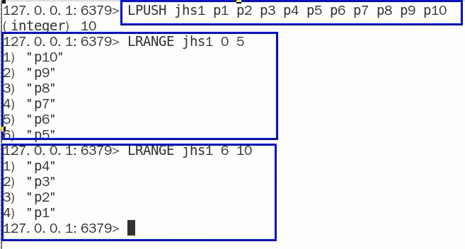
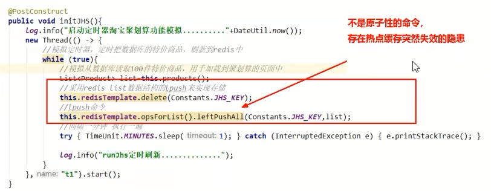
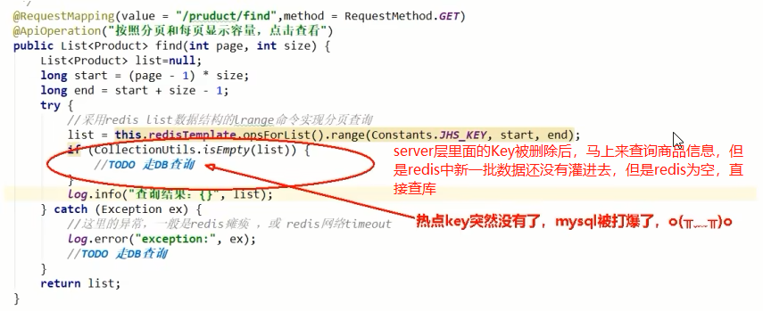
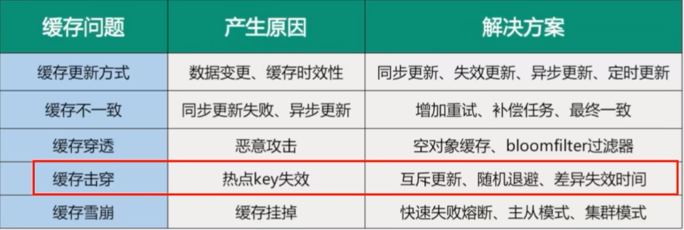
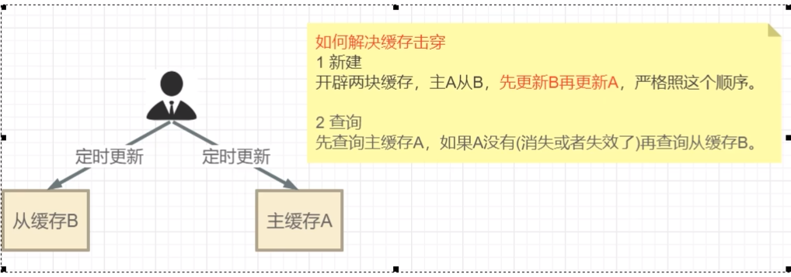

# 缓存击穿

### 是什么

大量请求同时查询一个key时，此时这个key正好失效了，就会导致大量的请求都打到数据库，<font color = 'red'>简单点就是热点key突然失效了，暴打MySQL</font>

<font color = 'gren'>缓存穿透和缓存击穿是完全不同的东西</font>

### 危害

会造成某一时刻数据库请求量过大，压力剧增；一般技术部门需要知道热点key是哪些，做到心里有数防止击穿。

### 解决

缓存击穿 -> 热点key失效-> 今天互斥更新、随机退避、差异失效时间

热点key失效：时间到了自然清除但还是被访问到，delete掉的key，刚好又被访问到

方案一：差异失效时间，对于访问频繁的热点key，干脆就不设置过期时间

<font color = 'red'>方案二：互斥更新，采用双检加锁策略</font>

多个线程同时去查询数据库的这条数据，那么我们可以在第一个查询数据的请求上使用一个互斥锁来锁住它。其他的线程走到这一步拿不到锁就等着，等第一个线程查询到了数据，然后做缓存。后面的线程进来发现已经有缓存了，就直接走缓存

### 案例

模拟高并发的天猫聚划算案例code 

分析过程

| 步骤 | 说明                                                         |
| ---- | ------------------------------------------------------------ |
| 1    | 100%高并发，绝对不可以用MySQL实现                            |
| 2    | 先把MySQL里面参加活动的数据抽取进redis，一般采用定时器扫描来决定上线活动还是下线取消。 |
| 3    | 支持分页功能，一页20条数据                                   |
|      | 思考：什么样的数据类型支持上述功能？                         |


<font color = 'red'>高并发+定时任务+分页显示</font>

redis数据类型选型



springboot+redis实现高并发的聚划算业务

创建entity对象

```java
package com.luojia.redis7_study.entities;

import io.swagger.annotations.ApiModel;
import lombok.AllArgsConstructor;
import lombok.Data;
import lombok.NoArgsConstructor;

@Data
@AllArgsConstructor
@NoArgsConstructor
@ApiModel(value="聚划算活动Product信息")
public class Product {

    // 产品id
    private Long id;
    // 产品名称
    private String name;
    // 产品价格
    private Integer price;
    // 产品详情
    private String detail;

}
```

JHSTaskService：采用定时器将参与聚划算活动的特价商品新增进入redis中

```java
package com.luojia.redis7_study.service;

import com.luojia.redis7_study.entities.Product;
import lombok.extern.slf4j.Slf4j;
import org.springframework.beans.factory.annotation.Autowired;
import org.springframework.data.redis.core.RedisTemplate;
import org.springframework.stereotype.Service;

import javax.annotation.PostConstruct;
import java.util.ArrayList;
import java.util.List;
import java.util.Random;

@Service
@Slf4j
public class JHSTaskService {

    public static final String JHS_KEY = "jhs";
    public static final String JHS_KEY_A = "jhs:a";
    public static final String JHS_KEY_B = "jhs:b";

    @Autowired
    private RedisTemplate redisTemplate;

    /**
     * 假设此处是从数据库读取，然后加载到redis
     * @return
     */
    private List<Product> getProductsFromMysql() {
        ArrayList<Product> list = new ArrayList<>();
        for (int i = 0; i < 20; i++) {
            Random random = new Random();
            int id = random.nextInt(10000);
            Product product = new Product((long) id, "product" + i, i, "detail");
            list.add(product);
        }
        return list;
    }

    @PostConstruct
    public void initJHS() {
        log.info("模拟定时任务从数据库中不断获取参加聚划算的商品");
        // 1 用多线程模拟定时任务，将商品从数据库刷新到redis
        new Thread(() -> {
            while(true) {
                // 2 模拟从数据库查询数据
                List<Product> list = this.getProductsFromMysql();
                // 3 删除原来的数据
                redisTemplate.delete(JHS_KEY);
                // 4 加入最新的数据给Redis参加活动
                redisTemplate.opsForList().leftPushAll(JHS_KEY, list);
                // 5 暂停1分钟，模拟聚划算参加商品下架上新等操作
                try {
                    Thread.sleep(60000);
                } catch (InterruptedException e) {
                    e.printStackTrace();
                }
            }
        }, "t1").start();
    }
}
```

JHSTaskController

```java
package com.luojia.redis7_study.controller;

import com.luojia.redis7_study.entities.Product;
import io.swagger.annotations.Api;
import io.swagger.annotations.ApiOperation;
import lombok.extern.slf4j.Slf4j;
import org.springframework.beans.factory.annotation.Autowired;
import org.springframework.data.redis.core.RedisTemplate;
import org.springframework.util.CollectionUtils;
import org.springframework.web.bind.annotation.GetMapping;
import org.springframework.web.bind.annotation.RestController;

import java.util.List;

@Api(tags = "模拟聚划算商品上下架")
@RestController
@Slf4j
public class JHSTaskController {

    public static final String JHS_KEY = "jhs";
    public static final String JHS_KEY_A = "jhs:a";
    public static final String JHS_KEY_B = "jhs:b";

    @Autowired
    private RedisTemplate redisTemplate;

    @ApiOperation("聚划算案例，每次1页，每页5条数据")
    @GetMapping("/product/find")
    public List<Product> find(int page, int size) {
        long start = (page - 1) * size;
        long end = start + size - 1;
        List list = redisTemplate.opsForList().range(JHS_KEY, start, end);
        if (CollectionUtils.isEmpty(list)) {
            // todo Redis找不到，去数据库中查询
        }
        log.info("参加活动的商家: {}", list);
        return list;
    }
}
```

**至此步骤，上述聚划算的功能算是完成，请思考在高并发下有什么经典生产问题?**

异常问题：热点缓存Key突然失效导致可怕的缓存击穿





delete命令执行的一瞬间有空隙，其他请求线程继续找redis，但是结果为null，请求直接打到redis，暴击数据库

最终目的：2条命令原子性还是其次，<font color='red'>主要是要防止热key突然失效</font>



进一步升级加固案例

- 互斥跟新，采用双检加锁策略

- 差异失效时间

  

- 代码更新

  JHSTaskService

  ```java
  // 双缓存
  @PostConstruct
  public void initJHSAB() {
      log.info("模拟定时任务从数据库中不断获取参加聚划算的商品");
      // 1 用多线程模拟定时任务，将商品从数据库刷新到redis
      new Thread(() -> {
          while(true) {
              // 2 模拟从数据库查询数据
              List<Product> list = this.getProductsFromMysql();
              // 3 先更新B缓存且让B缓存过期时间超过A缓存，如果突然失效还有B兜底，防止击穿
              redisTemplate.delete(JHS_KEY_B);
              redisTemplate.opsForList().leftPushAll(JHS_KEY_B, list);
              // 设置过期时间为1天+10秒
              redisTemplate.expire(JHS_KEY_B, 86410L, TimeUnit.SECONDS);
              // 4 在更新缓存A
              redisTemplate.delete(JHS_KEY_A);
              redisTemplate.opsForList().leftPushAll(JHS_KEY_A, list);
              redisTemplate.expire(JHS_KEY_A, 86400L, TimeUnit.SECONDS);
              // 5 暂停1分钟，模拟聚划算参加商品下架上新等操作
              try {
                  Thread.sleep(60000);
              } catch (InterruptedException e) {
                  e.printStackTrace();
              }
          }
      }, "t1").start();
  }
  ```

  JHSTaskController

  ```java
  @ApiOperation("聚划算案例，AB双缓存，防止热key突然失效")
  @GetMapping("/product/findab")
  public List<Product> findAB(int page, int size) {
      List<Product> list = null;
      long start = (page - 1) * size;
      long end = start + size - 1;
      list = redisTemplate.opsForList().range(JHS_KEY_A, start, end);
      if (CollectionUtils.isEmpty(list)) {
          //  Redis找不到，去数据库中查询
          log.info("A缓存已经失效或活动已经结束");
          list = redisTemplate.opsForList().range(JHS_KEY_B, start, end);
          if (CollectionUtils.isEmpty(list)) {
              // todo Redis找不到，去数据库中查询
          }
      }
      log.info("参加活动的商家: {}", list);
      return list;
  }
  ```

  


