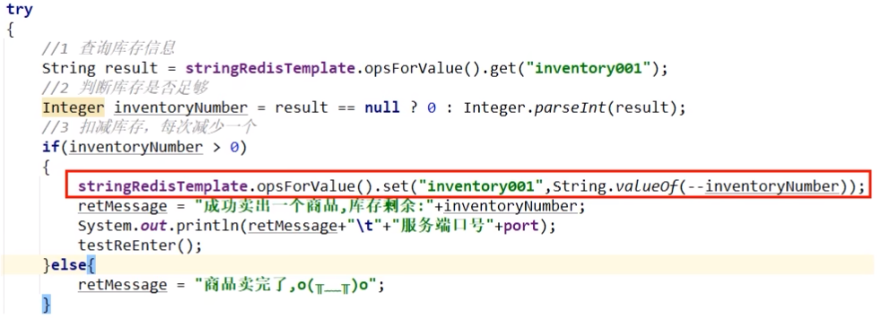

# 上述可重入锁的计数问题，redis中哪个数据类型可以替代

### K K V 数据结构

```java
hset luojiaRedisLock 0c90d37cb6ec42268861b3d739f8b3a8:1 11
    
type luojiaRedisLock -> hash
```

Map<String, Map<Object, Object>>

### 小总结

setnx只能解决有无的问题，够用但是不完美

hset，不但解决有无，还能解决可重入问题

### <font color='red'>设计重点（一横一纵）</font>

目前两个分支，目的是保证同一个时候只能有一个线程持有锁进去redis做扣减库存动作

一个分支保证加锁/解锁，lock/unlock;

另一个分支扣减库存，redis命令的原子性




